# Network Requests

<div mt-2 />

- <a @click="$slidev.nav.next()">Fetch and Its API</a>
- <a @click="$nav.go($nav.currentPage+5)">Form Data</a>
- <a @click="$nav.go($nav.currentPage+10)">Fetch: Download Progress and Aborting Requests</a>
- <a @click="$nav.go($nav.currentPage+16)">Fetch: Cross-Origin Requests</a>
- <a @click="$nav.go($nav.currentPage+22)">URL Objects</a>
- <a @click="$nav.go($nav.currentPage+29)">XMLHttpRequest</a>
- <a @click="$nav.go($nav.currentPage+38)">Resumable file upload</a>
- <a @click="$nav.go($nav.currentPage+45)">Long polling</a>
- <a @click="$nav.go($nav.currentPage+49)">WebSockets</a>
- <a @click="$nav.go($nav.currentPage+55)">Server-Sent Events</a>

---
hideInToc: true
clicksStart: 1
---

<v-clicks>

# Fetch

#### Fetch is a modern JavaScript API for making network requests (part of AJAX - Asynchronous JavaScript And XML) that allows you to:

- Submit forms/orders
- Load user information
- Receive server updates
- Make any HTTP request
- All of this without reloading the page!

```js
let promise = fetch(url, [options])
```

- <kbd>url</kbd> – the URL to access.
- <kbd>options</kbd> – optional parameters: method, headers etc.

</v-clicks>

---
hideInToc: true
---

# Two-Stage Process

<div className="flex border-blue-500 border-2  max-w-xl items-center divide-x-4 divide-blue-500">
<div className="basis-2/4 pl-5">
First Stage: Initial Response

- Gets response headers
- Can check HTTP status
- Body isn't available yet
</div>
<div className="basis-2/4 pl-5">

Second Stage: Body Retrieval

- Must call specific method to get body
- Can only read body once!

</div>
</div>

### Reponse Methods

```js
// Different ways to handle response
const response = await fetch(url)
// As JSON
const jsonData = await response.json()
// As Text
const textData = await response.text()
// As Blob
const blobData = await response.blob()
// As FormData
// return the response as FormData object (multipart/form-data)
const formData = await response.formData()
// As ArrayBuffer
const arrayBuffer = await response.arrayBuffer()
```

---
hideInToc: true
---

```mermaid
graph TD
    classDef methodClass fill:#f9f,stroke:#333,stroke-width:2px,color:black
    classDef resultClass fill:#bbf,stroke:#333,stroke-width:2px,color:black

    Response[Response Object]

    Response --> text[response.text&#40;&#41;]
    Response --> json[response.json&#40;&#41;]
    Response --> blob[response.blob&#40;&#41;]
    Response --> formData[response.formData&#40;&#41;]
    Response --> arrayBuffer[response.arrayBuffer&#40;&#41;]

    text --> textContent[Plain Text Content]
    json --> jsonObject[Parsed JSON Object]
    blob --> binaryData[Binary Data with Type]
    formData --> formDataObj[Form Data Object]
    arrayBuffer --> rawBinary[Raw Binary Data]

    class text,json,blob,formData,arrayBuffer methodClass
    class textContent,jsonObject,binaryData,formDataObj,rawBinary resultClass

    style Response fill:#ff9,stroke:#333,stroke-width:4px,color:black
```

#### Working with Headers

#### Reading Response Headers

````md magic-move
```js
const response = await fetch(url)

// Get single header
const contentType = response.headers.get('Content-Type')

// Iterate all headers
for (let [key, value] of response.headers) {
  console.log(`${key}: ${value}`)
}
```

```js
// Setting Request Headers
const response = await fetch(url, {
  headers: {
    'Content-Type': 'application/json',
    Authorization: 'Bearer token123',
  },
})
```
````

---
hideInToc: true
---

## POST Requests

<div className="flex gap-5 items-center">

<div>

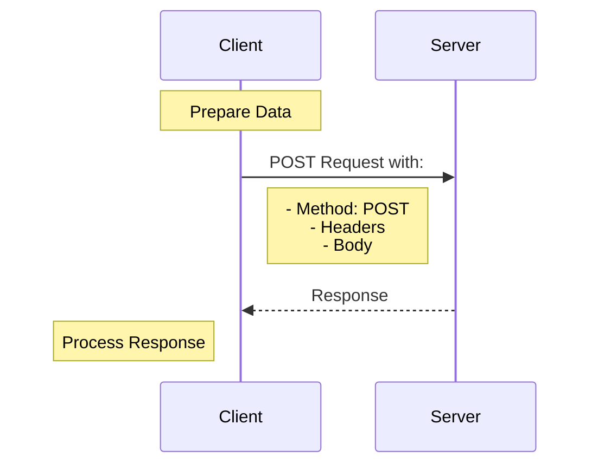

</div>
<div>

````md magic-move
```js
const user = {
  name: 'John',
  age: 30,
}

const response = await fetch('/api/users', {
  method: 'POST',
  headers: {
    'Content-Type': 'application/json',
  },
  body: JSON.stringify(user),
})

const result = await response.json()
```

```js
// Sending Binary Data
// Sending an image
async function sendImage(blob) {
  const response = await fetch('/api/upload', {
    method: 'POST',
    body: blob, // Content-Type automatically set
  })

  return await response.json()
}
```

```js
// Common Response Properties
const response = await fetch(url)

// Status kbd (200, 404, etc.)
console.log(response.status)

// OK if status is 200-299
console.log(response.ok)

// Response headers
console.log(response.headers)
```
````

</div>
</div>

---
hideInToc: true
---

# Form Data

<v-clicks>
FormData is a built-in JavaScript object that makes it easy to construct a set of key/value pairs representing form fields and their values. It's particularly useful for:

- Sending form data through fetch API
- Handling file uploads
- Creating form data programmatically

#### Key Features

- Easy Form Capture: Automatically captures all form fields when created with a form element
- File Handling: Supports file uploads and Blob data
- Multipart Encoding: Automatically encoded as multipart/form-data
- Flexible Modification: Can add, modify, or delete fields after creation

</v-clicks>

---
hideInToc: true
---

### Core Methods

<v-clicks>

<div className="w-full max-w-4xl mx-auto rounded-lg border border-blue-200">
      <div className="grid grid-cols-3 bg-blue-900 text-white font-semibold">
        <div className="p-3 text-center">Methods</div>
        <div className="p-3 text-center border-l border-blue-700">Syntax</div>
        <div className="p-3 text-center border-l border-blue-700">Description</div>
      </div>
      <div className="divide-y divide-blue-200">
        <div className="grid grid-cols-3">
          <div className="p-3 flex items-center">
            <kbd>append()</kbd>
          </div>
          <div className="p-3 border-l border-blue-200 flex items-center">
            <kbd>formData.append(name, value)</kbd>
          </div>
          <div className="p-3 border-l border-blue-200 flex items-center">
            Adds a new field (allows multiple with same name)
          </div>
        </div>
        <div className="grid grid-cols-3">
          <div className="p-3 flex items-center">
            <kbd>set()</kbd>
          </div>
          <div className="p-3 border-l border-blue-200 flex items-center">
            <kbd>formData.set(name, value)</kbd>
          </div>
          <div className="p-3 border-l border-blue-200 flex items-center">
            Adds/updates a field (replaces existing)
          </div>
        </div>
        <div className="grid grid-cols-3">
          <div className="p-3 flex items-center">
            <kbd>delete()</kbd>
          </div>
          <div className="p-3 border-l border-blue-200 flex items-center">
            <kbd>formData.delete(name)</kbd>
          </div>
          <div className="p-3 border-l border-blue-200 flex items-center">
            Removes a field
          </div>
        </div>
        <div className="grid grid-cols-3">
          <div className="p-3 flex items-center">
            <kbd>get()</kbd>
          </div>
          <div className="p-3 border-l border-blue-200 flex items-center">
            <kbd>formData.get(name)</kbd>
          </div>
          <div className="p-3 border-l border-blue-200 flex items-center">
            Retrieves a field value
          </div>
        </div>
        <div className="grid grid-cols-3">
          <div className="p-3 flex items-center">
            <kbd>has()</kbd>
          </div>
          <div className="p-3 border-l border-blue-200 flex items-center">
            <kbd>formData.has(name)</kbd>
          </div>
          <div className="p-3 border-l border-blue-200 flex items-center">
            Checks if a field exists
          </div>
        </div>
      </div>
    </div>
</v-clicks>

---
hideInToc: true
---

# Common Use Cases

<v-clicks>

````md magic-move
```js
// Basic Form Submission
// HTML Form
<form id="userForm">
  <input type="text" name="name" value="John">
  <input type="email" name="email" value="john@example.com">
  <button type="submit">Submit</button>
</form>

// JavaScript
document.getElementById('userForm').onsubmit = async (e) => {
  e.preventDefault();
  const formData = new FormData(e.target);

  const response = await fetch('/api/submit', {
    method: 'POST',
    body: formData
  });

  const result = await response.json();
  console.log(result);
};
```

```js
// File Upload with Additional Data
const formData = new FormData()
formData.append('username', 'john_doe')
formData.append('avatar', fileInput.files[0], 'profile.jpg')

await fetch('/api/upload', {
  method: 'POST',
  body: formData,
})
```

```js
// Working with Canvas Data
// Convert canvas to blob and send with FormData
const canvas = document.getElementById('myCanvas')
canvas.toBlob((blob) => {
  const formData = new FormData()
  formData.append('image', blob, 'drawing.png')
  formData.append('artist', 'John')

  fetch('/api/save-drawing', {
    method: 'POST',
    body: formData,
  })
})
```
````

</v-clicks>

---
hideInToc: true
---

# FormData Workflow Diagram

<div className="h-24 max-w-sm">

```mermaid
flowchart TB
    A[HTML Form] --> B{Create FormData}
    B -->|Method 1| C[new FormData&#40;form&#41;]
    B -->|Method 2| D[new FormData&#40;&#41;]

    D --> E[Modify Data]
    E -->|append&#40;&#41;| F[Add Fields]
    E -->|set&#40;&#41;| G[Update Fields]
    E -->|delete&#40;&#41;| H[Remove Fields]

    C --> I[Send Data]
    F --> I
    G --> I
    H --> I

    I --> J[fetch API]
    J --> K[Server]

    style A fill:#f9f,stroke:#333,stroke-width:2px,color:black
    style K fill:#bbf,stroke:#333,stroke-width:2px,color:black
```

</div>

---
hideInToc: true
---

## Best Practices

- Always prevent default form submission when handling forms with JavaScript
- Use <kbd>set()</kbd> when you want to ensure no duplicate fields
- Use <kbd>append()</kbd> when multiple values for the same field are acceptable
- Include appropriate file names when appending Blob/File data
- Use try-catch blocks when working with fetch requests

---
hideInToc: true
---

# Fetch: Download Progress and Aborting Requests

The fetch API allows us to track download progress of network requests, giving us visibility into how much data has been received at any point during the download process.

<Tips type="info">
 Currently, fetch cannot track upload progress. Use <a href="https://javascript.info/xmlhttprequest" target="_blank"> XMLHttpRequest </a> for upload progress tracking or <a href="https://axios-http.com/docs/intro" target="_blank"> Axios</a> for javascript frameworks .
</Tips>

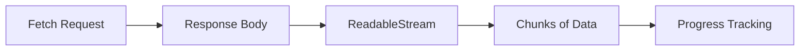

The process uses <kbd>response.body</kbd>, which returns a ReadableStream that provides the body content chunk by chunk as it arrives from the server.

---
hideInToc: true
---

# Key Components

   <div class="max-w-6xl mx-auto">
        <div class="bg-white rounded-xl shadow-lg overflow-hidden">
            <div class="overflow-x-auto">
                <table class="w-full divide-y divide-gray-200">
                    <thead>
                        <tr class="bg-gradient-to-r from-blue-600 to-blue-700">
                            <th class="px-6 py-4 text-left text-sm font-semibold text-white">Aspect</th>
                            <th class="px-6 py-4 text-left text-sm font-semibold text-white">ReadableStream Reader</th>
                            <th class="px-6 py-4 text-left text-sm font-semibold text-white">Reading Process</th>
                        </tr>
                    </thead>
                    <tbody class="divide-y divide-gray-200">
                        <tr class="hover:bg-gray-50 transition-colors">
                            <td class="px-6 py-4 text-sm font-medium text-gray-900">How it's obtained</td>
                            <td class="px-6 py-4 text-sm text-gray-700">
                                <code class="bg-gray-100 px-2 py-1 rounded text-blue-600">response.body.getReader()</code>
                            </td>
                            <td class="px-6 py-4 text-sm text-gray-700">Called repeatedly after obtaining the reader</td>
                        </tr>
                        <tr class="hover:bg-gray-50 transition-colors">
                            <td class="px-6 py-4 text-sm font-medium text-gray-900">Control</td>
                            <td class="px-6 py-4 text-sm text-gray-700">Provides control over the reading process</td>
                            <td class="px-6 py-4 text-sm text-gray-700">Returns chunks for each reading iteration</td>
                        </tr>
                        <tr class="hover:bg-gray-50 transition-colors">
                            <td class="px-6 py-4 text-sm font-medium text-gray-900">Data type</td>
                            <td class="px-6 py-4 text-sm text-gray-700">N/A (focuses on controlling reading)</td>
                            <td class="px-6 py-4 text-sm text-gray-700">
                                Returns chunks as <code class="bg-gray-100 px-2 py-1 rounded text-blue-600">Uint8Array</code>
                            </td>
                        </tr>
                        <tr class="hover:bg-gray-50 transition-colors">
                            <td class="px-6 py-4 text-sm font-medium text-gray-900">Tracking progress</td>
                            <td class="px-6 py-4 text-sm text-gray-700">
                                Allows counting of received data (e.g., <code class="bg-gray-100 px-2 py-1 rounded text-blue-600">receivedLength</code>)
                            </td>
                            <td class="px-6 py-4 text-sm text-gray-700">Tracks progress with cumulative chunk sizes</td>
                        </tr>
                        <tr class="hover:bg-gray-50 transition-colors">
                            <td class="px-6 py-4 text-sm font-medium text-gray-900">Completion status</td>
                            <td class="px-6 py-4 text-sm text-gray-700">N/A</td>
                            <td class="px-6 py-4 text-sm text-gray-700">
                                Tracks completion via the <code class="bg-gray-100 px-2 py-1 rounded text-blue-600">done</code> boolean flag
                            </td>
                        </tr>
                    </tbody>
                </table>
            </div>
        </div>
    </div>

---
hideInToc: true
---

# Practical Example

```js
async function downloadWithProgress(url) {
  const response = await fetch(url)
  const reader = response.body.getReader()
  const contentLength = +response.headers.get('Content-Length')

  let receivedLength = 0
  let debounceTimeout

  while (true) {
    const { done, value } = await reader.read()
    if (done) break
    receivedLength += value.length
    // Debounce the UI update to every 100ms
    clearTimeout(debounceTimeout)
    debounceTimeout = setTimeout(() => {
      updateProgressUI((receivedLength / contentLength) * 100)
    }, 100)
  }

  console.log('Download complete')
}
function updateProgressUI(progress) {
  console.log(`Downloaded: ${progress.toFixed(2)}%`)
}
```

---
hideInToc: true
---

#### Visual Representation of the Process

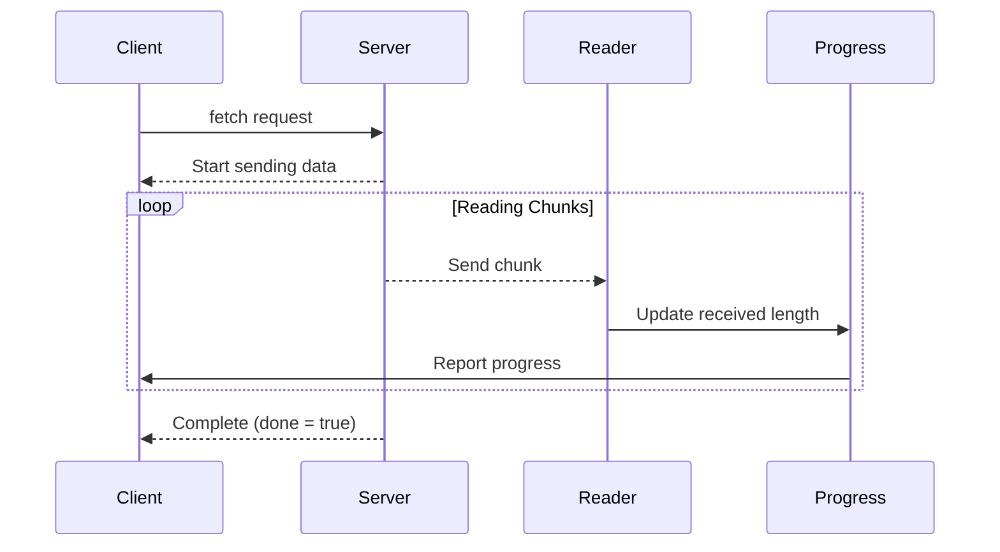

---
hideInToc: true
---

# Processing the Downloaded Data

<v-clicks>

##### After receiving all chunks, you have two main options:

````md magic-move
```js
// For Text/JSON Data
// Combine chunks into Uint8Array
const allChunks = new Uint8Array(receivedLength)
let position = 0

for (let chunk of chunks) {
  allChunks.set(chunk, position)
  position += chunk.length
}

// Convert to text
const result = new TextDecoder('utf-8').decode(allChunks)
```

```js
// For Binary Data
const blob = new Blob(chunks)
```
````

</v-clicks>

---
hideInToc: true
---

<BestPractices />

---
hideInToc: true
---

# Fetch: Cross-Origin Requests

#### CORS (Cross-Origin Resource Sharing) is a security feature implemented by web browsers that controls how web pages in one domain can request and interact with resources from another domain.

The Same-Origin Policy
An origin consists of three parts:

- Protocol (e.g., http:// or https://)
- Domain (e.g., example.com)
- Port (e.g., :80 or :443)

For example:<kbd>https://app.example.com:443</kbd>,<kbd>Protocol: https://</kbd>,<kbd>Domain: app.example.com</kbd>, <kbd>Port: 443</kbd>.

---
hideInToc: true
---

# Types of Cross-Origin Requests

1. Safe Requests
These requests must meet ALL of these criteria:
 <div class="container mx-auto max-w-4xl">
        <div class="bg-gradient-to-r from-gray-800 to-gray-900 rounded-xl shadow-2xl overflow-hidden border border-gray-700">      
  <div class="grid grid-cols-1 overflow-y-auto md:grid-cols-2 gap-8 p-6">
                <!-- Methods Section -->
                <div class="space-y-4">
                    <div class="flex items-center gap-3 mb-4">
                        <div class="bg-blue-500 h-8 w-1 rounded-full"></div>
                        <h2 class="text-xl font-bold text-white">Methods Allowed</h2>
                    </div>
                    <div class="space-y-3">
                        <div class="flex items-center gap-3 group">
                            <span class="bg-blue-500/10 text-blue-400 font-mono px-4 py-2 rounded-lg group-hover:bg-blue-500/20 transition-colors duration-150">GET</span>
                        </div>
                        <div class="flex items-center gap-3 group">
                            <span class="bg-green-500/10 text-green-400 font-mono px-4 py-2 rounded-lg group-hover:bg-green-500/20 transition-colors duration-150">POST</span>
                        </div>
                        <div class="flex items-center gap-3 group">
                            <span class="bg-purple-500/10 text-purple-400 font-mono px-4 py-2 rounded-lg group-hover:bg-purple-500/20 transition-colors duration-150">HEAD</span>
                        </div>
                    </div>
                </div>

  <div class="space-y-4">
                    <div class="flex items-center gap-3 mb-4">
                        <div class="bg-purple-500 h-8 w-1 rounded-full"></div>
                        <h2 class="text-xl font-bold text-white">Headers Allowed</h2>
                    </div>
                    <div class="space-y-3">
                        <div class="bg-gray-800/50 p-4 rounded-lg">
                            <div class="text-gray-300 hover:text-white transition-colors duration-150">Accept</div>
                        </div>
                        <div class="bg-gray-800/50 p-4 rounded-lg">
                            <div class="text-gray-300 hover:text-white transition-colors duration-150">Accept-Language</div>
                        </div>
                        <div class="bg-gray-800/50 p-4 rounded-lg">
                            <div class="text-gray-300 hover:text-white transition-colors duration-150">Content-Language</div>
                        </div>
                        <div class="bg-gray-800/50 p-4 rounded-lg space-y-2">
                            <div class="text-gray-300 hover:text-white transition-colors duration-150">Content-Type (allowed values):</div>
                            <div class="space-y-1 ml-4 text-sm">
                                <div class="text-blue-400 hover:text-blue-300 transition-colors duration-150">• application/x-www-form-urlencoded</div>
                                <div class="text-green-400 hover:text-green-300 transition-colors duration-150">• multipart/form-data</div>
                                <div class="text-purple-400 hover:text-purple-300 transition-colors duration-150">• text/plain</div>
                            </div>
                        </div>
                    </div>
                </div>
            </div>
        </div>
    </div>
```js
// Safe request
fetch('https://api.example.com/data')
  .then(response => response.json())
  .then(data => console.log(data));
```

---
hideInToc: true
---

# Unsafe Requests

Any request that doesn't meet the safe request criteria, such as:

- Using methods like PUT, DELETE, PATCH
- Using custom headers like API-Key
- Using different Content-Type values like application/json

````md magic-move
```js
// Unsafe request - will trigger preflight
fetch('https://api.example.com/data', {
  method: 'POST',
  headers: {
    'Content-Type': 'application/json',
    'API-Key': 'secret123', // Custom header
  },
  body: JSON.stringify({ name: 'John' }),
})
```

```js
// Unsafe - PUT method and JSON Content-Type
fetch('https://api.example.com/users/123', {
  method: 'PUT',
  headers: {
    'Content-Type': 'application/json', // Makes it unsafe
  },
  body: JSON.stringify({
    name: 'John',
    age: 30,
  }),
})
```
````

---
hideInToc: true
---

<h4>Unsafe Requests Flow (with Preflight)</h4>

<v-clicks>

<div className="max-w-md items-center  mx-auto ">

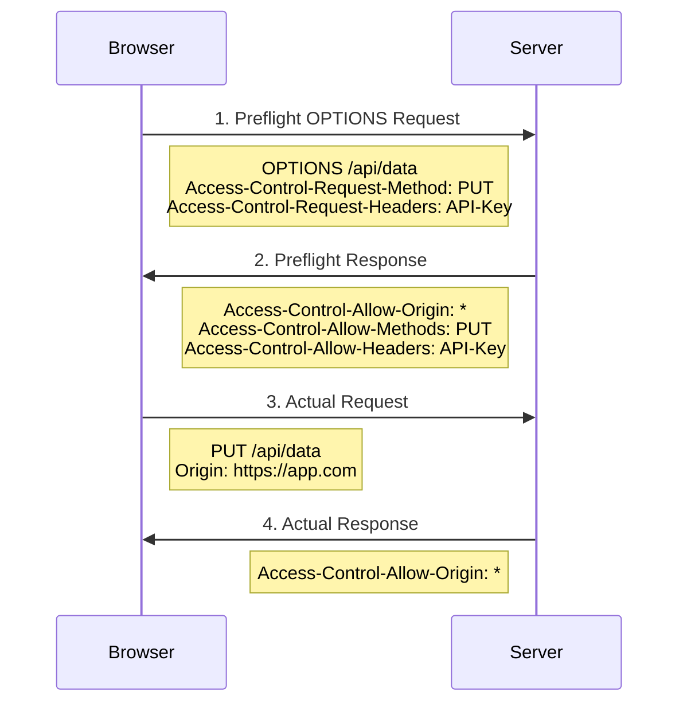

</div>
</v-clicks>

---
hideInToc: true
---

# Request With Credentials

```js
// Request with cookies
fetch('https://api.example.com/data', {
  credentials: 'include', // Sends cookies
})
```

<h2> Server Configuration Examples</h2>

````md magic-move
```js
// Basic CORS Setup (Express.js)
app.use((req, res, next) => {
  res.header('Access-Control-Allow-Origin', '*')
  res.header('Access-Control-Allow-Methods', 'GET, POST, PUT, DELETE')
  res.header('Access-Control-Allow-Headers', 'Content-Type, API-Key')
  next()
})
```

```js
// Handling Credentials
app.use((req, res, next) => {
  res.header('Access-Control-Allow-Origin', 'https://trusted-site.com')
  res.header('Access-Control-Allow-Credentials', 'true')
  next()
})
```
````

---
hideInToc: true
---

<div class="max-w-4xl mx-auto">
        <h2 class="text-2xl font-bold mb-4 text-white">CORS Best Practices</h2>
        <div class="overflow-hidden bg-white rounded-lg border border-gray-200 shadow-lg">
            <table class="min-w-full table-fixed border-collapse">
                <thead>
                    <tr class="bg-gray-800 text-white">
                        <th class="w-1/4 px-6 py-4 text-left text-sm font-semibold border-b border-gray-600">
                            Category
                        </th>
                        <th class="w-3/4 px-6 py-4 text-left text-sm font-semibold border-b border-gray-600">
                            Best Practices
                        </th>
                    </tr>
                </thead>
                <tbody class="divide-y divide-gray-200">
                    <!-- Security Row -->
                    <tr class="bg-red-50 border-b border-gray-200">
                        <td class="px-6 py-4 border-r border-gray-200">
                            <div class="flex items-center space-x-3">
                                <div class="flex-shrink-0 h-10 w-10 flex items-center justify-center rounded-full bg-red-100 text-red-600 font-bold">
                                    🔒
                                </div>
                                <div class="text-base font-semibold text-red-700">Security</div>
                            </div>
                        </td>
                        <td class="px-6 py-4">
                            <ul class="list-disc ml-4 space-y-2 text-red-900">
                                <li>Don't use <code class="bg-white px-2 py-1 rounded border border-red-200">Access-Control-Allow-Origin: *</code> with credentials</li>
                                <li>Explicitly list allowed methods and headers</li>
                                <li>Use specific origins instead of wildcards in production</li>
                            </ul>
                        </td>
                    </tr>
                    <!-- Performance Row -->
                    <tr class="bg-green-50 border-b border-gray-200">
                        <td class="px-6 py-4 border-r border-gray-200">
                            <div class="flex items-center space-x-3">
                                <div class="flex-shrink-0 h-10 w-10 flex items-center justify-center rounded-full bg-green-100 text-green-600 font-bold">
                                    ⚡
                                </div>
                                <div class="text-base font-semibold text-green-700">Performance</div>
                            </div>
                        </td>
                        <td class="px-6 py-4">
                            <ul class="list-disc ml-4 space-y-2 text-green-900">
                                <li>Use <code class="bg-white px-2 py-1 rounded border border-green-200">Access-Control-Max-Age</code> to cache preflight results</li>
                                <li>Minimize the number of preflight requests</li>
                                <li>Keep safe requests safe when possible</li>
                            </ul>
                        </td>
                    </tr>
                    <!-- Debugging Row -->
                    <tr class="bg-blue-50">
                        <td class="px-6 py-4 border-r border-gray-200">
                            <div class="flex items-center space-x-3">
                                <div class="flex-shrink-0 h-10 w-10 flex items-center justify-center rounded-full bg-blue-100 text-blue-600 font-bold">
                                    🔍
                                </div>
                                <div class="text-base font-semibold text-blue-700">Debugging</div>
                            </div>
                        </td>
                        <td class="px-6 py-4">
                            <ul class="list-disc ml-4 space-y-2 text-blue-900">
                                <li>Check browser console for CORS errors</li>
                                <li>Verify server headers in response</li>
                                <li>Use browser dev tools Network tab to inspect preflight requests</li>
                            </ul>
                        </td>
                    </tr>
                </tbody>
            </table>
        </div>
    </div>

---
hideInToc: true
---

# URL Handling

<v-clicks>

JavaScript provides a built-in URL class that makes working with URLs easier and safer. While you can use strings for URLs, the URL object provides convenient methods for parsing and manipulating URLs.

<div className="mx-auto w-56" >

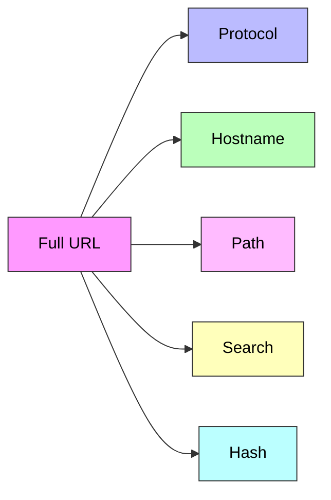

</div>

</v-clicks>

---
hideInToc: true
---

### Creating URL Objects

<v-clicks>

````md magic-move
```js
new URL(url, [base])
```

```js
// Direct URL creation
let url1 = new URL('https://example.com/profile/admin')

// Using base URL
let url2 = new URL('/profile/admin', 'https://example.com')

// Creating relative to existing URL
let baseUrl = new URL('https://example.com/profile/admin')
let newUrl = new URL('manager', baseUrl) // https://example.com/profile/manager
```
````

### Accessing URL Components

```js {monaco-run} {autorun:false}
let url = new URL('https://example.com/path?name=test#section')

console.log(url.protocol) // "https:"
console.log(url.hostname) // "example.com"
console.log(url.pathname) // "/path"
console.log(url.search) // "?name=test"
console.log(url.hash) // "#section"
```

</v-clicks>

---
hideInToc: true
---

##### The searchParams property provides a powerful interface for handling query parameters

<v-clicks>

```js {monaco-run} {autorun: false}
let url = new URL('https://example.com/search')

// Adding parameters using set (sets/replace the parameter)
url.searchParams.set('query', 'JavaScript Tutorial')
url.searchParams.set('category', 'programming')
// Adding a parameter with the same name using append
url.searchParams.append('tag', 'JavaScript')
url.searchParams.append('tag', 'Tutorial')
// Getting a parameter
console.log(url.searchParams.get('query')) // "JavaScript Tutorial"
// Getting all parameters with the same name
console.log(url.searchParams.getAll('tag')) // ["JavaScript", "Tutorial"]
// Checking for existence of a parameter
console.log(url.searchParams.has('category')) // true
// Deleting a parameter
url.searchParams.delete('category')
console.log(url.searchParams.has('category')) // false
// Sorting parameters by name
url.searchParams.sort()
console.log([...url.searchParams]) // Sorted parameter list
// The full URL with the query string
console.log(url.toString()) // https://example.com/search?query=JavaScript+Tutorial&tag=JavaScript&tag=Tutorial
```

</v-clicks>

---
hideInToc: true
---

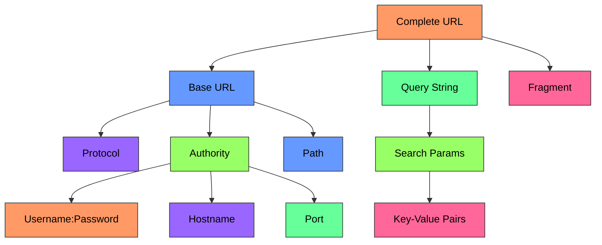

---
hideInToc: true
---

<div class="max-w-4xl mx-auto">
    
  <div class="bg-white rounded-lg shadow-lg border border-gray-200 h-[600px] flex flex-col">
            <!-- Fixed Header -->
            <div class="bg-gradient-to-r from-blue-500 to-blue-600 px-6 py-4 rounded-t-lg border-b border-blue-600">
                <h1 class="text-xl font-bold text-white text-center ">Three Levels Of URL Encoding</h1>
            </div>

   <div class="overflow-y-auto overflow-x-auto">
                <table class="min-w-full divide-y divide-gray-200 border-collapse">
                    <thead class="bg-gray-50 sticky top-0">
                        <tr class="divide-x divide-gray-200">
                            <th class="px-6 py-3 text-left text-xs font-medium text-gray-500 uppercase tracking-wider border-b bg-gray-50 w-1/3">
                                Method
                            </th>
                            <th class="px-6 py-3 text-left text-xs font-medium text-gray-500 uppercase tracking-wider border-b bg-gray-50 w-2/3">
                                Code Example
                            </th>
                        </tr>
                    </thead>
  <tbody class="bg-white divide-y divide-gray-200">
                        <tr class="hover:bg-gray-50 divide-x divide-gray-200">
                            <td class="px-6 py-4 whitespace-nowrap">
                                <div class="font-medium text-gray-900">Automatic Encoding</div>
                                <div class="text-sm text-gray-500">URL Object</div>
                            </td>
                            <td class="px-6 py-4">
                                <div class="bg-gray-50 rounded p-4 font-mono text-sm border border-gray-200">
                                    <div class="text-gray-800">let url = new URL('https://example.com/hello world');</div>
                                    <div class="text-gray-800">console.log(url.href);</div>
                                    <div class="text-gray-500 mt-2">// Output: https://example.com/hello%20world</div>
                                </div>
                            </td>
                        </tr>

   <tr class="hover:bg-gray-50 divide-x divide-gray-200">
                            <td class="px-6 py-4 whitespace-nowrap">
                                <div class="font-medium text-gray-900">Manual Full URL Encoding</div>
                                <div class="text-sm text-gray-500">encodeURI/decodeURI</div>
                            </td>
                            <td class="px-6 py-4">
                                <div class="bg-gray-50 rounded p-4 font-mono text-sm border border-gray-200">
                                    <div class="text-gray-500">// For full URLs</div>
                                    <div class="text-gray-800">let encoded = encodeURI('https://example.com/hello world');</div>
                                    <div class="text-gray-800">let decoded = decodeURI(encoded);</div>
                                </div>
                            </td>
                        </tr>

   <tr class="hover:bg-gray-50 divide-x divide-gray-200">
                            <td class="px-6 py-4 whitespace-nowrap">
                                <div class="font-medium text-gray-900">Manual Component Encoding</div>
                                <div class="text-sm text-gray-500">encodeURIComponent/decodeURIComponent</div>
                            </td>
                            <td class="px-6 py-4">
                                <div class="text-black rounded p-4 font-mono text-sm border border-gray-200">
                                    <div class="text-gray-500">// For URL components (parameters, fragments)</div>
                                    <div class="text-gray-800">let param = encodeURIComponent('user&name');</div>
                                    <div class="text-gray-500">// Output: user%26name</div>
                                    <div class="text-gray-800">let decoded = decodeURIComponent(param);</div>
                                    <div class="text-gray-500">// Output: user&name</div>
                                </div>
                            </td>
                        </tr>
                    </tbody>
                </table>
            </div>
            </div>
            </div>

---
hideInToc: true
---

<div class="max-w-4xl mb-5 mx-auto">
  <div class="bg-white rounded-lg shadow-lg border border-gray-200">
    <!-- Header -->
    <div class="bg-gradient-to-r from-green-600 to-green-700 px-6 py-1 rounded-t-lg">
      <h1 class="text-xl text-center font-bold text-white">Best Practices for URL Encoding</h1>
    </div>

  <div class="p-4 space-y-6 max-h-80 overflow-y-auto">
      <!-- URL Objects Section -->
      <div class="border rounded-lg overflow-hidden">
        <div class="bg-blue-50 px-6 py-3 border-b border-blue-100">
          <h2 class="text-lg font-semibold text-blue-800">Use URL Objects When You Need To:</h2>
        </div>
        <div class="px-6 py-4 bg-white">
          <ul class="space-y-3">
            <li class="flex items-start">
              <span class="text-blue-500 mr-2">•</span>
              <span class="text-gray-700">Parse URLs</span>
            </li>
            <li class="flex items-start">
              <span class="text-blue-500 mr-2">•</span>
              <span class="text-gray-700">Modify URL components</span>
            </li>
            <li class="flex items-start">
              <span class="text-blue-500 mr-2">•</span>
              <span class="text-gray-700">Work with search parameters</span>
            </li>
            <li class="flex items-start">
              <span class="text-blue-500 mr-2">•</span>
              <span class="text-gray-700">Handle automatic encoding</span>
            </li>
          </ul>
        </div>
      </div>

  <div class="border rounded-lg">
        <div class="bg-purple-50 px-6 py-3 border-b border-purple-100">
          <h2 class="text-lg font-semibold text-purple-800">Use encodeURIComponent for:</h2>
        </div>
        <div class="px-6 py-4 bg-white">
          <ul class="space-y-3">
            <li class="flex items-start">
              <span class="text-purple-500 mr-2">•</span>
              <span class="text-gray-700">URL parameters</span>
            </li>
            <li class="flex items-start">
              <span class="text-purple-500 mr-2">•</span>
              <span class="text-gray-700">Any component that might contain special characters</span>
            </li>
          </ul>
        </div>
      </div>

  <div class="border rounded-lg">
        <div class="bg-indigo-50 px-6 py-3 border-b border-indigo-100">
          <h2 class="text-lg font-semibold text-indigo-800">Use encodeURI for:</h2>
        </div>
        <div class="px-6 py-4 bg-white">
          <ul class="space-y-3">
            <li class="flex items-start">
              <span class="text-indigo-500 mr-2">•</span>
              <span class="text-gray-700">Encoding full URLs that contain international characters</span>
            </li>
          </ul>
        </div>
      </div>
    </div>
  </div>
</div>

<Tips  type="tip"> Always test your encoded URLs with special characters and international characters to ensure proper encoding and decoding.</Tips>

---
hideInToc: true
---

<div class="max-w-4xl mx-auto p-6">
  <h2 class="text-2xl font-bold mb-4">Character Encoding Comparison</h2>
  <table class="min-w-full table-auto border-collapse border border-gray-300">
    <thead>
      <tr class="bg-blue-500">
        <th class="border border-gray-300 px-4 py-2 text-left">Character</th>
        <th class="border border-gray-300 px-4 py-2 text-left">encodeURI</th>
        <th class="border border-gray-300 px-4 py-2 text-left">encodeURIComponent</th>
      </tr>
    </thead>
    <tbody>
      <tr class="bg-gray-100 text-black">
        <td class="border border-gray-300 px-4 py-2">Space (` `)</td>
        <td class="border border-gray-300 px-4 py-2">%20</td>
        <td class="border border-gray-300 px-4 py-2">%20</td>
      </tr>
      <tr class="bg-gray-100 text-black">
        <td class="border border-gray-300 px-4 py-2">/</td>
        <td class="border border-gray-300 px-4 py-2">/</td>
        <td class="border border-gray-300 px-4 py-2">%2F</td>
      </tr>
      <tr class="bg-gray-100 text-black">
        <td class="border border-gray-300 px-4 py-2">?</td>
        <td class="border border-gray-300 px-4 py-2">?</td>
        <td class="border border-gray-300 px-4 py-2">%3F</td>
      </tr>
      <tr class="bg-gray-100 text-black">
        <td class="border border-gray-300 px-4 py-2">#</td>
        <td class="border border-gray-300 px-4 py-2">#</td>
        <td class="border border-gray-300 px-4 py-2">%23</td>
      </tr>
      <tr class="bg-gray-100 text-black">
        <td class="border border-gray-300 px-4 py-2">&</td>
        <td class="border border-gray-300 px-4 py-2">&</td>
        <td class="border border-gray-300 px-4 py-2">%26</td>
      </tr>
    </tbody>
  </table>
</div>

<Tips type="info"> The URL object is generally the safest and most convenient way to handle URLs in modern JavaScript, as it handles encoding automatically and provides a clean interface for URL manipulation.</Tips>

---
hideInToc: true
---

# XMLHttpRequest

<v-clicks>
XMLHttpRequest (XHR) is a built-in browser object that enables making HTTP requests in JavaScript. Despite its name, it can handle any type of data, not just XML.

<Tips type="tip">While XHR is still widely used, the modern fetch API is now preferred for new projects. XHR is mainly used for:

<ul>
<li>Supporting legacy code</li>
<li>Browser compatibility without polyfills</li>
<li>Specific features not available in fetch (e.g., upload progress tracking)</li>
</ul>
</Tips>

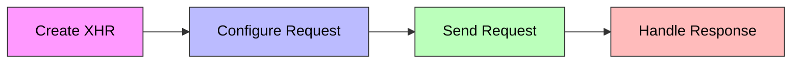

</v-clicks>

---
hideInToc: true
---

# Example

```js {monaco-run} {autorun: false}
// 1. Create XHR object
let xhr = new XMLHttpRequest()

// 2. Configure the request
xhr.open('GET', '/api/data')

// 3. Set up event handlers
xhr.onload = function () {
  if (xhr.status === 200) {
    console.log('Success:', xhr.response)
  }
}

xhr.onerror = function () {
  console.error('Request failed')
}

// 4. Send the request
xhr.send()
```

---
hideInToc: true
---

# XHR Lifecycle

<v-clicks>

<div class=" mx-auto max-w-xs">

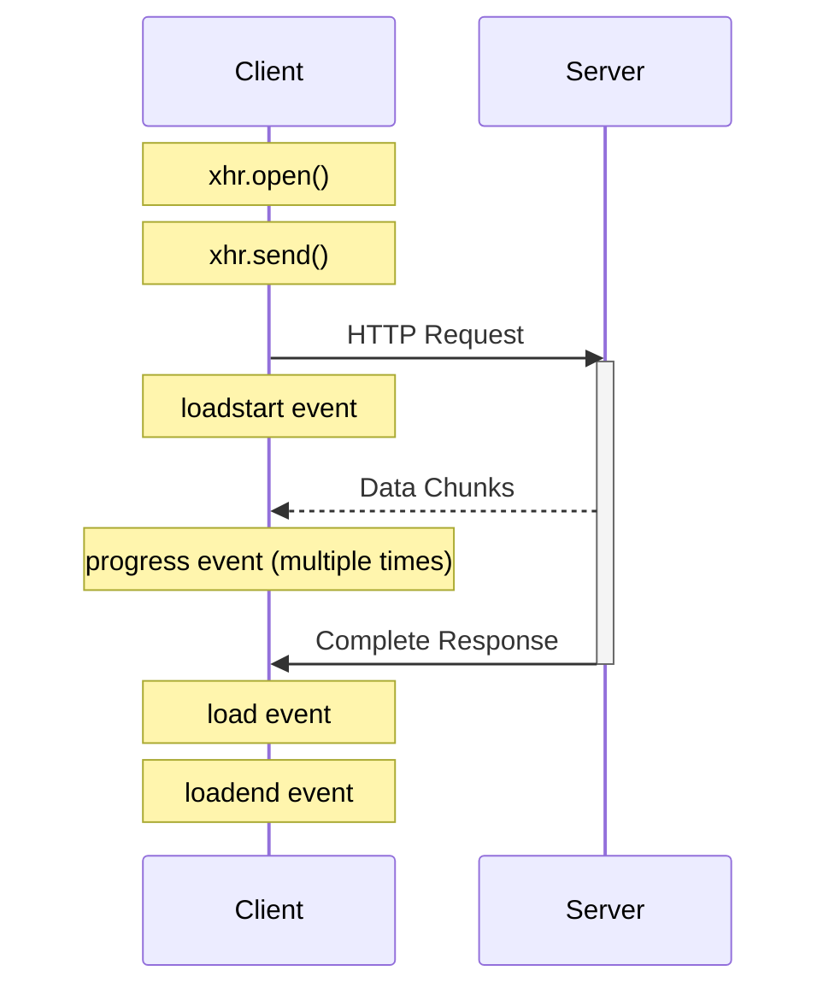

</div>

</v-clicks>

---
hideInToc: true
---

# Key Components

<v-clicks>

 <h4 class="text-2xl font-bold  text-white">Response Types</h4>
 <div class="flex gap-10">
<div class="basis-2/4 mx-auto">
  <table class="min-w-full table-auto border-collapse border border-gray-300  shadow-lg">
    <thead>
      <tr class="bg-blue-600">
        <th class="border border-gray-300 px-6 py-3 text-left text-white font-semibold">Response Type</th>
        <th class="border border-gray-300 px-6 py-3 text-left text-white font-semibold">Description</th>
      </tr>
    </thead>
    <tbody>
      <tr class="bg-white">
        <td class="border border-gray-300 px-6 py-4 text-gray-800"><kbd>""</kbd> or <kbd>text</kbd></td>
        <td class="border border-gray-300 px-6 py-4 text-gray-600">String response (plain text)</td>
      </tr>
      <tr class="bg-gray-50">
        <td class="border border-gray-300 px-6 py-4 text-gray-800"><kbd>json</kbd></td>
        <td class="border border-gray-300 px-6 py-4 text-gray-600">Parsed JSON object</td>
      </tr>
      <tr class="bg-gray-50">
        <td class="border border-gray-300 px-6 py-4 text-gray-800"><kbd>document</kbd></td>
        <td class="border border-gray-300 px-6 py-4 text-gray-600">XML/HTML document</td>
      </tr>
      <tr class="bg-gray-50">
        <td class="border border-gray-300 px-6 py-4 text-gray-800"><kbd>blob</kbd></td>
        <td class="border border-gray-300 px-6 py-4 text-gray-600">Binary data (file-like)</td>
      </tr>
      <tr class="bg-gray-50">
        <td class="border border-gray-300 px-6 py-4 text-gray-800"><kbd>arraybuffer</kbd></td>
        <td class="border border-gray-300 px-6 py-4 text-gray-600">Binary data (raw memory)</td>
      </tr>
    </tbody>
  </table>
</div>

<div class="basis-2/4">
```js 
let xhr = new XMLHttpRequest();
xhr.responseType = 'json';
xhr.open('GET', '/api/data');
xhr.onload = () => console.log(xhr.response);
 // Automatically parsed JSON
xhr.send();
```
</div>

</div>

</v-clicks>

---
hideInToc: true
---

<h2 class="text-2xl font-bold text-white">Progress Event Handlers</h2>

<div class="max-w-2xl">
  <table class="min-w-full  table-auto border-collapse border border-gray-300 shadow-lg">
    <thead>
      <tr class="bg-blue-600">
        <th class="border border-gray-300 px-6 py-3 text-left text-white font-semibold">Type</th>
        <th class="border border-gray-300 px-6 py-3 text-left text-white font-semibold">Code</th>
      </tr>
    </thead>
    <tbody>
      <!-- Download Progress Row -->
      <tr class="bg-white">
        <td class="border border-gray-300 px-6 text-gray-800">Download Progress</td>
        <td class="border border-gray-300 px-6 text-gray-600">
          <pre class="rounded-lg text-black text-sm">
            <code class="bg-black text-white" >
xhr.onprogress = function(event) {
    if (event.lengthComputable) {
        let percentComplete = (event.loaded / event.total) * 100;
        console.log(`Downloaded: ${percentComplete}%`);
    }
};
            </code>
          </pre>
        </td>
      </tr>
      
      
  <tr class="bg-gray-50">
        <td class="border border-gray-300 px-6 text-gray-800">Upload Progress</td>
        <td class="border border-gray-300 px-6 text-gray-600">
          <pre class="rounded-lg text-sm text-black">
            <code class="bg-black text-white">
xhr.upload.onprogress = function(event) {
    if (event.lengthComputable) {
        let percentComplete = (event.loaded / event.total) * 100;
        console.log(`Uploaded: ${percentComplete}%`);
    }
};
            </code>
          </pre>
        </td>
      </tr>
    </tbody>
  </table>
</div>

---
hideInToc: true
---

# Handling POST Requests

<v-clicks>

#### Using FormData

```js
let formData = new FormData()
formData.append('username', 'john_doe')
formData.append('age', 25)

let xhr = new XMLHttpRequest()
xhr.open('POST', '/api/submit')
xhr.send(formData)
```

#### Using JSON

```js
let data = {
  username: 'john_doe',
  age: 25,
}

let xhr = new XMLHttpRequest()
xhr.open('POST', '/api/submit')
xhr.setRequestHeader('Content-Type', 'application/json')
xhr.send(JSON.stringify(data))
```

</v-clicks>

---
hideInToc: true
---

## Ready States

<div class="max-w-xs mx-auto">

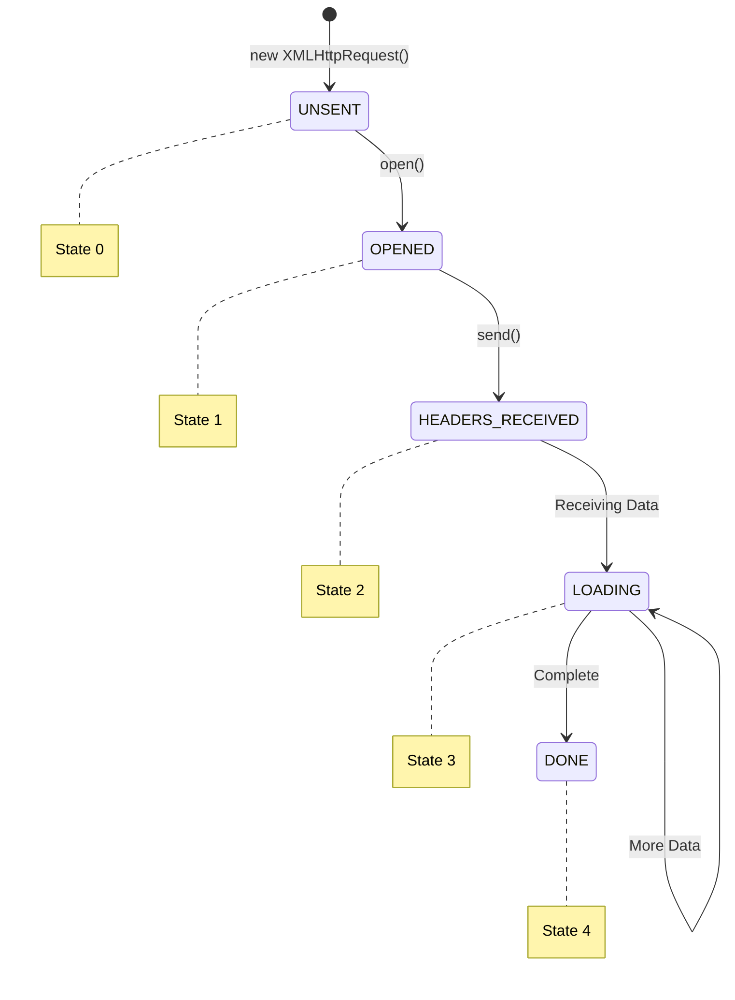

</div>

---
hideInToc: true
---

<div class="max-w-7xl mx-auto">

  <div class="bg-white rounded-xl shadow-lg overflow-hidden">
            
  <div class="bg-gradient-to-r from-purple-600 to-purple-800 p-6">
                <h1 class="text-2xl font-bold text-white">XMLHttpRequest Event Lifecycle</h1>
            </div>
  <div class="overflow-auto max-h-[600px]">
                <table class="w-full border-collapse">
                    <thead class="sticky top-0 bg-purple-50">
                        <tr>
                            <th class="text-left p-4 text-purple-900 font-semibold border-b">Event</th>
                            <th class="text-left p-4 text-purple-900 font-semibold border-b">Description</th>
                            <th class="text-left p-4 text-purple-900 font-semibold border-b">Code Example</th>
                        </tr>
                    </thead>
                    <tbody class="divide-y divide-gray-100">
                      
   <tr class="hover:bg-purple-50/50 transition-colors">
                            <td class="p-4">
                                <span class="font-mono text-purple-700 bg-purple-100 px-2 py-1 rounded">loadstart</span>
                            </td>
                            <td class="p-4 text-gray-600">Request has started</td>
                            <td class="p-4">
                                <div class="bg-gray-100 rounded-lg p-3">
                                    <kbd class="font-mono text-sm text-gray-800">xhr.onloadstart = function() {</kbd>
                                    <br>
                                    <kbd class="font-mono text-sm text-gray-800 pl-4">console.log('Request started');</kbd>
                                    <br>
                                    <kbd class="font-mono text-sm text-gray-800">};</kbd>
                                </div>
                            </td>
                        </tr>

  <tr class="hover:bg-purple-50/50 transition-colors">
                            <td class="p-4">
                                <span class="font-mono text-purple-700 bg-purple-100 px-2 py-1 rounded">progress</span>
                            </td>
                            <td class="p-4 text-gray-600">Data packet received, response body available in response property</td>
                            <td class="p-4">
                                <div class="bg-gray-100 rounded-lg p-3">
                                    <kbd class="font-mono text-sm text-gray-800">xhr.onprogress = function(event) {</kbd>
                                    <br>
                                    <kbd class="font-mono text-sm text-gray-800 pl-4">if (event.lengthComputable) {</kbd>
                                    <br>
                                    <kbd class="font-mono text-sm text-gray-800 pl-8">const progress = (event.loaded / event.total) * 100;</kbd>
                                    <br>
                                    <kbd class="font-mono text-sm text-gray-800 pl-8">console.log(`Progress: ${progress}%`);</kbd>
                                    <br>
                                    <kbd class="font-mono text-sm text-gray-800 pl-4">}</kbd>
                                    <br>
                                    <kbd class="font-mono text-sm text-gray-800">};</kbd>
                                </div>
                            </td>
                        </tr>

  <tr class="hover:bg-purple-50/50 transition-colors">
                            <td class="p-4">
                                <span class="font-mono text-purple-700 bg-purple-100 px-2 py-1 rounded">abort</span>
                            </td>
                            <td class="p-4 text-gray-600">Request was canceled by xhr.abort()</td>
                            <td class="p-4">
                                <div class="bg-gray-100 rounded-lg p-3">
                                    <kbd class="font-mono text-sm text-gray-800">xhr.onabort = function() {</kbd>
                                    <br>
                                    <kbd class="font-mono text-sm text-gray-800 pl-4">console.log('Request aborted');</kbd>
                                    <br>
                                    <kbd class="font-mono text-sm text-gray-800">};</kbd>
                                </div>
                            </td>
                        </tr>

   <tr class="hover:bg-purple-50/50 transition-colors">
                            <td class="p-4">
                                <span class="font-mono text-purple-700 bg-purple-100 px-2 py-1 rounded">error</span>
                            </td>
                            <td class="p-4 text-gray-600">Connection error occurred (e.g., wrong domain). Not for HTTP errors like 404</td>
                            <td class="p-4">
                                <div class="bg-gray-100 rounded-lg p-3">
                                    <kbd class="font-mono text-sm text-gray-800">xhr.onerror = function() {</kbd>
                                    <br>
                                    <kbd class="font-mono text-sm text-gray-800 pl-4">console.log('Network error occurred');</kbd>
                                    <br>
                                    <kbd class="font-mono text-sm text-gray-800">};</kbd>
                                </div>
                            </td>
                        </tr>

  <tr class="hover:bg-purple-50/50 transition-colors">
                            <td class="p-4">
                                <span class="font-mono text-purple-700 bg-purple-100 px-2 py-1 rounded">load</span>
                            </td>
                            <td class="p-4 text-gray-600">Request completed successfully</td>
                            <td class="p-4">
                                <div class="bg-gray-100 rounded-lg p-3">
                                    <kbd class="font-mono text-sm text-gray-800">xhr.onload = function() {</kbd>
                                    <br>
                                    <kbd class="font-mono text-sm text-gray-800 pl-4">if (xhr.status === 200) {</kbd>
                                    <br>
                                    <kbd class="font-mono text-sm text-gray-800 pl-8">console.log('Data received:', xhr.response);</kbd>
                                    <br>
                                    <kbd class="font-mono text-sm text-gray-800 pl-4">}</kbd>
                                    <br>
                                    <kbd class="font-mono text-sm text-gray-800">};</kbd>
                                </div>
                            </td>
                        </tr>

   <tr class="hover:bg-purple-50/50 transition-colors">
                            <td class="p-4">
                                <span class="font-mono text-purple-700 bg-purple-100 px-2 py-1 rounded">timeout</span>
                            </td>
                            <td class="p-4 text-gray-600">Request canceled due to timeout (only if timeout was set)</td>
                            <td class="p-4">
                                <div class="bg-gray-100 rounded-lg p-3">
                                    <kbd class="font-mono text-sm text-gray-800">xhr.timeout = 5000; // 5 seconds</kbd>
                                    <br>
                                    <kbd class="font-mono text-sm text-gray-800">xhr.ontimeout = function() {</kbd>
                                    <br>
                                    <kbd class="font-mono text-sm text-gray-800 pl-4">console.log('Request timed out');</kbd>
                                    <br>
                                    <kbd class="font-mono text-sm text-gray-800">};</kbd>
                                </div>
                            </td>
                        </tr>

  <tr class="hover:bg-purple-50/50 transition-colors">
                            <td class="p-4">
                                <span class="font-mono text-purple-700 bg-purple-100 px-2 py-1 rounded">loadend</span>
                            </td>
                            <td class="p-4 text-gray-600">Triggers after load, error, timeout or abort</td>
                            <td class="p-4">
                                <div class="bg-gray-100 rounded-lg p-3">
                                    <kbd class="font-mono text-sm text-gray-800">xhr.onloadend = function() {</kbd>
                                    <br>
                                    <kbd class="font-mono text-sm text-gray-800 pl-4">console.log('Request completed');</kbd>
                                    <br>
                                    <kbd class="font-mono text-sm text-gray-800">};</kbd>
                                </div>
                            </td>
                        </tr>
                    </tbody>
                </table>
            </div>
        </div>
    </div>

---
hideInToc: true
---

<div class="max-w-7xl mx-auto bg-white rounded-xl shadow-lg">
       
   <div class="bg-gradient-to-r from-blue-600 to-blue-800 rounded-t-xl">
            <h1 class="text-xl text-center font-semibold text-white">XHR Best Practices</h1>
        </div>

 <div class="overflow-auto max-h-[600px] rounded-b-xl">
            <table class="w-full border-collapse">
                
   <thead class="sticky top-0 bg-slate-50 shadow-sm">
                    <tr>
                        <th class="text-left p-4 text-slate-700 font-semibold">Best Practice</th>
                        <th class="text-left p-4 text-slate-700 font-semibold">Code Example</th>
                        <th class="text-left p-4 text-slate-700 font-semibold">Description</th>
                    </tr>
                </thead>

   <tbody class="divide-y divide-slate-100">
                   
   <tr class="hover:bg-slate-50 transition-colors">
                        <td class="p-4 text-slate-800 font-medium">Error Handling</td>
                        <td class="p-4">
                            <div class="bg-slate-100 rounded-lg p-3 font-mono text-sm">
                                <kbd class="text-slate-800">xhr.onerror = function() {</kbd>
                                <br>
                                <kbd class="text-slate-800 pl-4">console.error('Network error occurred');</kbd>
                                <br>
                                <kbd class="text-slate-800">};</kbd>
                            </div>
                        </td>
                        <td class="p-4 text-slate-600">Handles network failures gracefully</td>
                    </tr>

   <tr class="hover:bg-slate-50 transition-colors">
                        <td class="p-4 text-slate-800 font-medium">Request Timeouts</td>
                        <td class="p-4">
                            <div class="bg-slate-100 rounded-lg p-3 font-mono text-sm">
                                <kbd class="text-slate-800">xhr.timeout = 5000;</kbd>
                                <br>
                                <kbd class="text-slate-800">xhr.ontimeout = function() {</kbd>
                                <br>
                                <kbd class="text-slate-800 pl-4">console.error('Request timed out');</kbd>
                                <br>
                                <kbd class="text-slate-800">};</kbd>
                            </div>
                        </td>
                        <td class="p-4 text-slate-600">Prevents infinite request waiting</td>
                    </tr>

  <tr class="hover:bg-slate-50 transition-colors">
                        <td class="p-4 text-slate-800 font-medium">Response Types</td>
                        <td class="p-4">
                            <div class="bg-slate-100 rounded-lg p-3 font-mono text-sm">
                                <kbd class="text-slate-800">xhr.responseType = 'json';</kbd>
                                <br>
                                <kbd class="text-slate-800">// For JSON APIs</kbd>
                                <br>
                                <kbd class="text-slate-800">xhr.responseType = 'blob';</kbd>
                                <br>
                                <kbd class="text-slate-800">// For file downloads</kbd>
                            </div>
                        </td>
                        <td class="p-4 text-slate-600">Sets appropriate data format</td>
                    </tr>

   <tr class="hover:bg-slate-50 transition-colors">
                        <td class="p-4 text-slate-800 font-medium">CORS Handling</td>
                        <td class="p-4">
                            <div class="bg-slate-100 rounded-lg p-3 font-mono text-sm">
                                <kbd class="text-slate-800">xhr.withCredentials = true;</kbd>
                                <br>
                                <kbd class="text-slate-800">// For cross-origin requests</kbd>
                            </div>
                        </td>
                        <td class="p-4 text-slate-600">Manages cross-origin requests</td>
                    </tr>

  <tr class="hover:bg-slate-50 transition-colors">
                        <td class="p-4 text-slate-800 font-medium">Progress Tracking</td>
                        <td class="p-4">
                            <div class="bg-slate-100 rounded-lg p-3 font-mono text-sm">
                                <kbd class="text-slate-800">xhr.onprogress = function(e) {</kbd>
                                <br>
                                <kbd class="text-slate-800 pl-4">if (e.lengthComputable) {</kbd>
                                <br>
                                <kbd class="text-slate-800 pl-8">const progress = (e.loaded / e.total) * 100;</kbd>
                                <br>
                                <kbd class="text-slate-800 pl-8">console.log(progress + '%');</kbd>
                                <br>
                                <kbd class="text-slate-800 pl-4">}</kbd>
                                <br>
                                <kbd class="text-slate-800">};</kbd>
                            </div>
                        </td>
                        <td class="p-4 text-slate-600">Tracks request progress</td>
                    </tr>

   </tbody>
            </table>
        </div>
    </div>

---
hideInToc: true
---

# Resumable File Upload Guide

##### A resumable file upload system allows users to continue uploading files from where they left off if the connection is interrupted. This is particularly useful for:

- Large file uploads
- Unreliable network connections
- Mobile devices
- Saving bandwidth

---
hideInToc: true
---

<div class="w-72 mx-auto ">

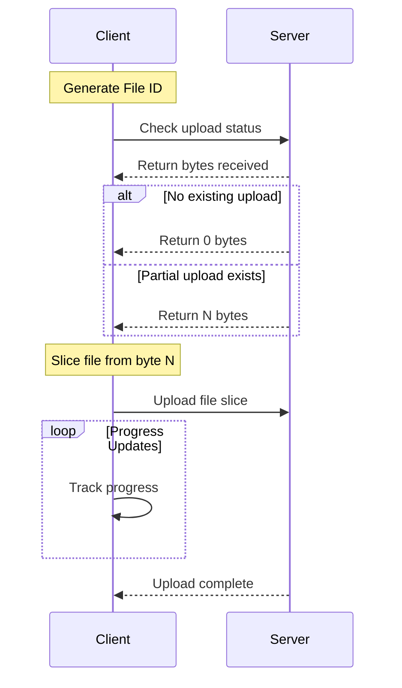

</div>

---
hideInToc: true
---

1. File Identification

<v-clicks>

```js
// Generate a unique file ID
const fileId = `${file.name}-${file.size}-${file.lastModified}`
```

This ID helps the server track partial uploads across sessions.

2. Status Check
   Before starting/resuming an upload, check how many bytes the server already has:

```js
async function checkUploadStatus(fileId) {
  const response = await fetch('status', {
    headers: {
      'X-File-Id': fileId,
    },
  })

  // Server returns the number of bytes received
  return parseInt(await response.text())
}
```

</v-clicks>

---
hideInToc: true
---

3. Resumable Upload Implementation

```js
async function uploadFile(file) {
  // 1. Generate file ID
  const fileId = `${file.name}-${file.size}-${file.lastModified}`

  // 2. Check existing upload
  const startByte = await checkUploadStatus(fileId)

  // 3. Create upload request
  const xhr = new XMLHttpRequest()
  xhr.open('POST', 'upload')
  // 4. Set headers for resuming
  xhr.setRequestHeader('X-File-Id', fileId)
  xhr.setRequestHeader('X-Start-Byte', startByte)
  // 5. Progress tracking
  xhr.upload.onprogress = (event) => {
    const total = startByte + event.total
    const loaded = startByte + event.loaded
    const progress = (loaded / total) * 100
    updateProgressBar(progress)
  }
  // 6. Send sliced file
  xhr.send(file.slice(startByte))
  return new Promise((resolve, reject) => {
    xhr.onload = () => resolve()
    xhr.onerror = () => reject()
  })
}
```

---
hideInToc: true
---

# Progress Visualization

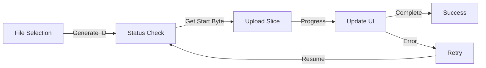

### Server-side Considerations

The server needs to:

- Track partial uploads using the file ID
- Support byte range requests
- Handle concurrent uploads
- Manage temporary storage
- Clean up incomplete uploads

---
hideInToc: true
---

# Example

```js
// node js
app.post('/upload', (req, res) => {
  const fileId = req.headers['x-file-id']
  const startByte = parseInt(req.headers['x-start-byte']) || 0
  const fileStream = fs.createWriteStream(fileId, {
    flags: startByte === 0 ? 'w' : 'r+',
    start: startByte,
  })

  req.pipe(fileStream)

  fileStream.on('finish', () => {
    res.send('Upload complete')
  })
})
```

---
hideInToc: true
---

<div class="max-w-7xl mx-auto h-screen p-4">
  <div class="bg-white rounded-xl shadow-lg overflow-hidden h-[600px] flex flex-col">
    <div class="bg-gradient-to-r from-emerald-600 to-emerald-800 p-2 flex-shrink-0">
      <h1 class="text-2xl font-bold text-white">File Upload Best Practices</h1>
    </div>
    
    
  <div class="overflow-y-auto flex-1">
      <div class="grid md:grid-cols-2 gap-6 p-6">  
        <div class="bg-gray-50 rounded-xl p-6 hover:shadow-md transition-shadow">
          <div class="flex items-center gap-3 mb-4">
            <span class="bg-emerald-100 text-emerald-700 rounded-full px-3 py-1 text-sm font-medium">1</span>
            <h2 class="text-xl font-bold text-gray-800">Chunk Size</h2>
          </div>
          <div class="space-y-4">
            <p class="text-gray-600 font-medium">Choose appropriate chunk size based on:</p>
            <ul class="space-y-3 text-gray-700">
              <li class="flex items-start gap-2">
                <span class="text-emerald-500">•</span>
                <div>
                  <span class="font-medium">Network conditions</span>
                  <p class="text-sm text-gray-600 mt-1">Adjust chunk size dynamically based on connection speed</p>
                </div>
              </li>
              <li class="flex items-start gap-2">
                <span class="text-emerald-500">•</span>
                <div>
                  <span class="font-medium">File size</span>
                  <p class="text-sm text-gray-600 mt-1">Larger files may benefit from bigger chunks</p>
                </div>
              </li>
              <li class="flex items-start gap-2">
                <span class="text-emerald-500">•</span>
                <div>
                  <span class="font-medium">Server capabilities</span>
                  <p class="text-sm text-gray-600 mt-1">Consider server processing and memory limits</p>
                </div>
              </li>
            </ul>
          </div>
        </div>

   <div class="bg-gray-50 rounded-xl p-6 hover:shadow-md transition-shadow">
          <div class="flex items-center gap-3 mb-4">
            <span class="bg-emerald-100 text-emerald-700 rounded-full px-3 py-1 text-sm font-medium">2</span>
            <h2 class="text-xl font-bold text-gray-800">Error Handling</h2>
          </div>
          <div class="space-y-4">
            <ul class="space-y-3 text-gray-700">
              <li class="flex items-start gap-2">
                <span class="text-emerald-500">•</span>
                <div>
                  <span class="font-medium">Implement retry logic</span>
                  <p class="text-sm text-gray-600 mt-1">Automatically retry failed chunks</p>
                  <div class="bg-gray-100 rounded p-2 mt-2">
                    <kbd class="text-sm font-mono">
                      maxRetries = 3;<br>
                      retryDelay = 1000; // ms
                    </kbd>
                  </div>
                </div>
              </li>
              <li class="flex items-start gap-2">
                <span class="text-emerald-500">•</span>
                <div>
                  <span class="font-medium">Add exponential backoff</span>
                  <p class="text-sm text-gray-600 mt-1">Increase delay between retries</p>
                </div>
              </li>
              <li class="flex items-start gap-2">
                <span class="text-emerald-500">•</span>
                <div>
                  <span class="font-medium">Handle timeout errors</span>
                  <p class="text-sm text-gray-600 mt-1">Set appropriate timeout limits</p>
                </div>
              </li>
            </ul>
          </div>
        </div>

   <div class="bg-gray-50 rounded-xl p-6 hover:shadow-md transition-shadow">
          <div class="flex items-center gap-3 mb-4">
            <span class="bg-emerald-100 text-emerald-700 rounded-full px-3 py-1 text-sm font-medium">3</span>
            <h2 class="text-xl font-bold text-gray-800">Security</h2>
          </div>
          <div class="space-y-4">
            <ul class="space-y-3 text-gray-700">
              <li class="flex items-start gap-2">
                <span class="text-emerald-500">•</span>
                <div>
                  <span class="font-medium">Validate file types</span>
                  <p class="text-sm text-gray-600 mt-1">Check MIME types and file extensions</p>
                  <div class="bg-gray-100 rounded p-2 mt-2">
                    <kbd class="text-sm font-mono">
                      allowedTypes = ['image/jpeg', 'image/png'];
                    </kbd>
                  </div>
                </div>
              </li>
              <li class="flex items-start gap-2">
                <span class="text-emerald-500">•</span>
                <div>
                  <span class="font-medium">Implement authentication</span>
                  <p class="text-sm text-gray-600 mt-1">Secure upload endpoints</p>
                </div>
              </li>
              <li class="flex items-start gap-2">
                <span class="text-emerald-500">•</span>
                <div>
                  <span class="font-medium">Set upload size limits</span>
                  <p class="text-sm text-gray-600 mt-1">Prevent server overload</p>
                </div>
              </li>
            </ul>
          </div>
        </div>

  <div class="bg-gray-50 rounded-xl p-6 hover:shadow-md transition-shadow">
          <div class="flex items-center gap-3 mb-4">
            <span class="bg-emerald-100 text-emerald-700 rounded-full px-3 py-1 text-sm font-medium">4</span>
            <h2 class="text-xl font-bold text-gray-800">User Experience</h2>
          </div>
          <div class="space-y-4">
            <ul class="space-y-3 text-gray-700">
              <li class="flex items-start gap-2">
                <span class="text-emerald-500">•</span>
                <div>
                  <span class="font-medium">Show clear progress indication</span>
                  <p class="text-sm text-gray-600 mt-1">Display upload progress and remaining time</p>
                  <div class="mt-2 bg-gray-200 rounded-full h-4 overflow-hidden">
                    <div class="bg-emerald-500 w-3/4 h-full rounded-full"></div>
                  </div>
                </div>
              </li>
              <li class="flex items-start gap-2">
                <span class="text-emerald-500">•</span>
                <div>
                  <span class="font-medium">Provide cancel option</span>
                  <p class="text-sm text-gray-600 mt-1">Allow users to abort uploads</p>
                </div>
              </li>
              <li class="flex items-start gap-2">
                <span class="text-emerald-500">•</span>
                <div>
                  <span class="font-medium">Display error messages</span>
                  <p class="text-sm text-gray-600 mt-1">Clear feedback on failures</p>
                </div>
              </li>
              <li class="flex items-start gap-2">
                <span class="text-emerald-500">•</span>
                <div>
                  <span class="font-medium">Enable pause/resume controls</span>
                  <p class="text-sm text-gray-600 mt-1">Allow interruption of large uploads</p>
                </div>
              </li>
            </ul>
          </div>
        </div>
      </div>
    </div>
  </div>
</div>

---
hideInToc: true
---

# Understanding Long Polling

<v-clicks>

#### Regular Polling

<h5> Regular polling is like a child repeatedly asking "Are we there yet?" every few minutes during a car ride. In technical terms, the client sends regular requests to the server at fixed intervals (e.g., every 10 seconds) to check for new information.</h5>

#### Limitations of Regular Polling:

- Message delays (up to polling interval)
- Unnecessary server load
- Wasted resources when no new data is available

#### Long Polling: A Better Alternative

#### What is Long Polling?

Long polling is an improved version of regular polling where the server holds the connection open until it has new data to send. Think of it like saying "I'll call you when dinner is ready" instead of asking "Is dinner ready?" every few minutes.

</v-clicks>

---
hideInToc: true
---

#### How Long Polling Works:

<v-clicks>

- Initial Request: Client sends a request to the server
- Waiting Phase: Server holds the connection open
- Data Available: Server sends response when new data arrives
- Immediate Reconnection: Client immediately makes a new request

```js
async function longPoll() {
  try {
    // Make request to server
    const response = await fetch('/api/messages')
    if (response.status === 200) {
      // Process the received data
      const data = await response.json()
      displayMessage(data)
    }
    // Immediately make next request
    await longPoll()
  } catch (error) {
    // Handle any errors
    console.error('Polling error:', error)
    // Wait before retry
    setTimeout(longPoll, 1000)
  }
}
// Start long polling
longPoll()
```

</v-clicks>

---
hideInToc: true
---

##### Server Considerations

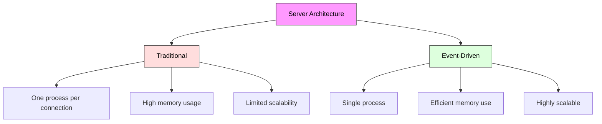

##### Server Requirements:

- Must handle multiple concurrent connections
- Should use event-driven architecture (like Node.js)
- Memory management is crucial

##### Best Use Cases:

- Real-time chat applications
- Notification systems
- Stock tickers
- Social media feeds
- Gaming applications (for non-intensive updates)

---
hideInToc: true
---

### Error Handling Best Practices

<v-clicks>

Connection Timeout:

```js
if (response.status === 502) {
  // Retry connection after timeout
  await new Promise((resolve) => setTimeout(resolve, 1000))
  await longPoll()
}
```

#### Network Errors:

```js
try {
  // polling logic
} catch (error) {
  // Wait before reconnecting
  setTimeout(longPoll, 1000)
}
```

#### Server Errors:

```js
if (response.status !== 200) {
  // Handle server error
  console.error('Server error:', response.statusText)
  // Implement exponential backoff
  await exponentialBackoff()
}
```

</v-clicks>

---
hideInToc: true
---

#### What is WebSocket?

<v-clicks>

WebSocket is a protocol that enables two-way persistent communication between a browser and a server. Unlike traditional HTTP, it maintains an open connection, allowing real-time data exchange without repeated requests.
Perfect for:

- 🎮 Online games
- 📈 Real-time trading systems
- 💬 Chat applications
- 📊 Live data dashboards

</v-clicks>

---
hideInToc: true
---

# Implementation

<v-clicks>

```js
// Creating a WebSocket connection
const socket = new WebSocket('wss://example.com/socketserver')

// Connection opened
socket.onopen = (event) => {
  console.log('Connected to WebSocket server')
  socket.send('Hello Server!')
}

// Listen for messages
socket.onmessage = (event) => {
  console.log('Message from server:', event.data)
}

// Handle errors
socket.onerror = (error) => {
  console.error('WebSocket error:', error)
}

// Connection closed
socket.onclose = (event) => {
  console.log('Disconnected from WebSocket server')
}
```

</v-clicks>

---
hideInToc: true
---

#### Key Concepts

 <div class="max-w-4xl mx-auto bg-white rounded-lg shadow-lg">
        <div class="p-6">
            <h1 class="text-2xl font-bold text-center mb-6 sticky top-0 bg-white text-black">WebSocket Protocol Reference</h1>
            
   <div class="space-y-8 max-h-[80vh] overflow-y-auto">
                <div class="border rounded-lg">
                    <div class="bg-gray-100 p-4 sticky top-0">
                        <h2 class="text-lg font-semibold text-black">Protocol Types</h2>
                    </div>
                    <div class="p-4 space-y-4 max-h-[300px] overflow-y-auto">
                        <div class="flex items-center space-x-4 p-4 bg-red-50 rounded-lg">
                            <span class="icon-[material-symbols--shield-off] text-2xl text-red-500"></span>
                            <div>
                                <p class="font-medium text-black">ws://</p>
                                <p class="text-sm text-black">Unencrypted connection</p>
                            </div>
                        </div>
                        <div class="flex items-center space-x-4 p-4 bg-green-50 rounded-lg">
                            <span class="icon-[material-symbols--shield] text-2xl text-green-500"></span>
                            <div>
                                <p class="font-medium text-black">wss://</p>
                                <p class="text-sm text-black">Encrypted connection (recommended)</p>
                            </div>
                        </div>
                    </div>
                </div>

   <div class="border rounded-lg">
                    <div class="bg-gray-100 p-4 sticky top-0">
                        <h2 class="text-lg font-semibold text-black">Connection States</h2>
                    </div>
                    <div class="p-4 space-y-4 max-h-[300px] overflow-y-auto">
                        <div class="flex items-center space-x-4 p-4 bg-yellow-50 rounded-lg">
                            <span class="icon-[material-symbols--sync] text-2xl text-yellow-500 animate-spin"></span>
                            <div>
                                <p class="font-medium text-black">CONNECTING (0)</p>
                                <p class="text-sm text-black">Connection initiated</p>
                            </div>
                        </div>
                        <div class="flex items-center space-x-4 p-4 bg-green-50 rounded-lg">
                            <span class="icon-[material-symbols--check-circle] text-2xl text-green-500"></span>
                            <div>
                                <p class="font-medium text-black">OPEN (1)</p>
                                <p class="text-sm text-black">Connection active</p>
                            </div>
                        </div>
                        <div class="flex items-center space-x-4 p-4 bg-orange-50 rounded-lg">
                            <span class="icon-[material-symbols--warning] text-2xl text-orange-500"></span>
                            <div>
                                <p class="font-medium text-black">CLOSING (2)</p>
                                <p class="text-sm text-black">Connection closing</p>
                            </div>
                        </div>
                        <div class="flex items-center space-x-4 p-4 bg-red-50 rounded-lg">
                            <span class="icon-[material-symbols--cancel] text-2xl text-red-500"></span>
                            <div>
                                <p class="font-medium text-black">CLOSED (3)</p>
                                <p class="text-sm text-black">Connection closed</p>
                            </div>
                        </div>
                    </div>
                </div>

  <div class="border rounded-lg">
                    <div class="bg-gray-100 p-4 sticky top-0">
                        <h2 class="text-lg font-semibold text-black">Data Types</h2>
                    </div>
                    <div class="p-4 space-y-4 max-h-[300px] overflow-y-auto">
                        <div class="flex items-center space-x-4 p-4 bg-blue-50 rounded-lg">
                            <span class="icon-[material-symbols--text-fields] text-2xl text-blue-500"></span>
                            <div>
                                <p class="font-medium text-black">Text frames</p>
                                <p class="text-sm text-black">strings</p>
                            </div>
                        </div>
                        <div class="flex items-center space-x-4 p-4 bg-purple-50 rounded-lg">
                            <span class="icon-[material-symbols--database] text-2xl text-purple-500"></span>
                            <div>
                                <p class="font-medium text-black">Binary frames</p>
                                <p class="text-sm text-black">Blob/ArrayBuffer</p>
                            </div>
                        </div>
                        <div class="flex items-center space-x-4 p-4 bg-indigo-50 rounded-lg">
                            <span class="icon-[material-symbols--swap-horiz] text-2xl text-indigo-500"></span>
                            <div>
                                <p class="font-medium text-black">Control frames</p>
                                <p class="text-sm text-black">ping/pong</p>
                            </div>
                        </div>
                    </div>
                </div>
            </div>
        </div>
    </div>

---
hideInToc: true
---

### Best Practices

1. Always use wss://

- More secure
- Better proxy handling
- Encrypted data transfer

2. Handle Connection State

```js
function checkConnection() {
  return socket.readyState === WebSocket.OPEN
}
```

3. Rate Limiting

```js
setInterval(() => {
  if (socket.bufferedAmount === 0) {
    socket.send(data)
  }
}, 100)
```

---
hideInToc: true
---

<div class="max-w-2xl mx-auto">
        <div class="bg-white shadow-lg rounded-lg overflow-hidden">
            <div class="px-6 py-4 bg-gray-800 text-white">
                <h2 class="text-xl font-bold">WebSocket Close Codes</h2>
            </div>
            <table class="w-full">
                <thead>
                    <tr class="bg-gray-100">
                        <th class="px-6 py-3 text-left text-xs font-medium text-gray-500 uppercase tracking-wider border-b">Code</th>
                        <th class="px-6 py-3 text-left text-xs font-medium text-gray-500 uppercase tracking-wider border-b">Meaning</th>
                        <th class="px-6 py-3 text-left text-xs font-medium text-gray-500 uppercase tracking-wider border-b">Status</th>
                    </tr>
                </thead>
                <tbody class="bg-white divide-y divide-gray-200">
                    <tr>
                        <td class="px-6 py-4 whitespace-nowrap font-mono text-sm text-gray-900">1000</td>
                        <td class="px-6 py-4 whitespace-nowrap text-sm text-gray-500">Normal closure</td>
                        <td class="px-6 py-4 whitespace-nowrap">
                            <span class="px-2 inline-flex text-xs leading-5 font-semibold rounded-full bg-green-100 text-green-800">
                                Normal
                            </span>
                        </td>
                    </tr>
                    <tr>
                        <td class="px-6 py-4 whitespace-nowrap font-mono text-sm text-gray-900">1001</td>
                        <td class="px-6 py-4 whitespace-nowrap text-sm text-gray-500">Going away</td>
                        <td class="px-6 py-4 whitespace-nowrap">
                            <span class="px-2 inline-flex text-xs leading-5 font-semibold rounded-full bg-yellow-100 text-yellow-800">
                                Expected
                            </span>
                        </td>
                    </tr>
                    <tr>
                        <td class="px-6 py-4 whitespace-nowrap font-mono text-sm text-gray-900">1006</td>
                        <td class="px-6 py-4 whitespace-nowrap text-sm text-gray-500">Abnormal closure</td>
                        <td class="px-6 py-4 whitespace-nowrap">
                            <span class="px-2 inline-flex text-xs leading-5 font-semibold rounded-full bg-red-100 text-red-800">
                                Error
                            </span>
                        </td>
                    </tr>
                    <tr>
                        <td class="px-6 py-4 whitespace-nowrap font-mono text-sm text-gray-900">1009</td>
                        <td class="px-6 py-4 whitespace-nowrap text-sm text-gray-500">Message too big</td>
                        <td class="px-6 py-4 whitespace-nowrap">
                            <span class="px-2 inline-flex text-xs leading-5 font-semibold rounded-full bg-red-100 text-red-800">
                                Error
                            </span>
                        </td>
                    </tr>
                    <tr>
                        <td class="px-6 py-4 whitespace-nowrap font-mono text-sm text-gray-900">1011</td>
                        <td class="px-6 py-4 whitespace-nowrap text-sm text-gray-500">Unexpected server error</td>
                        <td class="px-6 py-4 whitespace-nowrap">
                            <span class="px-2 inline-flex text-xs leading-5 font-semibold rounded-full bg-red-100 text-red-800">
                                Error
                            </span>
                        </td>
                    </tr>
                </tbody>
            </table>
        </div>
    </div>

---
hideInToc: true
---

#### Error Handling Example

<v-clicks>

```js
socket.onclose = (event) => {
  if (event.wasClean) {
    console.log(`Closed cleanly, code=${event.code}, reason=${event.reason}`)
  } else {
    console.log('Connection died')
    // Implement reconnection logic here
  }
}
```

#### Advanced Features

#### Extensions and Subprotocols

```js
//  Using specific protocols
const socket = new WebSocket('wss://example.com', ['soap', 'wamp'])
```

#### Binary Data Handling

```js
// For ArrayBuffer
// socket.binaryType = "arraybuffer";
socket.onmessage = (event) => {
  if (typeof event.data === 'string') {
    console.log('Received text data')
  } else {
    console.log('Received binary data')
  }
}
```

</v-clicks>

---
hideInToc: true
---

# Server-Sent Events?

<v-clicks>

##### Server-Sent Events (SSE) is a technology that enables servers to push real-time updates to web browsers. It's a one-directional communication channel where the server can send data to the client over a persistent HTTP connection.

 <div class="max-w-4xl mx-auto">
        <h2 class="text-2xl font-bold mb-4 text-white">SSE vs WebSocket Comparison</h2>
        
   <div class="overflow-x-auto shadow-lg rounded-lg">
            <table class="min-w-full bg-white">
                <thead>
                    <tr class="bg-blue-500 text-white">
                        <th class="sticky top-0 px-6 py-3 text-left text-sm font-semibold uppercase tracking-wider border-b">
                            Feature
                        </th>
                        <th class="sticky top-0 px-6 py-3 text-left text-sm font-semibold uppercase tracking-wider border-b">
                            SSE
                        </th>
                        <th class="sticky top-0 px-6 py-3 text-left text-sm font-semibold uppercase tracking-wider border-b">
                            WebSocket
                        </th>
                    </tr>
                </thead>
                <tbody class="divide-y divide-gray-200">
                    <tr class="hover:bg-gray-50 transition-colors">
                        <td class="px-6 py-4 whitespace-nowrap text-sm font-medium text-gray-900">
                            Direction
                        </td>
                        <td class="px-6 py-4 whitespace-nowrap text-sm text-gray-600">
                            One-way (Server → Client)
                        </td>
                        <td class="px-6 py-4 whitespace-nowrap text-sm text-gray-600">
                            Two-way (Server ↔ Client)
                        </td>
                    </tr>
                    <tr class="hover:bg-gray-50 transition-colors">
                        <td class="px-6 py-4 whitespace-nowrap text-sm font-medium text-gray-900">
                            Data Format
                        </td>
                        <td class="px-6 py-4 whitespace-nowrap text-sm text-gray-600">
                            Text only
                        </td>
                        <td class="px-6 py-4 whitespace-nowrap text-sm text-gray-600">
                            Binary and Text
                        </td>
                    </tr>
                    <tr class="hover:bg-gray-50 transition-colors">
                        <td class="px-6 py-4 whitespace-nowrap text-sm font-medium text-gray-900">
                            Protocol
                        </td>
                        <td class="px-6 py-4 whitespace-nowrap text-sm text-gray-600">
                            Standard HTTP
                        </td>
                        <td class="px-6 py-4 whitespace-nowrap text-sm text-gray-600">
                            WebSocket Protocol
                        </td>
                    </tr>
                    <tr class="hover:bg-gray-50 transition-colors">
                        <td class="px-6 py-4 whitespace-nowrap text-sm font-medium text-gray-900">
                            Auto-reconnection
                        </td>
                        <td class="px-6 py-4 whitespace-nowrap text-sm text-gray-600">
                            Built-in
                        </td>
                        <td class="px-6 py-4 whitespace-nowrap text-sm text-gray-600">
                            Manual implementation needed
                        </td>
                    </tr>
                    <tr class="hover:bg-gray-50 transition-colors">
                        <td class="px-6 py-4 whitespace-nowrap text-sm font-medium text-gray-900">
                            Browser Support
                        </td>
                        <td class="px-6 py-4 whitespace-nowrap text-sm text-gray-600">
                            All modern browsers (except IE)
                        </td>
                        <td class="px-6 py-4 whitespace-nowrap text-sm text-gray-600">
                            All modern browsers
                        </td>
                    </tr>
                </tbody>
            </table>
        </div>
    </div>

  </v-clicks>

---
hideInToc: true
---

<div class="max-w-sm mx-auto">

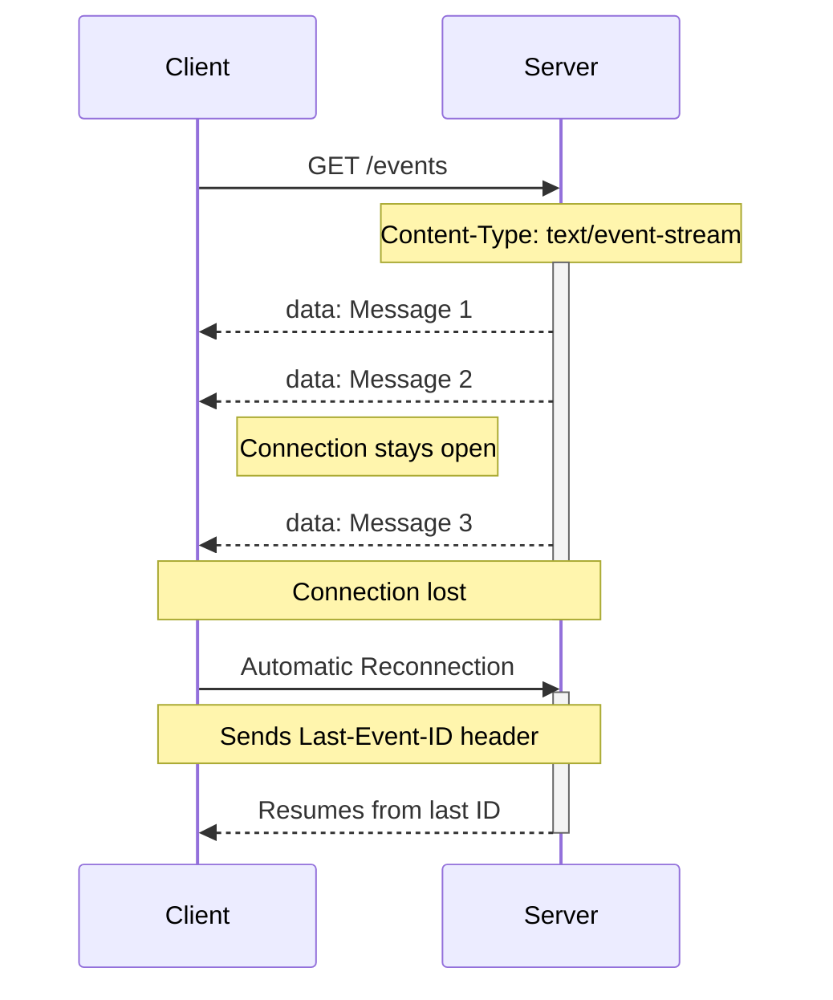

</div>

---
hideInToc: true
---

# Example

<v-clicks>

````md magic-move
```js
// Basic SSE Client Setup
// Creating an EventSource connection
const eventSource = new EventSource('/events/subscribe')

// Handling incoming messages
eventSource.onmessage = function (event) {
  console.log('New message:', event.data)
}

// Handling connection open
eventSource.onopen = function () {
  console.log('Connection established')
}

// Handling errors
eventSource.onerror = function (error) {
  console.error('Error:', error)
}
```

####

```html
<!-- Server Message Format  -->
// Single message data: Hello, world! // Multi-line message data: First line
data: Second line // Message with ID and event type event: userJoined id: 12345
data: {"username": "John", "time": "2024-10-25"}
```
````

</v-clicks>

---
hideInToc: true
---

# Key Features

<v-clicks>

 <div class="max-w-4xl mx-auto h-screen overflow-y-auto px-4">
        <div class="space-y-8 py-4">
            <div class="bg-white rounded-lg shadow-lg overflow-hidden max-h-[400px] flex flex-col">
                <div class="bg-blue-600 p-4 sticky top-0 z-10">
                    <h2 class="text-xl font-bold text-white">1. Automatic Reconnection</h2>
                </div>
                
  <div class="p-6 space-y-4 overflow-y-auto">
                    <ul class="list-disc list-inside space-y-2 text-gray-700">
                        <li>Built-in reconnection mechanism</li>
                        <li>Configurable retry timeout using <code class="bg-gray-100 px-2 py-1 rounded text-blue-600">retry: milliseconds</code></li>
                    </ul>
                    
   <div class="bg-gray-50 rounded-lg p-4 border border-gray-200">
                        <h3 class="text-sm font-semibold text-gray-600 mb-2">Example:</h3>
                        <code class="block bg-gray-800 text-green-400 p-4 rounded-md">
                            retry: 15000<br>
                            data: Reconnection delay set to 15 seconds
                        </code>
                    </div>
                </div>
            </div>

   <div class="bg-white rounded-lg shadow-lg overflow-hidden max-h-[400px] flex flex-col">
                <div class="bg-purple-600 p-4 sticky top-0 z-10">
                    <h2 class="text-xl font-bold text-white">2. Message ID and State Recovery</h2>
                </div>
                
  <div class="p-6 overflow-y-auto">
                    <div class="grid md:grid-cols-2 gap-6">
                        <div class="space-y-4">
                            <ul class="list-disc list-inside space-y-2 text-gray-700">
                                <li>Server can assign IDs to messages</li>
                                <li>Browser tracks last received ID</li>
                                <li>Automatic recovery after disconnection</li>
                                <li>State tracking via <code class="bg-gray-100 px-2 py-1 rounded text-purple-600">eventSource.lastEventId</code></li>
                            </ul>
                        </div>
                        
  <div class="bg-gray-50 rounded-lg p-4 border border-gray-200">
                            <code class=" text-sm text-gray-700">
id: 1
data: Message 1
id: 2
data: Message 2
Last-Event-ID: 2
                            </code>
                        </div>
                    </div>
                </div>
            </div>

   <div class="bg-white rounded-lg shadow-lg overflow-hidden max-h-[600px] flex flex-col">
                <div class="bg-green-600 p-4 sticky top-0 z-10">
                    <h2 class="text-xl font-bold text-white">3. Connection States (readyState)</h2>
                </div>
                
  <div class="p-6 overflow-y-auto">
                    <div class="grid gap-4">
                        <div class="grid grid-cols-1 md:grid-cols-3 gap-4">
                            
  <div class="bg-yellow-50 border border-yellow-200 rounded-lg p-4">
                                <div class="font-mono text-sm text-yellow-800 mb-2">EventSource.CONNECTING = 0</div>
                                <div class="text-sm text-yellow-600">Connecting or Reconnecting</div>
                            </div>
                            
                            
  <div class="bg-green-50 border border-green-200 rounded-lg p-4">
                                <div class="font-mono text-sm text-green-800 mb-2">EventSource.OPEN = 1</div>
                                <div class="text-sm text-green-600">Connected</div>
                            </div>
                            
                           
  <div class="bg-red-50 border border-red-200 rounded-lg p-4">
                                <div class="font-mono text-sm text-red-800 mb-2">EventSource.CLOSED = 2</div>
                                <div class="text-sm text-red-600">Connection closed</div>
                            </div>
                        </div>
                        
   <div class="bg-gray-50 rounded-lg p-4 border border-gray-200">
                            <h3 class="text-sm font-semibold text-gray-600 mb-2">Usage Example:</h3>
                            <code class="block bg-gray-800 text-green-400 p-4 rounded-md">
const eventSource = new EventSource('/events');
switch(eventSource.readyState) {
    case EventSource.CONNECTING:
        console.log('Connecting...');
        break;
    case EventSource.OPEN:
        console.log('Connected');
        break;
    case EventSource.CLOSED:
        console.log('Connection closed');
        break;
}
                            </code>
                        </div>
                    </div>
                </div>
            </div>
        </div>
    </div>

  </v-clicks>

---
hideInToc: true
---

# Event Types

<v-clicks>

  <div class="max-w-4xl mx-auto h-screen overflow-y-auto px-4">
  <div class="space-y-8 py-4">
  <div class="bg-white rounded-lg shadow-lg overflow-hidden max-h-[400px] flex flex-col">
                <div class="bg-indigo-600 p-4 sticky top-0 z-10">
                    <h2 class="text-xl font-bold text-white">Standard Events</h2>
                </div>
                
   <div class="p-6 overflow-y-auto">
                    <div class="grid gap-6">
                        
  <div class="grid grid-cols-1 md:grid-cols-3 gap-4">
                            
  <div class="bg-indigo-50 border border-indigo-200 rounded-lg p-4">
                                <div class="font-mono text-sm text-indigo-800 mb-2">message</div>
                                <div class="text-sm text-indigo-600">Regular message received</div>
                                <kbd class="block text-black mt-2 p-2 rounded text-sm">
                                    eventSource.onmessage = (event) => {
                                        console.log(event.data);
                                    }
                                </kbd>
                            </div>
                            
                            
   <div class="bg-green-50 border border-green-200 rounded-lg p-4">
                                <div class="font-mono text-sm text-green-800 mb-2">open</div>
                                <div class="text-sm text-green-600">Connection established</div>
                                <kbd class="block text-black  mt-2 p-2 rounded text-sm">
                                    eventSource.onopen = () => {
                                        console.log("Connected!");
                                    }
                                </kbd>
                            </div>
                            
                            
   <div class="bg-red-50 border border-red-200 rounded-lg p-4">
                                <div class="font-mono text-sm text-red-800 mb-2">error</div>
                                <div class="text-sm text-red-600">Connection error occurred</div>
                                <kbd class="block text-black  mt-2 p-2 rounded text-sm">
                                    eventSource.onerror = (error) => {
                                        console.error(error);
                                    }
                                </kbd>
                            </div>
                        </div>
                    </div>
                </div>
            </div>

   <div class="bg-white rounded-lg shadow-lg overflow-hidden max-h-[400px] flex flex-col">
                <div class="bg-purple-600 p-4 sticky top-0 z-10">
                    <h2 class="text-xl font-bold text-white">Custom Events</h2>
                </div>
                
   <div class="p-6 overflow-y-auto">
                    <div class="grid md:grid-cols-2 gap-6">
   <div class="bg-gray-50 rounded-lg p-4 border border-gray-200">
                            <h3 class="text-sm font-semibold text-gray-600 mb-2">Server Sends:</h3>
                            <kbd class="block bg-gray-800 text-black p-4 rounded-md ">
event: userUpdate
data: {
    "id": 123,
    "status": "online"
}
                            </kbd>
                        </div>
                        
                        
  <div class="bg-gray-50 rounded-lg p-4 border border-gray-200">
                            <h3 class="text-sm font-semibold text-gray-600 mb-2">Client Handles:</h3>
                            <kbd class="block bg-gray-800 text-black p-4 rounded-md">
eventSource.addEventListener('userUpdate', 
    event => {
        const userData = JSON.parse(event.data);
        updateUserStatus(userData);
    }
);
                            </kbd>
                        </div>
                    </div>
                </div>
            </div>

   <div class="bg-white rounded-lg shadow-lg overflow-hidden max-h-[400px] flex flex-col">
                <div class="bg-blue-600 p-4 sticky top-0 z-10">
                    <h2 class="text-xl font-bold text-white">Cross-Origin Requests</h2>
                </div>
                
   <div class="p-6 overflow-y-auto">
                    <div class="space-y-6">
                        
  <div class="bg-gray-50 rounded-lg p-4 border border-gray-200">
                            <h3 class="text-sm font-semibold text-gray-600 mb-2">Basic Cross-Origin Connection:</h3>
                            <code class="block bg-gray-800 text-green-400 p-4 rounded-md">
const source = new EventSource("https://api.example.com/events");
                            </code>
                        </div>
                        
                        
  <div class="bg-gray-50 rounded-lg p-4 border border-gray-200">
                            <h3 class="text-sm font-semibold text-gray-600 mb-2">With Credentials:</h3>
                            <code class="block bg-gray-800 text-green-400 p-4 rounded-md">
const source = new EventSource("https://api.example.com/events", {
    withCredentials: true
});
                            </code>
                        </div>

  <div class="bg-yellow-50 p-4 rounded-lg border border-yellow-200">
                            <h3 class="text-sm font-semibold text-yellow-800 mb-2">⚠️ CORS Requirements</h3>
                            <ul class="list-disc list-inside space-y-1 text-sm text-yellow-700">
                                <li>Server must send <code class="bg-yellow-100 px-1 rounded">Access-Control-Allow-Origin</code> header</li>
                                <li>For credentials, server must explicitly allow the requesting origin</li>
                                <li>Wildcards (*) not allowed with credentials</li>
                            </ul>
                        </div>
                    </div>
                </div>
            </div>
        </div>
    </div>

</v-clicks>

---
hideInToc: true
---

<div class="max-w-4xl mx-auto bg-white rounded-lg shadow-lg overflow-hidden">
    <div class="px-6 py-4 bg-indigo-600">
      <h2 class="text-2xl font-bold text-center text-white">Best Practices</h2>
    </div>
    
  <div class="overflow-x-auto">
      <div class="max-h-96 overflow-y-auto">
        <table class="min-w-full divide-y divide-gray-200">
          <thead class="bg-gray-50 sticky top-0">
            <tr>
              <th class="px-6 py-3 text-left text-xs font-medium text-gray-500 uppercase tracking-wider">Category</th>
              <th class="px-6 py-3 text-left text-xs font-medium text-gray-500 uppercase tracking-wider">Practice</th>
              <th class="px-6 py-3 text-left text-xs font-medium text-gray-500 uppercase tracking-wider">Description</th>
            </tr>
          </thead>
          <tbody class="bg-white divide-y divide-gray-200">
           
   <tr class="hover:bg-gray-50">
              <td class="px-6 py-4 whitespace-nowrap" rowspan="3">
                <div class="flex items-center">
                  <div class="flex-shrink-0 h-10 w-10 flex items-center justify-center bg-red-100 rounded-lg">
                    <svg class="h-6 w-6 text-red-600" fill="none" stroke="currentColor" viewBox="0 0 24 24">
                      <path stroke-linecap="round" stroke-linejoin="round" stroke-width="2" d="M12 9v2m0 4h.01m-6.938 4h13.856c1.54 0 2.502-1.667 1.732-3L13.732 4c-.77-1.333-2.694-1.333-3.464 0L3.34 16c-.77 1.333.192 3 1.732 3z"/>
                    </svg>
                  </div>
                  <div class="ml-4">
                    <div class="text-sm font-medium text-gray-900">Error Handling</div>
                  </div>
                </div>
              </td>
              <td class="px-6 py-4">
                <div class="text-sm text-gray-900">Event Listeners</div>
              </td>
              <td class="px-6 py-4">
                <div class="text-sm text-gray-500">Always implement error event listeners for proper error catching and handling</div>
              </td>
            </tr>
            <tr class="hover:bg-gray-50">
              <td class="px-6 py-4">
                <div class="text-sm text-gray-900">Exponential Backoff</div>
              </td>
              <td class="px-6 py-4">
                <div class="text-sm text-gray-500">Implement exponential backoff strategy for connection retry attempts</div>
              </td>
            </tr>
            <tr class="hover:bg-gray-50">
              <td class="px-6 py-4">
                <div class="text-sm text-gray-900">Connection Monitoring</div>
              </td>
              <td class="px-6 py-4">
                <div class="text-sm text-gray-500">Monitor and handle connection state changes effectively</div>
              </td>
            </tr>

   <tr class="hover:bg-gray-50">
              <td class="px-6 py-4 whitespace-nowrap" rowspan="2">
                <div class="flex items-center">
                  <div class="flex-shrink-0 h-10 w-10 flex items-center justify-center bg-green-100 rounded-lg">
                    <svg class="h-6 w-6 text-green-600" fill="none" stroke="currentColor" viewBox="0 0 24 24">
                      <path stroke-linecap="round" stroke-linejoin="round" stroke-width="2" d="M5 3v4M3 5h4M6 17v4m-2-2h4m5-16l2.286 6.857L21 12l-5.714 2.143L13 21l-2.286-6.857L5 12l5.714-2.143L13 3z"/>
                    </svg>
                  </div>
                  <div class="ml-4">
                    <div class="text-sm font-medium text-gray-900">Resource Management</div>
                  </div>
                </div>
              </td>
              <td class="px-6 py-4">
                <div class="text-sm text-gray-900">Connection Cleanup</div>
              </td>
              <td class="px-6 py-4">
                <div class="text-sm text-gray-500">Close connections properly when they are no longer needed</div>
              </td>
            </tr>
            <tr class="hover:bg-gray-50">
              <td class="px-6 py-4">
                <div class="text-sm text-gray-900">SPA Cleanup</div>
              </td>
              <td class="px-6 py-4">
                <div class="text-sm text-gray-500">Implement proper cleanup in single-page applications to prevent memory leaks</div>
              </td>
            </tr>

  <tr class="hover:bg-gray-50">
              <td class="px-6 py-4 whitespace-nowrap" rowspan="3">
                <div class="flex items-center">
                  <div class="flex-shrink-0 h-10 w-10 flex items-center justify-center bg-blue-100 rounded-lg">
                    <svg class="h-6 w-6 text-blue-600" fill="none" stroke="currentColor" viewBox="0 0 24 24">
                      <path stroke-linecap="round" stroke-linejoin="round" stroke-width="2" d="M8 9l3 3-3 3m5 0h3M5 20h14a2 2 0 002-2V6a2 2 0 00-2-2H5a2 2 0 00-2 2v12a2 2 0 002 2z"/>
                    </svg>
                  </div>
                  <div class="ml-4">
                    <div class="text-sm font-medium text-gray-900">Message Format</div>
                  </div>
                </div>
              </td>
              <td class="px-6 py-4">
                <div class="text-sm text-gray-900">JSON Structure</div>
              </td>
              <td class="px-6 py-4">
                <div class="text-sm text-gray-500">Use JSON for structured data transmission</div>
              </td>
            </tr>
            <tr class="hover:bg-gray-50">
              <td class="px-6 py-4">
                <div class="text-sm text-gray-900">Timestamps</div>
              </td>
              <td class="px-6 py-4">
                <div class="text-sm text-gray-500">Include timestamps for proper message ordering</div>
              </td>
            </tr>
            <tr class="hover:bg-gray-50">
              <td class="px-6 py-4">
                <div class="text-sm text-gray-900">Versioning</div>
              </td>
              <td class="px-6 py-4">
                <div class="text-sm text-gray-500">Implement message versioning for compatibility</div>
              </td>
            </tr>
          </tbody>
        </table>
      </div>
    </div>
  </div>

---

