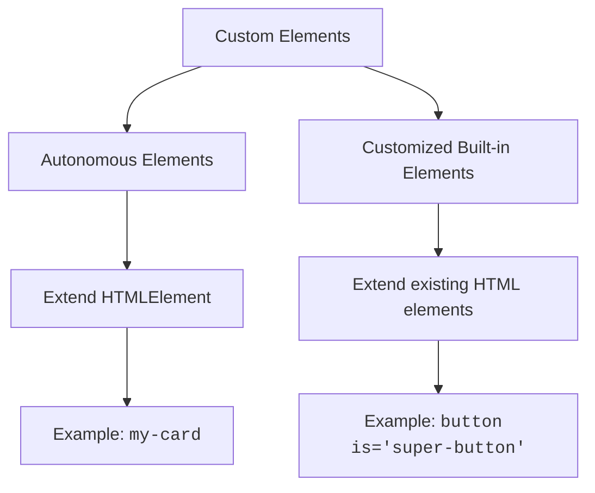
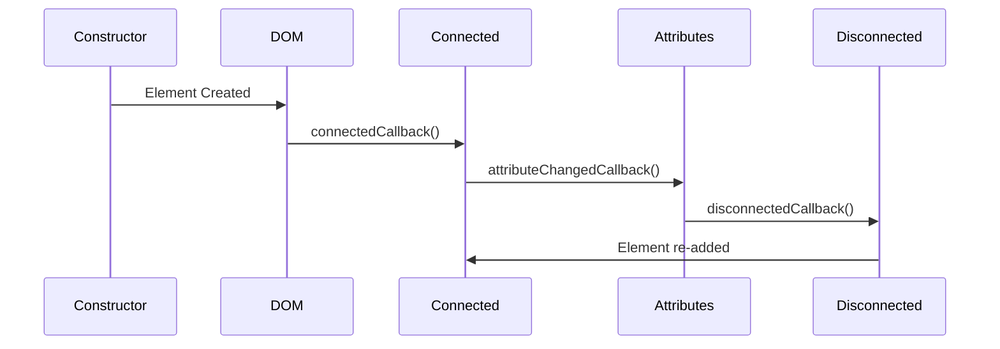
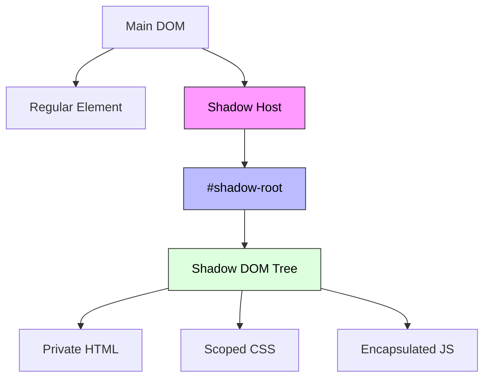
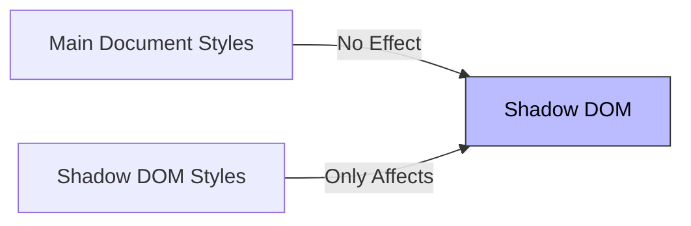
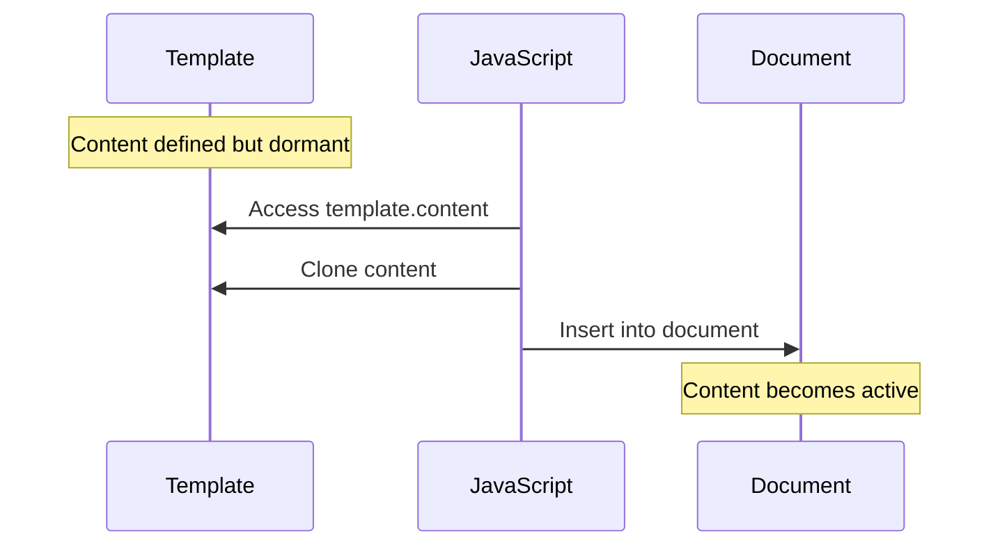

# Web Components

<div mt-2 />

- Basics
- Custom Elements
- Shadow DOM
- Templates Elements
- Shadow DOM Slots, Composition
- Shadow DOM CSS
- Shadow DOM Events

---
hideInToc: true
---

# Basics

<v-clicks>

##### Web Components represent a significant leap forward in web development, offering developers the ability to create reusable, encapsulated components that work seamlessly across different frameworks and libraries. This introduction will help you understand what Web Components are, why they matter, and how they can transform your approach to building web applications.

### What Are Web Components?

##### At their core, Web Components are a set of standardized web platform APIs that allow you to create new, custom, reusable HTML elements. Imagine being able to create your own <kbd>custom-datepicker</kbd> or <kbd>advanced-carousel</kbd> that works just like native HTML elements such as <kbd>select</kbd> or <kbd>video</kbd>. That's exactly what Web Components enable!

</v-clicks>

---

## Why Web Components Matters

<v-clicks>

 <div class="max-w-4xl mx-auto">  
 <div class="h-[70vh] overflow-y-auto rounded-lg shadow-inner bg-white p-4">
            <div class="grid gap-6 p-2">
                <div class="bg-white rounded-lg shadow-lg overflow-hidden hover:shadow-xl transition-shadow duration-300">
                    <div class="bg-blue-600 p-4 sticky top-0 z-10">
                        <h3 class="text-xl font-semibold text-white">1. Framework Independence</h3>
                    </div>
                    <div class="p-6">
                        <ul class="space-y-3">
                            <li class="flex items-start">
                                <svg class="h-6 w-6 text-green-500 mr-2 flex-shrink-0" fill="none" stroke="currentColor" viewBox="0 0 24 24">
                                    <path stroke-linecap="round" stroke-linejoin="round" stroke-width="2" d="M5 13l4 4L19 7"></path>
                                </svg>
                                <span class="text-gray-700">Work in any JavaScript framework</span>
                            </li>
                            <li class="flex items-start">
                                <svg class="h-6 w-6 text-green-500 mr-2 flex-shrink-0" fill="none" stroke="currentColor" viewBox="0 0 24 24">
                                    <path stroke-linecap="round" stroke-linejoin="round" stroke-width="2" d="M5 13l4 4L19 7"></path>
                                </svg>
                                <span class="text-gray-700">Don't require any external libraries</span>
                            </li>
                            <li class="flex items-start">
                                <svg class="h-6 w-6 text-green-500 mr-2 flex-shrink-0" fill="none" stroke="currentColor" viewBox="0 0 24 24">
                                    <path stroke-linecap="round" stroke-linejoin="round" stroke-width="2" d="M5 13l4 4L19 7"></path>
                                </svg>
                                <span class="text-gray-700">Are future-proof against framework changes</span>
                            </li>
                            <li class="flex items-start">
                                <svg class="h-6 w-6 text-green-500 mr-2 flex-shrink-0" fill="none" stroke="currentColor" viewBox="0 0 24 24">
                                    <path stroke-linecap="round" stroke-linejoin="round" stroke-width="2" d="M5 13l4 4L19 7"></path>
                                </svg>
                                <span class="text-gray-700">Function natively in modern browsers</span>
                            </li>
                        </ul>
                    </div>
                </div>

<div class="bg-white rounded-lg shadow-lg overflow-hidden hover:shadow-xl transition-shadow duration-300">
                    <div class="bg-green-600 p-4 sticky top-0 z-10">
                        <h3 class="text-xl font-semibold text-white">2. Reusability</h3>
                    </div>
                    <div class="p-6">
                        <ul class="space-y-3">
                            <li class="flex items-start">
                                <svg class="h-6 w-6 text-green-500 mr-2 flex-shrink-0" fill="none" stroke="currentColor" viewBox="0 0 24 24">
                                    <path stroke-linecap="round" stroke-linejoin="round" stroke-width="2" d="M5 13l4 4L19 7"></path>
                                </svg>
                                <span class="text-gray-700">Create once, use anywhere</span>
                            </li>
                            <li class="flex items-start">
                                <svg class="h-6 w-6 text-green-500 mr-2 flex-shrink-0" fill="none" stroke="currentColor" viewBox="0 0 24 24">
                                    <path stroke-linecap="round" stroke-linejoin="round" stroke-width="2" d="M5 13l4 4L19 7"></path>
                                </svg>
                                <span class="text-gray-700">Share components across different projects</span>
                            </li>
                            <li class="flex items-start">
                                <svg class="h-6 w-6 text-green-500 mr-2 flex-shrink-0" fill="none" stroke="currentColor" viewBox="0 0 24 24">
                                    <path stroke-linecap="round" stroke-linejoin="round" stroke-width="2" d="M5 13l4 4L19 7"></path>
                                </svg>
                                <span class="text-gray-700">Maintain consistency across applications</span>
                            </li>
                            <li class="flex items-start">
                                <svg class="h-6 w-6 text-green-500 mr-2 flex-shrink-0" fill="none" stroke="currentColor" viewBox="0 0 24 24">
                                    <path stroke-linecap="round" stroke-linejoin="round" stroke-width="2" d="M5 13l4 4L19 7"></path>
                                </svg>
                                <span class="text-gray-700">Reduce code duplication</span>
                            </li>
                        </ul>
                    </div>
                </div>

 <div class="bg-white rounded-lg shadow-lg overflow-hidden hover:shadow-xl transition-shadow duration-300">
                    <div class="bg-purple-600 p-4 sticky top-0 z-10">
                        <h3 class="text-xl font-semibold text-white">3. Encapsulation</h3>
                    </div>
                    <div class="p-6">
                        <ul class="space-y-3">
                            <li class="flex items-start">
                                <svg class="h-6 w-6 text-green-500 mr-2 flex-shrink-0" fill="none" stroke="currentColor" viewBox="0 0 24 24">
                                    <path stroke-linecap="round" stroke-linejoin="round" stroke-width="2" d="M5 13l4 4L19 7"></path>
                                </svg>
                                <span class="text-gray-700">Components are self-contained</span>
                            </li>
                            <li class="flex items-start">
                                <svg class="h-6 w-6 text-green-500 mr-2 flex-shrink-0" fill="none" stroke="currentColor" viewBox="0 0 24 24">
                                    <path stroke-linecap="round" stroke-linejoin="round" stroke-width="2" d="M5 13l4 4L19 7"></path>
                                </svg>
                                <span class="text-gray-700">Styles don't leak in or out</span>
                            </li>
                            <li class="flex items-start">
                                <svg class="h-6 w-6 text-green-500 mr-2 flex-shrink-0" fill="none" stroke="currentColor" viewBox="0 0 24 24">
                                    <path stroke-linecap="round" stroke-linejoin="round" stroke-width="2" d="M5 13l4 4L19 7"></path>
                                </svg>
                                <span class="text-gray-700">JavaScript functionality is scoped</span>
                            </li>
                            <li class="flex items-start">
                                <svg class="h-6 w-6 text-green-500 mr-2 flex-shrink-0" fill="none" stroke="currentColor" viewBox="0 0 24 24">
                                    <path stroke-linecap="round" stroke-linejoin="round" stroke-width="2" d="M5 13l4 4L19 7"></path>
                                </svg>
                                <span class="text-gray-700">Prevents naming conflicts</span>
                            </li>
                        </ul>
                    </div>
                </div>
            </div>
        </div>
    </div>

</v-clicks>

---

## The Three Pillars of Web Components

<v-clicks>

 <div class="max-w-4xl mx-auto">  
 <div class="h-[70vh] overflow-y-auto rounded-lg shadow-inner bg-white p-4">
            <div class="grid gap-6 p-2">
                <div class="bg-white rounded-lg shadow-lg overflow-hidden hover:shadow-xl transition-shadow duration-300">
                    <div class="bg-blue-600 p-4 sticky top-0 z-10">
                        <h3 class="text-xl font-semibold text-white">1. Custom Elements</h3>
                    </div>
                    <div class="p-6">
                        <ul class="space-y-3">
                            <li class="flex items-start">
                                <svg class="h-6 w-6 text-green-500 mr-2 flex-shrink-0" fill="none" stroke="currentColor" viewBox="0 0 24 24">
                                    <path stroke-linecap="round" stroke-linejoin="round" stroke-width="2" d="M5 13l4 4L19 7"></path>
                                </svg>
                                <span class="text-gray-700">Define new HTML tags</span>
                            </li>
                            <li class="flex items-start">
                                <svg class="h-6 w-6 text-green-500 mr-2 flex-shrink-0" fill="none" stroke="currentColor" viewBox="0 0 24 24">
                                    <path stroke-linecap="round" stroke-linejoin="round" stroke-width="2" d="M5 13l4 4L19 7"></path>
                                </svg>
                                <span class="text-gray-700">Create custom elements behaviour</span>
                            </li>
                            <li class="flex items-start">
                                <svg class="h-6 w-6 text-green-500 mr-2 flex-shrink-0" fill="none" stroke="currentColor" viewBox="0 0 24 24">
                                    <path stroke-linecap="round" stroke-linejoin="round" stroke-width="2" d="M5 13l4 4L19 7"></path>
                                </svg>
                                <span class="text-gray-700">Extend existing HTML elements</span>
                            </li>
                        </ul>
                    </div>
                </div>

<div class="bg-white rounded-lg shadow-lg overflow-hidden hover:shadow-xl transition-shadow duration-300">
                    <div class="bg-green-600 p-4 sticky top-0 z-10">
                        <h3 class="text-xl font-semibold text-white">2. Shadow DOM</h3>
                    </div>
                    <div class="p-6">
                        <ul class="space-y-3">
                            <li class="flex items-start">
                                <svg class="h-6 w-6 text-green-500 mr-2 flex-shrink-0" fill="none" stroke="currentColor" viewBox="0 0 24 24">
                                    <path stroke-linecap="round" stroke-linejoin="round" stroke-width="2" d="M5 13l4 4L19 7"></path>
                                </svg>
                                <span class="text-gray-700">Encapsulate styles and markup</span>
                            </li>
                            <li class="flex items-start">
                                <svg class="h-6 w-6 text-green-500 mr-2 flex-shrink-0" fill="none" stroke="currentColor" viewBox="0 0 24 24">
                                    <path stroke-linecap="round" stroke-linejoin="round" stroke-width="2" d="M5 13l4 4L19 7"></path>
                                </svg>
                                <span class="text-gray-700">Create a seperate DOM tree</span>
                            </li>
                            <li class="flex items-start">
                                <svg class="h-6 w-6 text-green-500 mr-2 flex-shrink-0" fill="none" stroke="currentColor" viewBox="0 0 24 24">
                                    <path stroke-linecap="round" stroke-linejoin="round" stroke-width="2" d="M5 13l4 4L19 7"></path>
                                </svg>
                                <span class="text-gray-700">Isolate components internals</span>
                            </li>
                        </ul>
                    </div>
                </div>

 <div class="bg-white rounded-lg shadow-lg overflow-hidden hover:shadow-xl transition-shadow duration-300">
                    <div class="bg-purple-600 p-4 sticky top-0 z-10">
                        <h3 class="text-xl font-semibold text-white">3. HTML Templates</h3>
                    </div>
                    <div class="p-6">
                        <ul class="space-y-3">
                            <li class="flex items-start">
                                <svg class="h-6 w-6 text-green-500 mr-2 flex-shrink-0" fill="none" stroke="currentColor" viewBox="0 0 24 24">
                                    <path stroke-linecap="round" stroke-linejoin="round" stroke-width="2" d="M5 13l4 4L19 7"></path>
                                </svg>
                                <span class="text-gray-700">Define resuable markup</span>
                            </li>
                            <li class="flex items-start">
                                <svg class="h-6 w-6 text-green-500 mr-2 flex-shrink-0" fill="none" stroke="currentColor" viewBox="0 0 24 24">
                                    <path stroke-linecap="round" stroke-linejoin="round" stroke-width="2" d="M5 13l4 4L19 7"></path>
                                </svg>
                                <span class="text-gray-700">Create insert HTML fragments</span>
                            </li>
                            <li class="flex items-start">
                                <svg class="h-6 w-6 text-green-500 mr-2 flex-shrink-0" fill="none" stroke="currentColor" viewBox="0 0 24 24">
                                    <path stroke-linecap="round" stroke-linejoin="round" stroke-width="2" d="M5 13l4 4L19 7"></path>
                                </svg>
                                <span class="text-gray-700">Stamp out components instances</span>
                            </li>
                        </ul>
                    </div>
                </div>
            </div>
        </div>
    </div>

   </v-clicks>

---

````md magic-move
```js
// Define a custom element
class GreetingCard extends HTMLElement {
  constructor() {
    super()
    this.attachShadow({ mode: 'open' })
    this.shadowRoot.innerHTML = `
      <style>
        .card {
          padding: 16px;
          border: 2px solid #ccc;
          border-radius: 8px;
          display: inline-block;
        }
        h2 {
          color: #2196F3;
          margin-top: 0;
        }
      </style>
      <div class="card">
        <h2>Hello!</h2>
        <slot></slot>
      </div>
    `
  }
}

// Register the custom element
customElements.define('greeting-card', GreetingCard)
```

```html
<greeting-card> Welcome to Web Components! </greeting-card>
```
````

##### Web Components represent a powerful shift in web development, offering a standardized way to create reusable components. As you begin your journey with Web Components, remember that mastery comes through practice and experimentation. Start small, build incrementally, and soon you'll be creating sophisticated, reusable components that work anywhere on the web.

---
hideInToc: true
---

# Custom Elements

<v-clicks>

#### What are Custom Elements? 🤔

##### Custom Elements allow us to create our own HTML tags with custom functionality, making our code more semantic and reusable. Think of them as creating your own LEGO blocks for the web!

<div className="max-w-4xl mx-auto p-4">
      <div className="bg-white rounded-lg shadow-lg">
        <div className="bg-gradient-to-r from-blue-600 to-blue-800 p-2">
          <h2 className="text-xl font-bold text-white">Types of Custom Elements</h2>
        </div>
        
<div className="relative">
          <div className="max-h-[300px] overflow-auto rounded-b-lg">
            <table className="min-w-full border-separate border-spacing-0">
              <thead>
                <tr className="sticky top-0">
                  <th className="bg-gray-50 px-6 py-4 text-left text-sm font-semibold text-gray-900 whitespace-nowrap border-b border-gray-200 min-w-[200px]">
                    Feature
                  </th>
                  <th className="bg-gray-50 px-6 py-4 text-left text-sm font-semibold text-gray-900 whitespace-nowrap border-b border-gray-200 min-w-[300px]">
                    Autonomous Elements
                  </th>
                  <th className="bg-gray-50 px-6 py-4 text-left text-sm font-semibold text-gray-900 whitespace-nowrap border-b border-gray-200 min-w-[300px]">
                    Customized Built-in Elements
                  </th>
                </tr>
              </thead>
<tbody className="bg-white">
                <tr>
                  <td className="px-6 py-4 text-sm font-medium text-gray-900 border-b border-gray-200 whitespace-nowrap">Definition</td>
                  <td className="px-6 py-4 text-sm text-gray-600 border-b border-gray-200">Brand new HTML elements created from scratch</td>
                  <td className="px-6 py-4 text-sm text-gray-600 border-b border-gray-200">Extensions of existing HTML elements</td>
                </tr>
                
                
<tr>
                  <td className="px-6 py-4 text-sm font-medium text-gray-900 border-b border-gray-200 whitespace-nowrap">Base Class</td>
                  <td className="px-6 py-4 text-sm text-gray-600 border-b border-gray-200">
                    <code className="bg-gray-100 px-2 py-1 rounded">HTMLElement</code>
                  </td>
                  <td className="px-6 py-4 text-sm text-gray-600 border-b border-gray-200">
                    Extends specific element classes (e.g., <code className="bg-gray-100 px-2 py-1 rounded">HTMLButtonElement</code>)
                  </td>
                </tr>
                
                
<tr>
                  <td className="px-6 py-4 text-sm font-medium text-gray-900 border-b border-gray-200 whitespace-nowrap">Usage Syntax</td>
                  <td className="px-6 py-4 text-sm text-gray-600 border-b border-gray-200">
                    <code className="bg-gray-100 px-2 py-1 rounded">&lt;custom-element&gt;</code>
                  </td>
                  <td className="px-6 py-4 text-sm text-gray-600 border-b border-gray-200">
                    <code className="bg-gray-100 px-2 py-1 rounded">&lt;button is="custom-button"&gt;</code>
                  </td>
                </tr>
                
              
 <tr>
                  <td className="px-6 py-4 text-sm font-medium text-gray-900 border-b border-gray-200 whitespace-nowrap">Examples</td>
                  <td className="px-6 py-4 text-sm text-gray-600 border-b border-gray-200">
                    <ul className="list-disc list-inside space-y-2">
                      <li>&lt;user-profile&gt;</li>
                      <li>&lt;custom-slider&gt;</li>
                      <li>&lt;data-chart&gt;</li>
                      <li>&lt;custom-modal&gt;</li>
                      <li>&lt;app-drawer&gt;</li>
                    </ul>
                  </td>
                  <td className="px-6 py-4 text-sm text-gray-600 border-b border-gray-200">
                    <ul className="list-disc list-inside space-y-2">
                      <li>&lt;button is="super-button"&gt;</li>
                      <li>&lt;input is="auto-complete"&gt;</li>
                      <li>&lt;img is="lazy-image"&gt;</li>
                      <li>&lt;select is="search-select"&gt;</li>
                      <li>&lt;form is="validate-form"&gt;</li>
                    </ul>
                  </td>
                </tr>
                
              
 <tr>
                  <td className="px-6 py-4 text-sm font-medium text-gray-900 border-b border-gray-200 whitespace-nowrap">Inheritance</td>
                  <td className="px-6 py-4 text-sm text-gray-600 border-b border-gray-200">
                    <p>Inherits basic HTML element functionality:</p>
                    <ul className="list-disc list-inside mt-2 space-y-1">
                      <li>Basic DOM properties</li>
                      <li>Standard event handling</li>
                      <li>Core element methods</li>
                    </ul>
                  </td>
                  <td className="px-6 py-4 text-sm text-gray-600 border-b border-gray-200">
                    <p>Inherits all features of the extended element:</p>
                    <ul className="list-disc list-inside mt-2 space-y-1">
                      <li>All native element properties</li>
                      <li>Built-in behaviors</li>
                      <li>Default styling</li>
                      <li>Accessibility features</li>
                    </ul>
                  </td>
                </tr>
            
<tr>
                  <td className="px-6 py-4 text-sm font-medium text-gray-900 border-b border-gray-200 whitespace-nowrap">Best Use Case</td>
                  <td className="px-6 py-4 text-sm text-gray-600 border-b border-gray-200">
                    <ul className="list-disc list-inside space-y-2">
                      <li>Complex UI components</li>
                      <li>Custom widgets</li>
                      <li>Application-specific elements</li>
                      <li>Composite components</li>
                    </ul>
                  </td>
                  <td className="px-6 py-4 text-sm text-gray-600 border-b border-gray-200">
                    <ul className="list-disc list-inside space-y-2">
                      <li>Enhanced form controls</li>
                      <li>Specialized buttons</li>
                      <li>Extended media elements</li>
                      <li>Augmented semantic elements</li>
                    </ul>
                  </td>
                </tr>
              </tbody>
            </table>
          </div>
        </div>
      </div>
    </div>

</v-clicks>

---

<div class="mx-auto max-w-xl">



</div>

---

# Creating Custom Elements 🛠️

<v-clicks>
```js
class MyElement extends HTMLElement {
    constructor() {
        super();
        // Initialize your element
    }
    // Lifecycle Methods
    connectedCallback() {
        // Element added to DOM
    }
    disconnectedCallback() {
        // Element removed from DOM
    }
    attributeChangedCallback(name, oldValue, newValue) {
        // Attribute changed
    }
    static get observedAttributes() {
        return ['my-attribute'];
    }
}
// Register the element
customElements.define('my-element', MyElement);
```
</v-clicks>

---

# Lifecycle Methods Explained



---

# Real-World Example: Custom Timer Element ⏰

<v-clicks>

````md magic-move
```js
class TimeFormatter extends HTMLElement {
  constructor() {
    super()
    this.intervalId = null
  }
  connectedCallback() {
    // Start the timer
    this.startTimer()
  }
  disconnectedCallback() {
    // Clean up
    if (this.intervalId) {
      clearInterval(this.intervalId)
    }
  }
  startTimer() {
    this.updateTime()
    this.intervalId = setInterval(() => this.updateTime(), 1000)
  }
  updateTime() {
    const now = new Date()
    this.innerHTML = now.toLocaleTimeString()
  }
}
customElements.define('time-display', TimeFormatter)
```

```html
<custom-card title="My Custom Card">
  <p>This is the card content!</p>
</custom-card>
```
````

<div class="mt-5">
<TimeFormatter />
</div>

</v-clicks>

---

# Common Pitfalls to Avoid ⚠️

<v-clicks>

<Tips type="danger">
<ul>
<li>Don't access children in constructor</li>
<li>Use <kbd>connectedCallback</kbd> instead</li>
<li>Children aren't ready in constructor</li>
</ul>
</Tips>

<Tips type="danger">
<ul>
<li>Don't forget to call <kbd>super()</kbd></li>
<li>Always call in constructor</li>
<li>Required for proper initialization</li>
</ul>
</Tips>

<Tips type="danger">
<ul>
<li>Avoid heavy operations in constructor</li>
<li>Keep it light</li>
<li><kbd>Move heavy work to connectedCallback</kbd></li>
</ul>
</Tips>

</v-clicks>

---
hideInToc: true
---

# Shadow DOM

<v-clicks>

#### Shadow DOM is a web standard that provides encapsulation for HTML, CSS, and JavaScript. Think of it as creating a "private" DOM tree inside your element that's isolated from the main document.

<div class="max-w-sm">



</div>

</v-clicks>

---

# Key Concepts 🔑

1. Two Types of DOM Trees

Light Tree: The regular DOM elements we typically work with
Shadow Tree: Hidden DOM elements encapsulated within a component

2. Browser Built-in Examples
   The most common example is the <kbd>input type="range"</kbd>:

<input type="range" />

#### Creating Shadow DOM 🛠️

```js
// Create a shadow root
const shadow = element.attachShadow({ mode: 'open' })

// Add content to the shadow root
shadow.innerHTML = `
  <style>
    /* Scoped styles here */
  </style>
  <div>
    <!-- Shadow DOM content here -->
  </div>
`
```

---

## Practical Examples

<v-clicks>

````md magic-move
```js
customElements.define(
  'custom-card',
  class extends HTMLElement {
    constructor() {
      super()
      const shadow = this.attachShadow({ mode: 'open' })

      shadow.innerHTML = `
      <style>
        .card {
          padding: 20px;
          border: 1px solid #ccc;
          border-radius: 4px;
        }
      </style>
      
      <div class="card">
        <slot></slot>
      </div>
    `
    }
  },
)
```

```html
<custom-card> Hello from the light DOM! </custom-card>
```
````

### Encapsulation Features 🛡️

##### 1. Style Isolation



</v-clicks>

---

```css
<!-- Main document -->
<style>
  p { color: red; }  /* Won't affect shadow DOM */
</style>

<custom-element>
  #shadow-root
    <style>
      p { color: blue; }  /* Only affects shadow DOM */
    </style>
    <p>This will be blue!</p>
</custom-element>
```

#### 2. DOM Isolation

- Shadow DOM elements are not accessible via <kbd>document.querySelector()</kbd>
- IDs can be reused within shadow DOM
- Events are retargeted to preserve encapsulation

---

## Best Practices 👌

- Use Open Mode for Components

```js
// Preferred for custom components
element.attachShadow({ mode: 'open' })
```

- Keep Styles Scoped

```html
shadow.innerHTML = `
<style>
  :host {
    display: block;
    border: 1px solid #ccc;
  }
</style>
`;
```

- Use Slots for Composition

```html
<!-- Inside shadow DOM -->
<div class="wrapper">
  <slot name="header"></slot>
  <slot></slot>
  <!-- default slot -->
</div>
<!-- Usage -->
<custom-element>
  <h1 slot="header">Title</h1>
  <p>Content goes in default slot</p>
</custom-element>
```

---

### What is the Template Element?

#### The <kbd>template</kbd> element is a powerful HTML feature that acts as a container for HTML content that should be hidden when a page loads. Think of it as a reusable blueprint that remains dormant until activated through JavaScript.

---

##### Key Characteristics

<v-clicks>

1. Content Isolation

- Content is inert (inactive)
- Not rendered in the DOM
- Scripts don't execute
- Images don't load
- Styles don't apply

2. Syntax Flexibility
   Unlike regular HTML, templates can contain elements that typically require specific parent elements:

```html
<!-- ✅ Valid in template -->
<template>
  <tr>
    <td>Row content</td>
  </tr>
</template>
<!-- ❌ Invalid in regular HTML -->
<div>
  <tr>
    <td>Row content</td>
  </tr>
</div>
```

</v-clicks>

---

## Visual Representation



---

```js
// Template Definition
<template id="userCard">
    <div class="user-card">
        
        <div class="info">
            <h2></h2>
            <p class="email"></p>
        </div>
    </div>
</template>
{/* Usage */}
<script>
    function createUserCard(user) {
        // 1. Get template
        const template = document.getElementById('userCard');
        // 2. Clone template content
        const userCard = template.content.cloneNode(true);
        // 3. Fill with data
        userCard.querySelector('img').src = user.photo;
        userCard.querySelector('h2').textContent = user.name;
        userCard.querySelector('.email').textContent = user.email;
        // 4. Insert into document
        document.body.appendChild(userCard);
    }
    createUserCard({
        name: 'John Doe',
        email: 'john@example.com',
        photo: 'john.jpg'
    });
</script>
```

---

### Use Cases & Benefits

<div class="max-w-4xl mx-auto">  
 <div class="h-[70vh] overflow-y-auto rounded-lg shadow-inner bg-white p-4">
            <div class="grid gap-6 p-2">
                <div class="bg-white rounded-lg shadow-lg overflow-hidden hover:shadow-xl transition-shadow duration-300">
                    <div class="bg-blue-600 p-4 sticky top-0 z-10">
                        <h3 class="text-xl font-semibold text-white">1. Component Templates</h3>
                    </div>
                    <div class="p-6">
                        <ul class="space-y-3">
                            <li class="flex items-start">
                                <svg class="h-6 w-6 text-green-500 mr-2 flex-shrink-0" fill="none" stroke="currentColor" viewBox="0 0 24 24">
                                    <path stroke-linecap="round" stroke-linejoin="round" stroke-width="2" d="M5 13l4 4L19 7"></path>
                                </svg>
                                <span class="text-gray-700">Reusable UI Componentsa</span>
                            </li>
                            <li class="flex items-start">
                                <svg class="h-6 w-6 text-green-500 mr-2 flex-shrink-0" fill="none" stroke="currentColor" viewBox="0 0 24 24">
                                    <path stroke-linecap="round" stroke-linejoin="round" stroke-width="2" d="M5 13l4 4L19 7"></path>
                                </svg>
                                <span class="text-gray-700">Consistent Structure</span>
                            </li>
                            <li class="flex items-start">
                                <svg class="h-6 w-6 text-green-500 mr-2 flex-shrink-0" fill="none" stroke="currentColor" viewBox="0 0 24 24">
                                    <path stroke-linecap="round" stroke-linejoin="round" stroke-width="2" d="M5 13l4 4L19 7"></path>
                                </svg>
                                <span class="text-gray-700">Easy Maintenace</span>
                            </li>
                        </ul>
                    </div>
                </div>

<div class="bg-white rounded-lg shadow-lg overflow-hidden hover:shadow-xl transition-shadow duration-300">
                    <div class="bg-green-600 p-4 sticky top-0 z-10">
                        <h3 class="text-xl font-semibold text-white">2. Dynamic Content</h3>
                    </div>
                    <div class="p-6">
                        <ul class="space-y-3">
                            <li class="flex items-start">
                                <svg class="h-6 w-6 text-green-500 mr-2 flex-shrink-0" fill="none" stroke="currentColor" viewBox="0 0 24 24">
                                    <path stroke-linecap="round" stroke-linejoin="round" stroke-width="2" d="M5 13l4 4L19 7"></path>
                                </svg>
                                <span class="text-gray-700">Loading items into lists</span>
                            </li>
                            <li class="flex items-start">
                                <svg class="h-6 w-6 text-green-500 mr-2 flex-shrink-0" fill="none" stroke="currentColor" viewBox="0 0 24 24">
                                    <path stroke-linecap="round" stroke-linejoin="round" stroke-width="2" d="M5 13l4 4L19 7"></path>
                                </svg>
                                <span class="text-gray-700">Creating modal windows</span>
                            </li>
                            <li class="flex items-start">
                                <svg class="h-6 w-6 text-green-500 mr-2 flex-shrink-0" fill="none" stroke="currentColor" viewBox="0 0 24 24">
                                    <path stroke-linecap="round" stroke-linejoin="round" stroke-width="2" d="M5 13l4 4L19 7"></path>
                                </svg>
                                <span class="text-gray-700">Building form elements</span>
                            </li>
                        </ul>
                    </div>
                </div>

<div class="bg-white rounded-lg shadow-lg overflow-hidden hover:shadow-xl transition-shadow duration-300">
                    <div class="bg-purple-600 p-4 sticky top-0 z-10">
                        <h3 class="text-xl font-semibold text-white">3. Shadow DOM Integration</h3>
                    </div>
                    <div class="p-6">
                          <pre class="bg-gray-50 rounded-lg p-4 overflow-x-auto">
                <code class="text-sm font-mono text-gray-800">
&lt;template id="customElement"&gt;
    &lt;style&gt;
        .wrapper { border: 2px solid blue; }
    &lt;/style&gt;
    &lt;div class="wrapper"&gt;
        &lt;slot&gt;&lt;/slot&gt;
    &lt;/div&gt;
&lt;/template&gt;
                </code>
            </pre>
                    </div>
                </div>
            </div>
        </div>
    </div>

---

### Best Practices

<div class="max-w-4xl mx-auto">  
 <div class="h-[70vh] overflow-y-auto rounded-lg shadow-inner bg-white p-4">
            <div class="grid gap-6 p-2">
                <div class="bg-white rounded-lg shadow-lg overflow-hidden hover:shadow-xl transition-shadow duration-300">
                    <div class="bg-blue-600 p-4 sticky top-0 z-10">
                        <h3 class="text-xl font-semibold text-white">1. Always Clone</h3>
                    </div>
                    <div class="p-6">
                       <pre class="bg-gray-50 rounded-lg p-4 overflow-x-auto">
                       <code class="text-sm font-mono text-gray-800">
// ✅ Correct way
const clone = template.content.cloneNode(true);
// ❌ Incorrect - content can only be used once
const content = template.content;
                       </code>
                       </pre>
                    </div>
                </div>

<div class="bg-white rounded-lg shadow-lg overflow-hidden hover:shadow-xl transition-shadow duration-300">
                    <div class="bg-green-600 p-4 sticky top-0 z-10">
                        <h3 class="text-xl font-semibold text-white">2. Use IDs for Reference</h3>
                    </div>
                    <div class="p-6">
                        <pre class="bg-gray-50 rounded-lg p-4 overflow-x-auto">
                <code class="text-sm font-mono text-gray-800">
&lt;template id="myTemplate"&gt;
    &lt;!-- Content --&gt;
&lt;/template&gt;</code>
            </pre>
                    </div>
                </div>

<div class="bg-white rounded-lg shadow-lg overflow-hidden hover:shadow-xl transition-shadow duration-300">
                    <div class="bg-purple-600 p-4 sticky top-0 z-10">
                        <h3 class="text-xl font-semibold text-white">3. Keep Templates Focused</h3>
                    </div>
                    <div class="p-6">
                        <ul>
                        <li>One template per component</li>
                        <li>Clear, specific purpose</li>
                        <li>Minimal Complexity</li>
                        </ul>
                    </div>
                </div>
            </div>
        </div>
    </div>

---

### Best Practices

<div class="max-w-4xl mx-auto">  
    <div class="h-[70vh] overflow-y-auto rounded-lg shadow-inner bg-white p-4">
        <div class="grid gap-6 p-2">  
            <!-- List Items Template -->
            <div class="bg-white rounded-lg shadow-lg overflow-hidden hover:shadow-xl transition-shadow duration-300">
                <div class="bg-green-600 p-4 sticky top-0 z-10">
                    <h3 class="text-xl font-semibold text-white">1. List Items</h3>
                </div>
                <div class="p-6">
                    <pre class="bg-gray-50 rounded-lg p-4 overflow-x-auto">
                        <code class="text-sm font-mono text-gray-800">
&lt;template id="listItem"&gt;
    &lt;li class="item"&gt;
        &lt;span class="title"&gt;&lt;/span&gt;
        &lt;button class="delete"&gt;❌&lt;/button&gt;
    &lt;/li&gt;
&lt;/template&gt;</code>
                    </pre>
                </div>
            </div>

<div class="bg-white rounded-lg shadow-lg overflow-hidden hover:shadow-xl transition-shadow duration-300">
                <div class="bg-purple-600 p-4 sticky top-0 z-10">
                    <h3 class="text-xl font-semibold text-white">2. Keep Templates Focused</h3>
                </div>
                <div class="p-6">
                    <pre class="bg-gray-50 rounded-lg p-4 overflow-x-auto">
                        <code class="text-sm font-mono text-gray-800">
&lt;template id="modal"&gt;
    &lt;div class="modal"&gt;
        &lt;header class="modal-header"&gt;
            &lt;h2&gt;&lt;/h2&gt;
            &lt;button class="close"&gt;×&lt;/button&gt;
        &lt;/header&gt;
        &lt;div class="modal-content"&gt;&lt;/div&gt;
    &lt;/div&gt;
&lt;/template&gt;</code>
                    </pre>
                </div>
            </div>
        </div>
    </div>
</div>

---


---


---


---


---


---

---
