# Web Components

<TocIcon />

<div mt-2 />

- <a @click="$slidev.nav.next()">Basics</a>
- <a @click="$nav.go($nav.currentPage+5)">Custom Elements</a>
- <a @click="$nav.go($nav.currentPage+11)">Shadow DOM</a>
- <a @click="$nav.go($nav.currentPage+16)">Templates Elements</a>
- <a @click="$nav.go($nav.currentPage+23)"> Shadow DOM Slots, Composition</a>
- <a @click="$nav.go($nav.currentPage+32)"> Shadow DOM CSS</a>
- <a @click="$nav.go($nav.currentPage+42)"> Shadow DOM Events</a>

---
hideInToc: true
---

# Basics

<v-clicks>

##### Web Components represent a significant leap forward in web development, offering developers the ability to create reusable, encapsulated components that work seamlessly across different frameworks and libraries. This introduction will help you understand what Web Components are, why they matter, and how they can transform your approach to building web applications.

### What Are Web Components?

##### At their core, Web Components are a set of standardized web platform APIs that allow you to create new, custom, reusable HTML elements. Imagine being able to create your own <kbd>custom-datepicker</kbd> or <kbd>advanced-carousel</kbd> that works just like native HTML elements such as <kbd>select</kbd> or <kbd>video</kbd>. That's exactly what Web Components enable!

</v-clicks>

---
hideInToc: true
---

## Why Web Components Matters

<v-clicks>

 <div class="max-w-4xl mx-auto">  
 <div class="h-[70vh] overflow-y-auto rounded-lg shadow-inner bg-white p-4">
            <div class="grid gap-6 p-2">
                <div class="bg-white rounded-lg shadow-lg overflow-hidden hover:shadow-xl transition-shadow duration-300">
                    <div class="bg-blue-600 p-4 sticky top-0 z-10">
                        <h3 class="text-xl font-semibold text-white">1. Framework Independence</h3>
                    </div>
                    <div class="p-6">
                        <ul class="space-y-3">
                            <li class="flex items-start">
                                <svg class="h-6 w-6 text-green-500 mr-2 flex-shrink-0" fill="none" stroke="currentColor" viewBox="0 0 24 24">
                                    <path stroke-linecap="round" stroke-linejoin="round" stroke-width="2" d="M5 13l4 4L19 7"></path>
                                </svg>
                                <span class="text-gray-700">Work in any JavaScript framework</span>
                            </li>
                            <li class="flex items-start">
                                <svg class="h-6 w-6 text-green-500 mr-2 flex-shrink-0" fill="none" stroke="currentColor" viewBox="0 0 24 24">
                                    <path stroke-linecap="round" stroke-linejoin="round" stroke-width="2" d="M5 13l4 4L19 7"></path>
                                </svg>
                                <span class="text-gray-700">Don't require any external libraries</span>
                            </li>
                            <li class="flex items-start">
                                <svg class="h-6 w-6 text-green-500 mr-2 flex-shrink-0" fill="none" stroke="currentColor" viewBox="0 0 24 24">
                                    <path stroke-linecap="round" stroke-linejoin="round" stroke-width="2" d="M5 13l4 4L19 7"></path>
                                </svg>
                                <span class="text-gray-700">Are future-proof against framework changes</span>
                            </li>
                            <li class="flex items-start">
                                <svg class="h-6 w-6 text-green-500 mr-2 flex-shrink-0" fill="none" stroke="currentColor" viewBox="0 0 24 24">
                                    <path stroke-linecap="round" stroke-linejoin="round" stroke-width="2" d="M5 13l4 4L19 7"></path>
                                </svg>
                                <span class="text-gray-700">Function natively in modern browsers</span>
                            </li>
                        </ul>
                    </div>
                </div>

<div class="bg-white rounded-lg shadow-lg overflow-hidden hover:shadow-xl transition-shadow duration-300">
                    <div class="bg-green-600 p-4 sticky top-0 z-10">
                        <h3 class="text-xl font-semibold text-white">2. Reusability</h3>
                    </div>
                    <div class="p-6">
                        <ul class="space-y-3">
                            <li class="flex items-start">
                                <svg class="h-6 w-6 text-green-500 mr-2 flex-shrink-0" fill="none" stroke="currentColor" viewBox="0 0 24 24">
                                    <path stroke-linecap="round" stroke-linejoin="round" stroke-width="2" d="M5 13l4 4L19 7"></path>
                                </svg>
                                <span class="text-gray-700">Create once, use anywhere</span>
                            </li>
                            <li class="flex items-start">
                                <svg class="h-6 w-6 text-green-500 mr-2 flex-shrink-0" fill="none" stroke="currentColor" viewBox="0 0 24 24">
                                    <path stroke-linecap="round" stroke-linejoin="round" stroke-width="2" d="M5 13l4 4L19 7"></path>
                                </svg>
                                <span class="text-gray-700">Share components across different projects</span>
                            </li>
                            <li class="flex items-start">
                                <svg class="h-6 w-6 text-green-500 mr-2 flex-shrink-0" fill="none" stroke="currentColor" viewBox="0 0 24 24">
                                    <path stroke-linecap="round" stroke-linejoin="round" stroke-width="2" d="M5 13l4 4L19 7"></path>
                                </svg>
                                <span class="text-gray-700">Maintain consistency across applications</span>
                            </li>
                            <li class="flex items-start">
                                <svg class="h-6 w-6 text-green-500 mr-2 flex-shrink-0" fill="none" stroke="currentColor" viewBox="0 0 24 24">
                                    <path stroke-linecap="round" stroke-linejoin="round" stroke-width="2" d="M5 13l4 4L19 7"></path>
                                </svg>
                                <span class="text-gray-700">Reduce code duplication</span>
                            </li>
                        </ul>
                    </div>
                </div>

 <div class="bg-white rounded-lg shadow-lg overflow-hidden hover:shadow-xl transition-shadow duration-300">
                    <div class="bg-purple-600 p-4 sticky top-0 z-10">
                        <h3 class="text-xl font-semibold text-white">3. Encapsulation</h3>
                    </div>
                    <div class="p-6">
                        <ul class="space-y-3">
                            <li class="flex items-start">
                                <svg class="h-6 w-6 text-green-500 mr-2 flex-shrink-0" fill="none" stroke="currentColor" viewBox="0 0 24 24">
                                    <path stroke-linecap="round" stroke-linejoin="round" stroke-width="2" d="M5 13l4 4L19 7"></path>
                                </svg>
                                <span class="text-gray-700">Components are self-contained</span>
                            </li>
                            <li class="flex items-start">
                                <svg class="h-6 w-6 text-green-500 mr-2 flex-shrink-0" fill="none" stroke="currentColor" viewBox="0 0 24 24">
                                    <path stroke-linecap="round" stroke-linejoin="round" stroke-width="2" d="M5 13l4 4L19 7"></path>
                                </svg>
                                <span class="text-gray-700">Styles don't leak in or out</span>
                            </li>
                            <li class="flex items-start">
                                <svg class="h-6 w-6 text-green-500 mr-2 flex-shrink-0" fill="none" stroke="currentColor" viewBox="0 0 24 24">
                                    <path stroke-linecap="round" stroke-linejoin="round" stroke-width="2" d="M5 13l4 4L19 7"></path>
                                </svg>
                                <span class="text-gray-700">JavaScript functionality is scoped</span>
                            </li>
                            <li class="flex items-start">
                                <svg class="h-6 w-6 text-green-500 mr-2 flex-shrink-0" fill="none" stroke="currentColor" viewBox="0 0 24 24">
                                    <path stroke-linecap="round" stroke-linejoin="round" stroke-width="2" d="M5 13l4 4L19 7"></path>
                                </svg>
                                <span class="text-gray-700">Prevents naming conflicts</span>
                            </li>
                        </ul>
                    </div>
                </div>
            </div>
        </div>
    </div>

</v-clicks>

---
hideInToc: true
---

## The Three Pillars of Web Components

<v-clicks>

 <div class="max-w-4xl mx-auto">  
 <div class="h-[70vh] overflow-y-auto rounded-lg shadow-inner bg-white p-4">
            <div class="grid gap-6 p-2">
                <div class="bg-white rounded-lg shadow-lg overflow-hidden hover:shadow-xl transition-shadow duration-300">
                    <div class="bg-blue-600 p-4 sticky top-0 z-10">
                        <h3 class="text-xl font-semibold text-white">1. Custom Elements</h3>
                    </div>
                    <div class="p-6">
                        <ul class="space-y-3">
                            <li class="flex items-start">
                                <svg class="h-6 w-6 text-green-500 mr-2 flex-shrink-0" fill="none" stroke="currentColor" viewBox="0 0 24 24">
                                    <path stroke-linecap="round" stroke-linejoin="round" stroke-width="2" d="M5 13l4 4L19 7"></path>
                                </svg>
                                <span class="text-gray-700">Define new HTML tags</span>
                            </li>
                            <li class="flex items-start">
                                <svg class="h-6 w-6 text-green-500 mr-2 flex-shrink-0" fill="none" stroke="currentColor" viewBox="0 0 24 24">
                                    <path stroke-linecap="round" stroke-linejoin="round" stroke-width="2" d="M5 13l4 4L19 7"></path>
                                </svg>
                                <span class="text-gray-700">Create custom elements behaviour</span>
                            </li>
                            <li class="flex items-start">
                                <svg class="h-6 w-6 text-green-500 mr-2 flex-shrink-0" fill="none" stroke="currentColor" viewBox="0 0 24 24">
                                    <path stroke-linecap="round" stroke-linejoin="round" stroke-width="2" d="M5 13l4 4L19 7"></path>
                                </svg>
                                <span class="text-gray-700">Extend existing HTML elements</span>
                            </li>
                        </ul>
                    </div>
                </div>

<div class="bg-white rounded-lg shadow-lg overflow-hidden hover:shadow-xl transition-shadow duration-300">
                    <div class="bg-green-600 p-4 sticky top-0 z-10">
                        <h3 class="text-xl font-semibold text-white">2. Shadow DOM</h3>
                    </div>
                    <div class="p-6">
                        <ul class="space-y-3">
                            <li class="flex items-start">
                                <svg class="h-6 w-6 text-green-500 mr-2 flex-shrink-0" fill="none" stroke="currentColor" viewBox="0 0 24 24">
                                    <path stroke-linecap="round" stroke-linejoin="round" stroke-width="2" d="M5 13l4 4L19 7"></path>
                                </svg>
                                <span class="text-gray-700">Encapsulate styles and markup</span>
                            </li>
                            <li class="flex items-start">
                                <svg class="h-6 w-6 text-green-500 mr-2 flex-shrink-0" fill="none" stroke="currentColor" viewBox="0 0 24 24">
                                    <path stroke-linecap="round" stroke-linejoin="round" stroke-width="2" d="M5 13l4 4L19 7"></path>
                                </svg>
                                <span class="text-gray-700">Create a seperate DOM tree</span>
                            </li>
                            <li class="flex items-start">
                                <svg class="h-6 w-6 text-green-500 mr-2 flex-shrink-0" fill="none" stroke="currentColor" viewBox="0 0 24 24">
                                    <path stroke-linecap="round" stroke-linejoin="round" stroke-width="2" d="M5 13l4 4L19 7"></path>
                                </svg>
                                <span class="text-gray-700">Isolate components internals</span>
                            </li>
                        </ul>
                    </div>
                </div>

 <div class="bg-white rounded-lg shadow-lg overflow-hidden hover:shadow-xl transition-shadow duration-300">
                    <div class="bg-purple-600 p-4 sticky top-0 z-10">
                        <h3 class="text-xl font-semibold text-white">3. HTML Templates</h3>
                    </div>
                    <div class="p-6">
                        <ul class="space-y-3">
                            <li class="flex items-start">
                                <svg class="h-6 w-6 text-green-500 mr-2 flex-shrink-0" fill="none" stroke="currentColor" viewBox="0 0 24 24">
                                    <path stroke-linecap="round" stroke-linejoin="round" stroke-width="2" d="M5 13l4 4L19 7"></path>
                                </svg>
                                <span class="text-gray-700">Define resuable markup</span>
                            </li>
                            <li class="flex items-start">
                                <svg class="h-6 w-6 text-green-500 mr-2 flex-shrink-0" fill="none" stroke="currentColor" viewBox="0 0 24 24">
                                    <path stroke-linecap="round" stroke-linejoin="round" stroke-width="2" d="M5 13l4 4L19 7"></path>
                                </svg>
                                <span class="text-gray-700">Create insert HTML fragments</span>
                            </li>
                            <li class="flex items-start">
                                <svg class="h-6 w-6 text-green-500 mr-2 flex-shrink-0" fill="none" stroke="currentColor" viewBox="0 0 24 24">
                                    <path stroke-linecap="round" stroke-linejoin="round" stroke-width="2" d="M5 13l4 4L19 7"></path>
                                </svg>
                                <span class="text-gray-700">Stamp out components instances</span>
                            </li>
                        </ul>
                    </div>
                </div>
            </div>
        </div>
    </div>

   </v-clicks>

---
hideInToc: true
---

````md magic-move
```js
// Define a custom element
class GreetingCard extends HTMLElement {
  constructor() {
    super()
    this.attachShadow({ mode: 'open' })
    this.shadowRoot.innerHTML = `
      <style>
        .card {
          padding: 16px;
          border: 2px solid #ccc;
          border-radius: 8px;
          display: inline-block;
        }
        h2 {
          color: #2196F3;
          margin-top: 0;
        }
      </style>
      <div class="card">
        <h2>Hello!</h2>
        <slot></slot>
      </div>
    `
  }
}

// Register the custom element
customElements.define('greeting-card', GreetingCard)
```

```html
<greeting-card> Welcome to Web Components! </greeting-card>
```
````

##### Web Components represent a powerful shift in web development, offering a standardized way to create reusable components. As you begin your journey with Web Components, remember that mastery comes through practice and experimentation. Start small, build incrementally, and soon you'll be creating sophisticated, reusable components that work anywhere on the web.

---
hideInToc: true
---

# Custom Elements

<v-clicks>

#### What are Custom Elements? 🤔

##### Custom Elements allow us to create our own HTML tags with custom functionality, making our code more semantic and reusable. Think of them as creating your own LEGO blocks for the web!

<div className="max-w-4xl mx-auto p-4">
      <div className="bg-white rounded-lg shadow-lg">
        <div className="bg-gradient-to-r from-blue-600 to-blue-800 p-2">
          <h2 className="text-xl font-bold text-white">Types of Custom Elements</h2>
        </div>
        
<div className="relative">
          <div className="max-h-[300px] overflow-auto rounded-b-lg">
            <table className="min-w-full border-separate border-spacing-0">
              <thead>
                <tr className="sticky top-0">
                  <th className="bg-gray-50 px-6 py-4 text-left text-sm font-semibold text-gray-900 whitespace-nowrap border-b border-gray-200 min-w-[200px]">
                    Feature
                  </th>
                  <th className="bg-gray-50 px-6 py-4 text-left text-sm font-semibold text-gray-900 whitespace-nowrap border-b border-gray-200 min-w-[300px]">
                    Autonomous Elements
                  </th>
                  <th className="bg-gray-50 px-6 py-4 text-left text-sm font-semibold text-gray-900 whitespace-nowrap border-b border-gray-200 min-w-[300px]">
                    Customized Built-in Elements
                  </th>
                </tr>
              </thead>
<tbody className="bg-white">
                <tr>
                  <td className="px-6 py-4 text-sm font-medium text-gray-900 border-b border-gray-200 whitespace-nowrap">Definition</td>
                  <td className="px-6 py-4 text-sm text-gray-600 border-b border-gray-200">Brand new HTML elements created from scratch</td>
                  <td className="px-6 py-4 text-sm text-gray-600 border-b border-gray-200">Extensions of existing HTML elements</td>
                </tr>
                
                
<tr>
                  <td className="px-6 py-4 text-sm font-medium text-gray-900 border-b border-gray-200 whitespace-nowrap">Base Class</td>
                  <td className="px-6 py-4 text-sm text-gray-600 border-b border-gray-200">
                    <code className="bg-gray-100 px-2 py-1 rounded">HTMLElement</code>
                  </td>
                  <td className="px-6 py-4 text-sm text-gray-600 border-b border-gray-200">
                    Extends specific element classes (e.g., <code className="bg-gray-100 px-2 py-1 rounded">HTMLButtonElement</code>)
                  </td>
                </tr>
                
                
<tr>
                  <td className="px-6 py-4 text-sm font-medium text-gray-900 border-b border-gray-200 whitespace-nowrap">Usage Syntax</td>
                  <td className="px-6 py-4 text-sm text-gray-600 border-b border-gray-200">
                    <code className="bg-gray-100 px-2 py-1 rounded">&lt;custom-element&gt;</code>
                  </td>
                  <td className="px-6 py-4 text-sm text-gray-600 border-b border-gray-200">
                    <code className="bg-gray-100 px-2 py-1 rounded">&lt;button is="custom-button"&gt;</code>
                  </td>
                </tr>
                
              
 <tr>
                  <td className="px-6 py-4 text-sm font-medium text-gray-900 border-b border-gray-200 whitespace-nowrap">Examples</td>
                  <td className="px-6 py-4 text-sm text-gray-600 border-b border-gray-200">
                    <ul className="list-disc list-inside space-y-2">
                      <li>&lt;user-profile&gt;</li>
                      <li>&lt;custom-slider&gt;</li>
                      <li>&lt;data-chart&gt;</li>
                      <li>&lt;custom-modal&gt;</li>
                      <li>&lt;app-drawer&gt;</li>
                    </ul>
                  </td>
                  <td className="px-6 py-4 text-sm text-gray-600 border-b border-gray-200">
                    <ul className="list-disc list-inside space-y-2">
                      <li>&lt;button is="super-button"&gt;</li>
                      <li>&lt;input is="auto-complete"&gt;</li>
                      <li>&lt;img is="lazy-image"&gt;</li>
                      <li>&lt;select is="search-select"&gt;</li>
                      <li>&lt;form is="validate-form"&gt;</li>
                    </ul>
                  </td>
                </tr>
                
              
 <tr>
                  <td className="px-6 py-4 text-sm font-medium text-gray-900 border-b border-gray-200 whitespace-nowrap">Inheritance</td>
                  <td className="px-6 py-4 text-sm text-gray-600 border-b border-gray-200">
                    <p>Inherits basic HTML element functionality:</p>
                    <ul className="list-disc list-inside mt-2 space-y-1">
                      <li>Basic DOM properties</li>
                      <li>Standard event handling</li>
                      <li>Core element methods</li>
                    </ul>
                  </td>
                  <td className="px-6 py-4 text-sm text-gray-600 border-b border-gray-200">
                    <p>Inherits all features of the extended element:</p>
                    <ul className="list-disc list-inside mt-2 space-y-1">
                      <li>All native element properties</li>
                      <li>Built-in behaviors</li>
                      <li>Default styling</li>
                      <li>Accessibility features</li>
                    </ul>
                  </td>
                </tr>
            
<tr>
                  <td className="px-6 py-4 text-sm font-medium text-gray-900 border-b border-gray-200 whitespace-nowrap">Best Use Case</td>
                  <td className="px-6 py-4 text-sm text-gray-600 border-b border-gray-200">
                    <ul className="list-disc list-inside space-y-2">
                      <li>Complex UI components</li>
                      <li>Custom widgets</li>
                      <li>Application-specific elements</li>
                      <li>Composite components</li>
                    </ul>
                  </td>
                  <td className="px-6 py-4 text-sm text-gray-600 border-b border-gray-200">
                    <ul className="list-disc list-inside space-y-2">
                      <li>Enhanced form controls</li>
                      <li>Specialized buttons</li>
                      <li>Extended media elements</li>
                      <li>Augmented semantic elements</li>
                    </ul>
                  </td>
                </tr>
              </tbody>
            </table>
          </div>
        </div>
      </div>
    </div>

</v-clicks>

---
hideInToc: true
---

<div class="mx-auto max-w-xl">

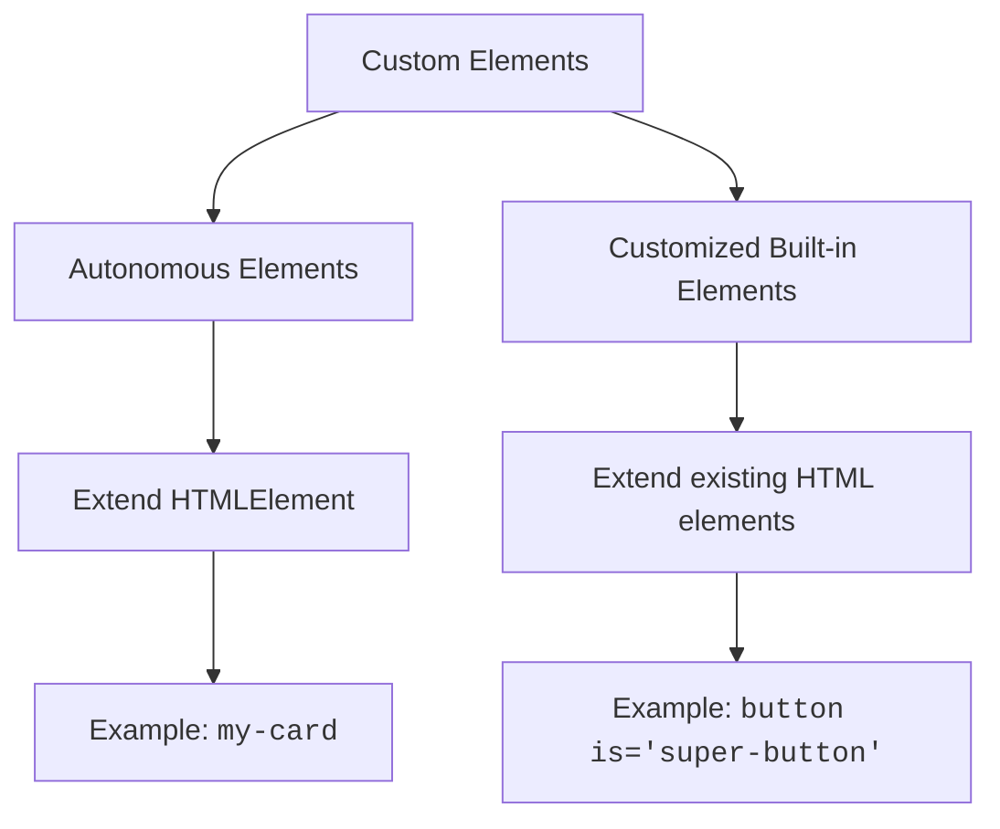

</div>

---
hideInToc: true
---

# Creating Custom Elements 🛠️

<v-clicks>
```js
class MyElement extends HTMLElement {
    constructor() {
        super();
        // Initialize your element
    }
    // Lifecycle Methods
    connectedCallback() {
        // Element added to DOM
    }
    disconnectedCallback() {
        // Element removed from DOM
    }
    attributeChangedCallback(name, oldValue, newValue) {
        // Attribute changed
    }
    static get observedAttributes() {
        return ['my-attribute'];
    }
}
// Register the element
customElements.define('my-element', MyElement);
```
</v-clicks>

---
hideInToc: true
---

# Lifecycle Methods Explained

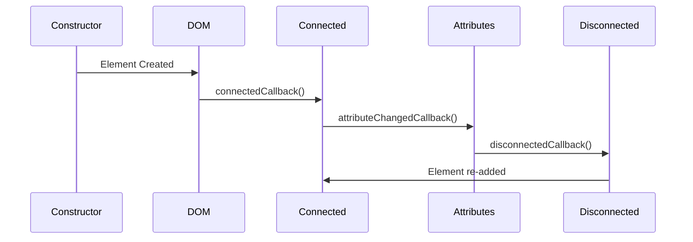

---
hideInToc: true
---

# Real-World Example: Custom Timer Element ⏰

<v-clicks>

````md magic-move
```js
class TimeFormatter extends HTMLElement {
  constructor() {
    super()
    this.intervalId = null
  }
  connectedCallback() {
    // Start the timer
    this.startTimer()
  }
  disconnectedCallback() {
    // Clean up
    if (this.intervalId) {
      clearInterval(this.intervalId)
    }
  }
  startTimer() {
    this.updateTime()
    this.intervalId = setInterval(() => this.updateTime(), 1000)
  }
  updateTime() {
    const now = new Date()
    this.innerHTML = now.toLocaleTimeString()
  }
}
customElements.define('time-display', TimeFormatter)
```

```html
<custom-card title="My Custom Card">
  <p>This is the card content!</p>
</custom-card>
```
````

<div class="mt-5">
<TimeFormatter />
</div>

</v-clicks>

---
hideInToc: true
---

# Common Pitfalls to Avoid ⚠️

<v-clicks>

<Tips type="danger">
<ul>
<p class="text-xl">Don't access children in constructor</p>
<li>Use <kbd>connectedCallback</kbd> instead</li>
<li>Children aren't ready in constructor</li>
<p class="text-xl">Don't forget to call <kbd>super()</kbd></p>
<li>Always call in constructor</li>
<li>Required for proper initialization</li>
<p class="text-xl">Avoid heavy operations in constructor</p>
<li>Keep it light</li>
<li><kbd>Move heavy work to connectedCallback</kbd></li>
</ul>
</Tips>

</v-clicks>

---
hideInToc: true
---

# Shadow DOM

<v-clicks>

#### Shadow DOM is a web standard that provides encapsulation for HTML, CSS, and JavaScript. Think of it as creating a "private" DOM tree inside your element that's isolated from the main document.

<div class="max-w-sm">

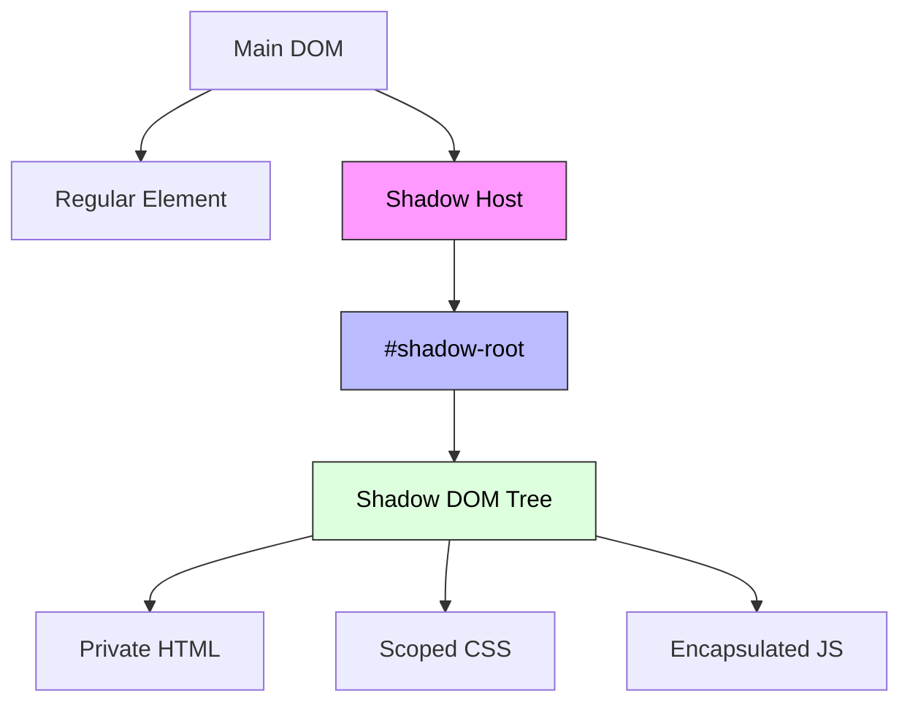

</div>

</v-clicks>

---
hideInToc: true
---

# Key Concepts 🔑

1. Two Types of DOM Trees

- Light Tree: The regular DOM elements we typically work with
- Shadow Tree: Hidden DOM elements encapsulated within a component

2. Browser Built-in Examples
   The most common example is the <kbd>input type="range"</kbd>:

<input type="range" />

#### Creating Shadow DOM 🛠️

```js
// Create a shadow root
const shadow = element.attachShadow({ mode: 'open' })

// Add content to the shadow root
shadow.innerHTML = `
  <style>
    /* Scoped styles here */
  </style>
  <div>
    <!-- Shadow DOM content here -->
  </div>
`
```

---
hideInToc: true
---

## Practical Examples

<v-clicks>

````md magic-move
```js
customElements.define(
  'custom-card',
  class extends HTMLElement {
    constructor() {
      super()
      const shadow = this.attachShadow({ mode: 'open' })

      shadow.innerHTML = `
      <style>
        .card {
          padding: 20px;
          border: 1px solid #ccc;
          border-radius: 4px;
        }
      </style>
      
      <div class="card">
        <slot></slot>
      </div>
    `
    }
  },
)
```

```html
<custom-card> Hello from the light DOM! </custom-card>
```
````

### Encapsulation Features 🛡️

##### 1. Style Isolation

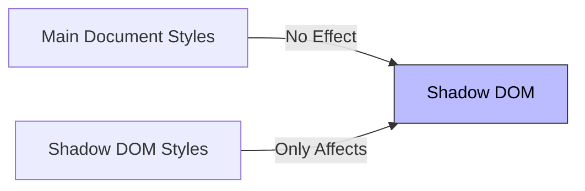

</v-clicks>

---
hideInToc: true
---

```css
<!-- Main document -->
<style>
  p { color: red; }  /* Won't affect shadow DOM */
</style>

<custom-element>
  #shadow-root
    <style>
      p { color: blue; }  /* Only affects shadow DOM */
    </style>
    <p>This will be blue!</p>
</custom-element>
```

#### 2. DOM Isolation

- Shadow DOM elements are not accessible via <kbd>document.querySelector()</kbd>
- IDs can be reused within shadow DOM
- Events are retargeted to preserve encapsulation

---
hideInToc: true
---

<div class="max-w-4xl mx-auto bg-white rounded-xl shadow-lg overflow-hidden">
      <div class="px-6 py-2 bg-indigo-600 sticky top-0">
        <h1 class="text-2xl text-center font-bold text-white"> Best Practices</h1>
      </div>
      
  <div class="relative">
        <div class="sticky top-0 bg-white z-10">
          <table class="min-w-full">
            <thead>
              <tr class="bg-gray-50">
                <th class="px-6 py-3 text-left text-sm font-semibold text-gray-700 border-b">Practice</th>
                <th class="px-6 py-3 text-left text-sm font-semibold text-gray-700 border-b">Implementation</th>
                <th class="px-6 py-3 text-left text-sm font-semibold text-gray-700 border-b">Purpose</th>
              </tr>
            </thead>
          </table>
        </div>
        
  <div class="overflow-y-auto max-h-96">
          <table class="min-w-full">
            <tbody class="divide-y divide-gray-200">
              <tr class="hover:bg-gray-50">
                <td class="px-6 py-4">
                  <div class="flex items-center">
                    <div class="h-8 w-8 flex-shrink-0 rounded-full bg-green-100 flex items-center justify-center">
                      <svg class="h-5 w-5 text-green-600" fill="none" stroke="currentColor" viewBox="0 0 24 24">
                        <path stroke-linecap="round" stroke-linejoin="round" stroke-width="2" d="M5 13l4 4L19 7"></path>
                      </svg>
                    </div>
                    <div class="ml-4">
                      <div class="font-medium text-gray-900">Use Open Mode</div>
                    </div>
                  </div>
                </td>
                <td class="px-6 py-4">
                  <pre class="text-sm"><code class="language-javascript">element.attachShadow({ mode: 'open' })</code></pre>
                </td>
                <td class="px-6 py-4 text-sm text-gray-600">
                  Enables external JavaScript to access the shadow DOM, making debugging and testing easier
                </td>
              </tr>
              <tr class="hover:bg-gray-50">
                <td class="px-6 py-4">
                  <div class="flex items-center">
                    <div class="h-8 w-8 flex-shrink-0 rounded-full bg-blue-100 flex items-center justify-center">
                      <svg class="h-5 w-5 text-blue-600" fill="none" stroke="currentColor" viewBox="0 0 24 24">
                        <path stroke-linecap="round" stroke-linejoin="round" stroke-width="2" d="M7 21h10a2 2 0 002-2V9.414a1 1 0 00-.293-.707l-5.414-5.414A1 1 0 0012.586 3H7a2 2 0 00-2 2v14a2 2 0 002 2z"></path>
                      </svg>
                    </div>
                    <div class="ml-4">
                      <div class="font-medium text-gray-900">Keep Styles Scoped</div>
                    </div>
                  </div>
                </td>
                <td class="px-6 py-4">
                  <pre class="text-sm"><code class="language-html">
          &lt;style&gt;
  :host {
    display: block;
    border: 1px solid #ccc;
  }
&lt;/style&gt;</code></pre>
                </td>
                <td class="px-6 py-4 text-sm text-gray-600">
                  Prevents style leakage and maintains component encapsulation
                </td>
              </tr>
              <tr class="hover:bg-gray-50">
                <td class="px-6 py-4">
                  <div class="flex items-center">
                    <div class="h-8 w-8 flex-shrink-0 rounded-full bg-purple-100 flex items-center justify-center">
                      <svg class="h-5 w-5 text-purple-600" fill="none" stroke="currentColor" viewBox="0 0 24 24">
                        <path stroke-linecap="round" stroke-linejoin="round" stroke-width="2" d="M4 6h16M4 12h16m-7 6h7"></path>
                      </svg>
                    </div>
                    <div class="ml-4">
                      <div class="font-medium text-gray-900">Use Slots for Composition</div>
                    </div>
                  </div>
                </td>
                <td class="px-6 py-4">
                  <pre class="text-sm"><code class="language-html">&lt;div class="wrapper"&gt;
  &lt;slot name="header"&gt;&lt;/slot&gt;
  &lt;slot&gt;&lt;/slot&gt;
&lt;/div&gt;</code></pre>
                </td>
                <td class="px-6 py-4 text-sm text-gray-600">
                  Enables flexible content distribution and component composition
                </td>
              </tr>
              <tr class="hover:bg-gray-50">
                <td class="px-6 py-4">
                  <div class="flex items-center">
                    <div class="h-8 w-8 flex-shrink-0 rounded-full bg-yellow-100 flex items-center justify-center">
                      <svg class="h-5 w-5 text-yellow-600" fill="none" stroke="currentColor" viewBox="0 0 24 24">
                        <path stroke-linecap="round" stroke-linejoin="round" stroke-width="2" d="M13 10V3L4 14h7v7l9-11h-7z"></path>
                      </svg>
                    </div>
                    <div class="ml-4">
                      <div class="font-medium text-gray-900">Custom Events</div>
                    </div>
                  </div>
                </td>
                <td class="px-6 py-4">
                  <pre class="text-sm"><code class="language-javascript">this.dispatchEvent(new CustomEvent('change', {
  detail: { value: newValue },
  bubbles: true
}))</code></pre>
                </td>
                <td class="px-6 py-4 text-sm text-gray-600">
                  Enables component communication while maintaining encapsulation
                </td>
              </tr>
              <tr class="hover:bg-gray-50">
                <td class="px-6 py-4">
                  <div class="flex items-center">
                    <div class="h-8 w-8 flex-shrink-0 rounded-full bg-red-100 flex items-center justify-center">
                      <svg class="h-5 w-5 text-red-600" fill="none" stroke="currentColor" viewBox="0 0 24 24">
                        <path stroke-linecap="round" stroke-linejoin="round" stroke-width="2" d="M12 6V4m0 2a2 2 0 100 4m0-4a2 2 0 110 4m-6 8a2 2 0 100-4m0 4a2 2 0 110-4m0 4v2m0-6V4m6 6v10m6-2a2 2 0 100-4m0 4a2 2 0 110-4m0 4v2m0-6V4"></path>
                      </svg>
                    </div>
                    <div class="ml-4">
                      <div class="font-medium text-gray-900">Lifecycle Callbacks</div>
                    </div>
                  </div>
                </td>
                <td class="px-6 py-4">
                  <pre class="text-sm"><code class="language-javascript">connectedCallback() {
  // Setup when element is added to DOM
}
disconnectedCallback() {
  // Cleanup when element is removed
}</code></pre>
                </td>
                <td class="px-6 py-4 text-sm text-gray-600">
                  Manage setup and cleanup operations effectively
                </td>
              </tr>
            </tbody>
          </table>
        </div>
      </div>
    </div>

---
hideInToc: true
---

### What is the Template Element?

#### The <kbd>template</kbd> element is a powerful HTML feature that acts as a container for HTML content that should be hidden when a page loads. Think of it as a reusable blueprint that remains dormant until activated through JavaScript.

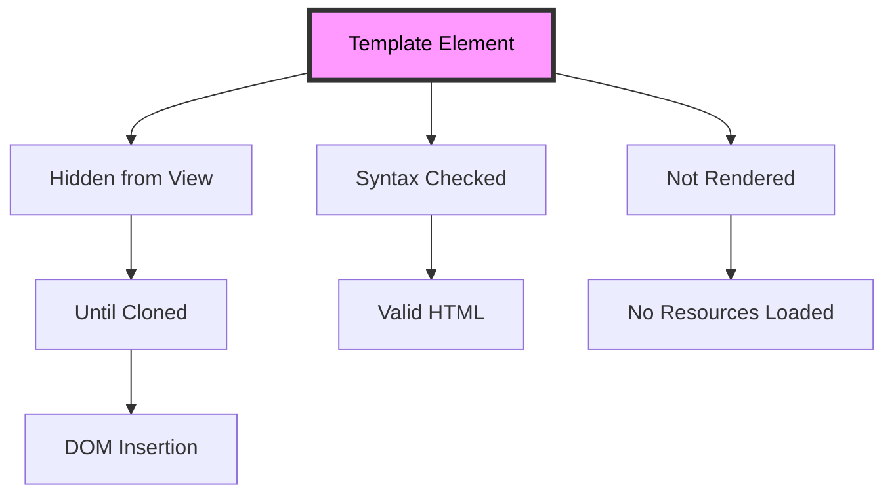

---
hideInToc: true
---

##### Key Characteristics

<v-clicks>

1. Content Isolation

- Content is inert (inactive)
- Not rendered in the DOM
- Scripts don't execute
- Images don't load
- Styles don't apply

2. Syntax Flexibility
   Unlike regular HTML, templates can contain elements that typically require specific parent elements:

```html
<!-- ✅ Valid in template -->
<template>
  <tr>
    <td>Row content</td>
  </tr>
</template>
<!-- ❌ Invalid in regular HTML -->
<div>
  <tr>
    <td>Row content</td>
  </tr>
</div>
```

</v-clicks>

---
hideInToc: true
---

## Visual Representation

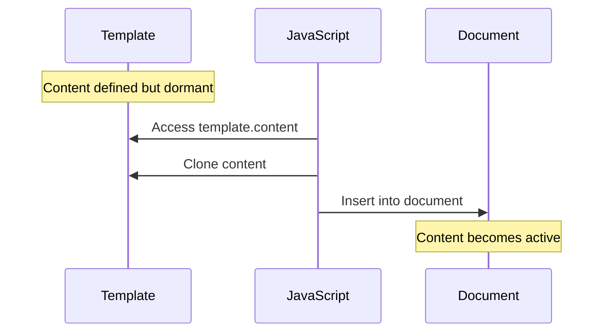

---
hideInToc: true
---

```js
// Template Definition
<template id="userCard">
    <div class="user-card">
        
        <div class="info">
            <h2></h2>
            <p class="email"></p>
        </div>
    </div>
</template>
{/* Usage */}
<script>
    function createUserCard(user) {
        // 1. Get template
        const template = document.getElementById('userCard');
        // 2. Clone template content
        const userCard = template.content.cloneNode(true);
        // 3. Fill with data
        userCard.querySelector('img').src = user.photo;
        userCard.querySelector('h2').textContent = user.name;
        userCard.querySelector('.email').textContent = user.email;
        // 4. Insert into document
        document.body.appendChild(userCard);
    }
    createUserCard({
        name: 'John Doe',
        email: 'john@example.com',
        photo: 'john.jpg'
    });
</script>
```

---
hideInToc: true
---

### Use Cases & Benefits

<div class="max-w-4xl mx-auto">  
 <div class="h-[70vh] overflow-y-auto rounded-lg shadow-inner bg-white p-4">
            <div class="grid gap-6 p-2">
                <div class="bg-white rounded-lg shadow-lg overflow-hidden hover:shadow-xl transition-shadow duration-300">
                    <div class="bg-blue-600 p-4 sticky top-0 z-10">
                        <h3 class="text-xl font-semibold text-white">1. Component Templates</h3>
                    </div>
                    <div class="p-6">
                        <ul class="space-y-3">
                            <li class="flex items-start">
                                <svg class="h-6 w-6 text-green-500 mr-2 flex-shrink-0" fill="none" stroke="currentColor" viewBox="0 0 24 24">
                                    <path stroke-linecap="round" stroke-linejoin="round" stroke-width="2" d="M5 13l4 4L19 7"></path>
                                </svg>
                                <span class="text-gray-700">Reusable UI Components</span>
                            </li>
                            <li class="flex items-start">
                                <svg class="h-6 w-6 text-green-500 mr-2 flex-shrink-0" fill="none" stroke="currentColor" viewBox="0 0 24 24">
                                    <path stroke-linecap="round" stroke-linejoin="round" stroke-width="2" d="M5 13l4 4L19 7"></path>
                                </svg>
                                <span class="text-gray-700">Consistent Structure</span>
                            </li>
                            <li class="flex items-start">
                                <svg class="h-6 w-6 text-green-500 mr-2 flex-shrink-0" fill="none" stroke="currentColor" viewBox="0 0 24 24">
                                    <path stroke-linecap="round" stroke-linejoin="round" stroke-width="2" d="M5 13l4 4L19 7"></path>
                                </svg>
                                <span class="text-gray-700">Easy Maintenace</span>
                            </li>
                        </ul>
                    </div>
                </div>

<div class="bg-white rounded-lg shadow-lg overflow-hidden hover:shadow-xl transition-shadow duration-300">
                    <div class="bg-green-600 p-4 sticky top-0 z-10">
                        <h3 class="text-xl font-semibold text-white">2. Dynamic Content</h3>
                    </div>
                    <div class="p-6">
                        <ul class="space-y-3">
                            <li class="flex items-start">
                                <svg class="h-6 w-6 text-green-500 mr-2 flex-shrink-0" fill="none" stroke="currentColor" viewBox="0 0 24 24">
                                    <path stroke-linecap="round" stroke-linejoin="round" stroke-width="2" d="M5 13l4 4L19 7"></path>
                                </svg>
                                <span class="text-gray-700">Loading items into lists</span>
                            </li>
                            <li class="flex items-start">
                                <svg class="h-6 w-6 text-green-500 mr-2 flex-shrink-0" fill="none" stroke="currentColor" viewBox="0 0 24 24">
                                    <path stroke-linecap="round" stroke-linejoin="round" stroke-width="2" d="M5 13l4 4L19 7"></path>
                                </svg>
                                <span class="text-gray-700">Creating modal windows</span>
                            </li>
                            <li class="flex items-start">
                                <svg class="h-6 w-6 text-green-500 mr-2 flex-shrink-0" fill="none" stroke="currentColor" viewBox="0 0 24 24">
                                    <path stroke-linecap="round" stroke-linejoin="round" stroke-width="2" d="M5 13l4 4L19 7"></path>
                                </svg>
                                <span class="text-gray-700">Building form elements</span>
                            </li>
                        </ul>
                    </div>
                </div>

<div class="bg-white rounded-lg shadow-lg overflow-hidden hover:shadow-xl transition-shadow duration-300">
                    <div class="bg-purple-600 p-4 sticky top-0 z-10">
                        <h3 class="text-xl font-semibold text-white">3. Shadow DOM Integration</h3>
                    </div>
                    <div class="p-6">
                          <pre class="bg-gray-50 rounded-lg p-4 overflow-x-auto">
                <code class="text-sm font-mono text-gray-800">
&lt;template id="customElement"&gt;
    &lt;style&gt;
        .wrapper { border: 2px solid blue; }
    &lt;/style&gt;
    &lt;div class="wrapper"&gt;
        &lt;slot&gt;&lt;/slot&gt;
    &lt;/div&gt;
&lt;/template&gt;
                </code>
            </pre>
                    </div>
                </div>
            </div>
        </div>
    </div>

---
hideInToc: true
---

### Best Practices

<div class="max-w-4xl mx-auto">  
 <div class="h-[70vh] overflow-y-auto rounded-lg shadow-inner bg-white p-4">
            <div class="grid gap-6 p-2">
                <div class="bg-white rounded-lg shadow-lg overflow-hidden hover:shadow-xl transition-shadow duration-300">
                    <div class="bg-blue-600 p-4 sticky top-0 z-10">
                        <h3 class="text-xl font-semibold text-white">1. Always Clone</h3>
                    </div>
                    <div class="p-6">
                       <pre class="bg-gray-50 rounded-lg p-4 overflow-x-auto">
                       <code class="text-sm font-mono text-gray-800">
// ✅ Correct way
const clone = template.content.cloneNode(true);
// ❌ Incorrect - content can only be used once
const content = template.content;
                       </code>
                       </pre>
                    </div>
                </div>

<div class="bg-white rounded-lg shadow-lg overflow-hidden hover:shadow-xl transition-shadow duration-300">
                    <div class="bg-green-600 p-4 sticky top-0 z-10">
                        <h3 class="text-xl font-semibold text-white">2. Use IDs for Reference</h3>
                    </div>
                    <div class="p-6">
                        <pre class="bg-gray-50 rounded-lg p-4 overflow-x-auto">
                <code class="text-sm font-mono text-gray-800">
&lt;template id="myTemplate"&gt;
    &lt;!-- Content --&gt;
&lt;/template&gt;</code>
            </pre>
                    </div>
                </div>

<div class="bg-white rounded-lg shadow-lg overflow-hidden hover:shadow-xl transition-shadow duration-300">
                    <div class="bg-purple-600 p-4 sticky top-0 z-10">
                        <h3 class="text-xl font-semibold text-white">3. Keep Templates Focused</h3>
                    </div>
                    <div class="p-6">
                        <ul>
                        <li>One template per component</li>
                        <li>Clear, specific purpose</li>
                        <li>Minimal Complexity</li>
                        </ul>
                    </div>
                </div>
            </div>
        </div>
    </div>

---
hideInToc: true
---

### Common Patterns

<div class="max-w-4xl mx-auto">  
    <div class="h-[70vh] overflow-y-auto rounded-lg shadow-inner bg-white p-4">
        <div class="grid gap-6 p-2">  
            <!-- List Items Template -->
            <div class="bg-white rounded-lg shadow-lg overflow-hidden hover:shadow-xl transition-shadow duration-300">
                <div class="bg-green-600 p-4 sticky top-0 z-10">
                    <h3 class="text-xl font-semibold text-white">1. List Items</h3>
                </div>
                <div class="p-6">
                    <pre class="bg-gray-50 rounded-lg p-4 overflow-x-auto">
                        <code class="text-sm font-mono text-gray-800">
&lt;template id="listItem"&gt;
    &lt;li class="item"&gt;
        &lt;span class="title"&gt;&lt;/span&gt;
        &lt;button class="delete"&gt;❌&lt;/button&gt;
    &lt;/li&gt;
&lt;/template&gt;</code>
                    </pre>
                </div>
            </div>

<div class="bg-white rounded-lg shadow-lg overflow-hidden hover:shadow-xl transition-shadow duration-300">
                <div class="bg-purple-600 p-4 sticky top-0 z-10">
                    <h3 class="text-xl font-semibold text-white">2. Keep Templates Focused</h3>
                </div>
                <div class="p-6">
                    <pre class="bg-gray-50 rounded-lg p-4 overflow-x-auto">
                        <code class="text-sm font-mono text-gray-800">
&lt;template id="modal"&gt;
    &lt;div class="modal"&gt;
        &lt;header class="modal-header"&gt;
            &lt;h2&gt;&lt;/h2&gt;
            &lt;button class="close"&gt;×&lt;/button&gt;
        &lt;/header&gt;
        &lt;div class="modal-content"&gt;&lt;/div&gt;
    &lt;/div&gt;
&lt;/template&gt;</code>
                    </pre>
                </div>
            </div>
        </div>
    </div>
</div>

---
hideInToc: true
---

# Shadow DOM Slots and Composition

<v-clicks>

##### Shadow DOM slots provide a powerful way to create reusable web components that can accept and render external content. Think of slots as "holes" in your shadow DOM where you can insert content from the light DOM (regular DOM).

##### Imagine a picture frame (shadow DOM) with designated spaces (slots) where you can insert different photos (light DOM content). The frame remains the same, but you can change the photos easily.

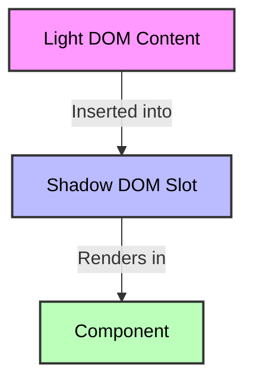

</v-clicks>

---
hideInToc: true
---

# Types of Slots

<v-clicks>

1. Named Slots
   Named slots are specific placement points identified by a name attribute. Content from the light DOM must have a matching slot attribute to be inserted into these slots.

```js
<!-- Shadow DOM Template -->
<div>
  <h2><slot name="title"></slot></h2>
  <div><slot name="content"></slot></div>
</div>
<!-- Light DOM Usage -->
<custom-element>
  <span slot="title">Hello World</span>
  <p slot="content">This is my content</p>
</custom-element>
```

</v-clicks>

---
hideInToc: true
---

# CONTD

<v-clicks>

2. Default Slot
   The default slot (unnamed) captures all light DOM content that isn't assigned to a specific named slot.

```js
<!-- Shadow DOM Template -->
<div>
  <slot name="header"></slot>
  <slot></slot> <!-- Default slot -->
</div>
<!-- Light DOM Usage -->
<custom-element>
  <h1 slot="header">Title</h1>
  <p>This goes to default slot</p>
  <span>This also goes to default slot</span>
</custom-element>
```

</v-clicks>

---
hideInToc: true
---

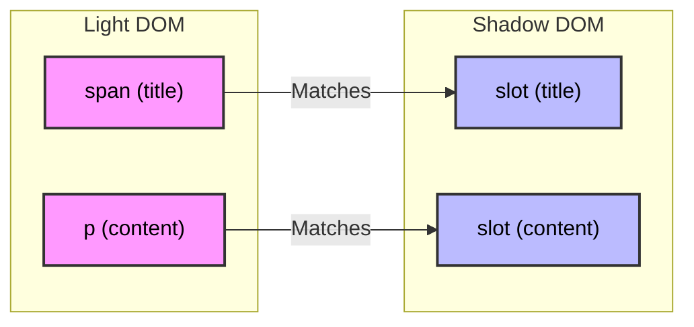

---
hideInToc: true
---

# Practical Example: Custom Menu Component

```html
<!-- Usage -->
<custom-menu>
  <span slot="title">Food Menu</span>
  <li slot="item">Pizza</li>
  <li slot="item">Burger</li>
  <li slot="item">Salad</li>
</custom-menu>

<!-- Shadow DOM Template -->
<div class="menu">
  <header><slot name="title"></slot></header>
  <ul>
    <slot name="item"></slot>
  </ul>
</div>
```

---
hideInToc: true
---

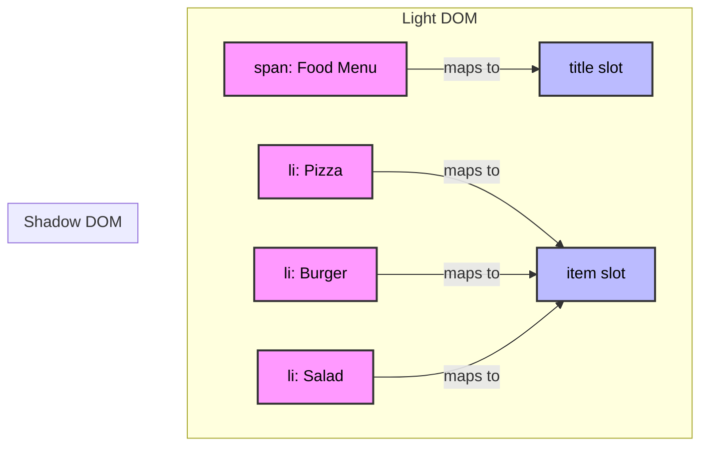

---
hideInToc: true
---

<div class="max-w-6xl mx-auto bg-white rounded-xl shadow-lg overflow-hidden">
    <div class="p-6">
      <h2 class="text-2xl font-bold text-gray-800 mb-4">Shadow DOM Slot Features and Behaviors</h2>
      <div class="overflow-x-auto overflow-y-auto max-h-[400px] rounded-lg border border-gray-200">
        <table class="min-w-full divide-y divide-gray-200">
          <thead class="bg-gray-50 sticky top-0">
            <tr>
              <th class="px-6 py-3 text-left text-xs font-medium text-gray-500 uppercase tracking-wider w-1/4">Feature</th>
              <th class="px-6 py-3 text-left text-xs font-medium text-gray-500 uppercase tracking-wider w-1/4">Example</th>
              <th class="px-6 py-3 text-left text-xs font-medium text-gray-500 uppercase tracking-wider w-2/4">Description</th>
            </tr>
          </thead>
<tbody class="bg-white divide-y divide-gray-200">
        <tr class="hover:bg-gray-50">
              <td class="px-6 py-4">
                <div class="text-sm font-medium text-gray-900">Fallback Content</div>
              </td>
              <td class="px-6 py-4">
                <div class="p-2 bg-gray-100 rounded-md">
                  <code class="text-sm text-purple-600">
                    &lt;slot name="title"&gt;Default Title&lt;/slot&gt;
                  </code>
                </div>
              </td>
              <td class="px-6 py-4">
                <div class="text-sm text-gray-600">
                  The content inside the slot tag serves as a default value when no matching content is provided in the light DOM.
                  <div class="mt-2 p-2 bg-blue-50 rounded-md">
                    <span class="text-blue-600 font-medium">Use Case:</span> Providing default text for optional content areas
                  </div>
                </div>
              </td>
            </tr>

<tr class="hover:bg-gray-50">
              <td class="px-6 py-4">
                <div class="text-sm font-medium text-gray-900">Multiple Elements in One Slot</div>
              </td>
              <td class="px-6 py-4">
                <div class="p-2 bg-gray-100 rounded-md">
                  <code class="text-sm text-purple-600">
                    &lt;custom-element&gt;<br>
                    &nbsp;&nbsp;&lt;p slot="content"&gt;First paragraph&lt;/p&gt;<br>
                    &nbsp;&nbsp;&lt;p slot="content"&gt;Second paragraph&lt;/p&gt;<br>
                    &lt;/custom-element&gt;
                  </code>
                </div>
              </td>
              <td class="px-6 py-4">
                <div class="text-sm text-gray-600">
                  Multiple elements with the same slot name are appended sequentially in the order they appear.
                  <div class="mt-2 p-2 bg-blue-50 rounded-md">
                    <span class="text-blue-600 font-medium">Use Case:</span> Creating lists, menu items, or multiple content sections
                  </div>
                </div>
              </td>
            </tr>

 <tr class="hover:bg-gray-50">
              <td class="px-6 py-4">
                <div class="text-sm font-medium text-gray-900">Slot Changes</div>
              </td>
              <td class="px-6 py-4">
                <div class="p-2 bg-gray-100 rounded-md">
                  <code class="text-sm text-purple-600">
                    shadowRoot.querySelector('slot')<br>
                    &nbsp;&nbsp;.addEventListener('slotchange', (e) => {<br>
                    &nbsp;&nbsp;&nbsp;&nbsp;console.log('Slot content changed!');<br>
                    });
                  </code>
                </div>
              </td>
              <td class="px-6 py-4">
                <div class="text-sm text-gray-600">
                  The slotchange event fires when slot content is added, removed, or changed.
                  <div class="mt-2 p-2 bg-blue-50 rounded-md">
                    <span class="text-blue-600 font-medium">Use Case:</span> Responding to dynamic content updates
                  </div>
                </div>
              </td>
            </tr>

<tr class="hover:bg-gray-50">
              <td class="px-6 py-4">
                <div class="text-sm font-medium text-gray-900">Named Slots</div>
              </td>
              <td class="px-6 py-4">
                <div class="p-2 bg-gray-100 rounded-md">
                  <code class="text-sm text-purple-600">
                    &lt;div&gt;<br>
                    &nbsp;&nbsp;&lt;slot name="header"&gt;&lt;/slot&gt;<br>
                    &nbsp;&nbsp;&lt;slot name="content"&gt;&lt;/slot&gt;<br>
                    &lt;/div&gt;
                  </code>
                </div>
              </td>
              <td class="px-6 py-4">
                <div class="text-sm text-gray-600">
                  Named slots allow specific content placement within the shadow DOM.
                  <div class="mt-2 p-2 bg-blue-50 rounded-md">
                    <span class="text-blue-600 font-medium">Use Case:</span> Creating structured layouts with defined content areas
                  </div>
                </div>
              </td>
            </tr>

 <tr class="hover:bg-gray-50">
              <td class="px-6 py-4">
                <div class="text-sm font-medium text-gray-900">Default Slot</div>
              </td>
              <td class="px-6 py-4">
                <div class="p-2 bg-gray-100 rounded-md">
                  <code class="text-sm text-purple-600">
                    &lt;div&gt;<br>
                    &nbsp;&nbsp;&lt;slot&gt;Default content&lt;/slot&gt;<br>
                    &lt;/div&gt;
                  </code>
                </div>
              </td>
              <td class="px-6 py-4">
                <div class="text-sm text-gray-600">
                  The default (unnamed) slot captures all unassigned light DOM content.
                  <div class="mt-2 p-2 bg-blue-50 rounded-md">
                    <span class="text-blue-600 font-medium">Use Case:</span> Handling general content without specific placement needs
                  </div>
                </div>
              </td>
            </tr>
          </tbody>
        </table>
      </div>
    </div>
  </div>

---
hideInToc: true
---

## JavaScript Slot API

Important slot-related methods:

<v-clicks>

1. <kbd>node.assignedSlot</kbd>

- Returns the slot element where a node is assigned

2. <kbd>slot.assignedNodes()</kbd>

- Returns nodes assigned to the slot

3. <kbd>slot.assignedElements()</kbd>

- Returns only element nodes assigned to the slot

```js
// Get all elements in a slot
const elements = slot.assignedElements()

// Check which slot an element is assigned to
const targetSlot = element.assignedSlot
```

</v-clicks>

---
hideInToc: true
---

## Best Practices

- Always provide fallback content for important slots
- Use named slots for specific content placement
- Use the default slot for flexible content areas
- Monitor slot changes when dynamic content updates are needed
- Keep slot names semantic and meaningful

---
hideInToc: true
---

## Shadow DOM CSS

<v-clicks>

Shadow DOM is a powerful web component feature that provides encapsulation for HTML, CSS, and JavaScript. This guide will explain how to style Shadow DOM elements effectively.

1. Basic Shadow DOM Styling Rules
   Shadow DOM can contain styles in two ways:

- Using <kbd>style</kbd> tags directly
- Using <kbd>link rel="stylesheet"</kbd> tags

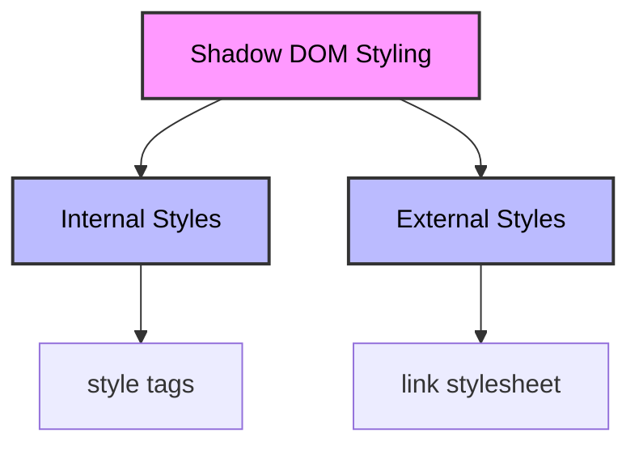

</v-clicks>

---
hideInToc: true
---

2. Host Styling with <kbd>:host</kbd>

##### What is :host?

<kbd>:host</kbd> is a special selector that targets the shadow host (the element containing the shadow tree).

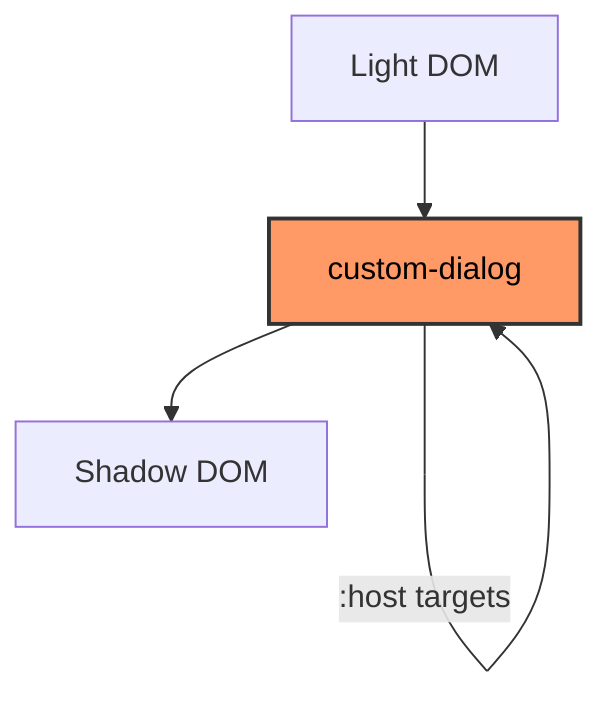

---
hideInToc: true
---

Example of :host Usage

```html
<template id="tmpl">
  <style>
    :host {
      position: fixed;
      left: 50%;
      top: 50%;
      transform: translate(-50%, -50%);
      display: inline-block;
      border: 1px solid red;
      padding: 10px;
    }
  </style>
  <slot></slot>
</template>
```

---
hideInToc: true
---

3. Style Cascading Priority

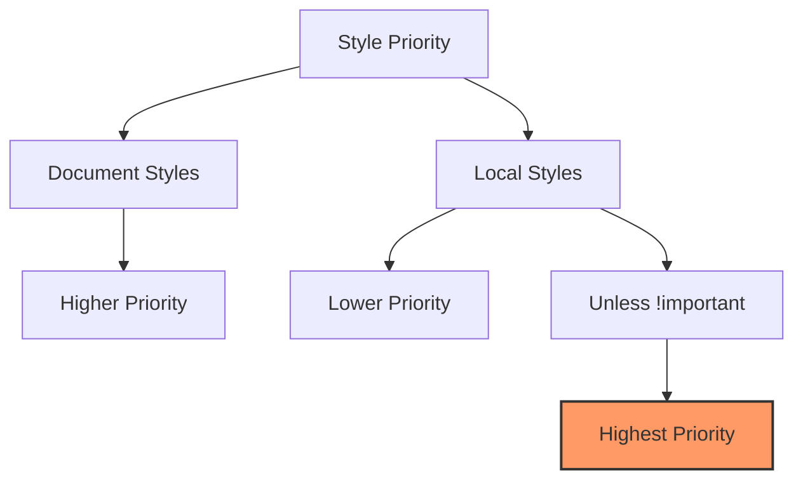

---
hideInToc: true
---

<Tips type="success" >
<ul>
<li>Document styles generally take precedence over local styles</li>
<li>Local styles with !important override document styles</li>
<li>This allows for easy customization while maintaining default styles</li>
</ul>
</Tips>

4. Conditional Host Styling with <kbd>:host(selector)</kbd>

##### <kbd>:host(selector)</kbd> allows you to apply styles only when the host element matches a specific selector.

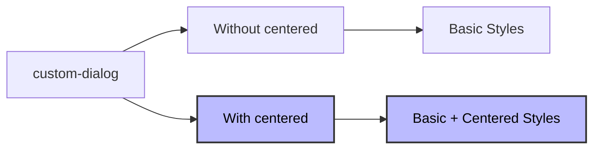

---
hideInToc: true
---

```css
:host([centered]) {
  position: fixed;
  left: 50%;
  top: 50%;
  transform: translate(-50%, -50%);
}
```

5. Styling Slotted Content

#### Key Points about Slots:

- Slotted elements come from light DOM
- They use document styles by default
- Local styles don't directly affect slotted content

---
hideInToc: true
---

## Two Ways to Style Slots:

<v-clicks>

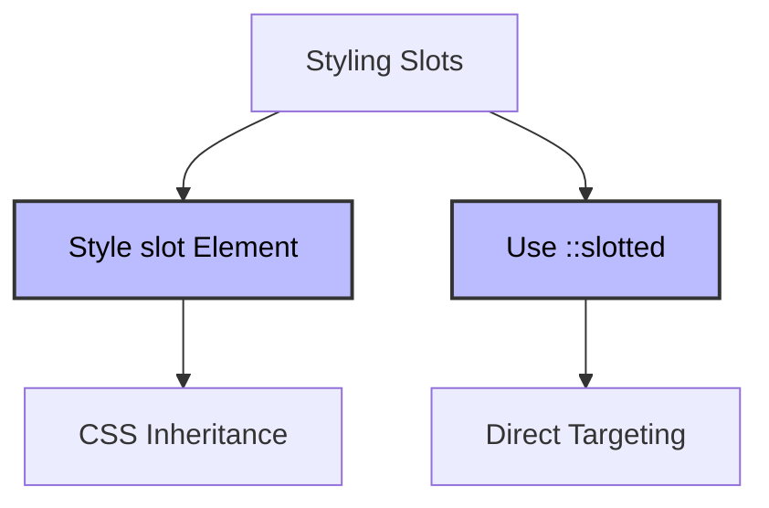

<div class="flex item-center gap-5">

<div>

- Method 1: Styling the slot

```css
slot[name='username'] {
  font-weight: bold;
}
```

</div>

<div>

- Method 2: Using ::slotted

```css
::slotted(div) {
  border: 1px solid red;
}
```

</div>
</div>
</v-clicks>

---
hideInToc: true
---

6. CSS Custom Properties for Styling

<v-clicks>

Custom properties (CSS variables) can pierce through shadow DOM boundaries, making them perfect for styling components from outside.

<div class="flex items-center gap-10">
<div>

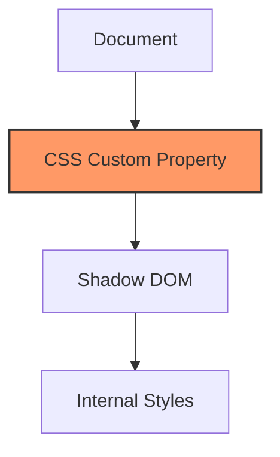

</div>
<div>
```css
/* In document */
user-card {
  --user-card-field-color: green;
}
/* In shadow DOM */
.field {
  color: var(--user-card-field-color, black);
}
```
</div>
</div>

</v-clicks>

---
hideInToc: true
---

<div class="container mx-auto">
    <div class="bg-white rounded-lg shadow-lg overflow-hidden">
      <div class="bg-gray-800 text-white px-6 py-4">
        <h2 class="text-xl font-semibold">Shadow DOM Styling Reference</h2>
      </div>
      
<div class="overflow-x-auto">
        <table class="min-w-full divide-y divide-gray-200">
          <thead class="bg-gray-50">
            <tr>
              <th class="px-6 py-3 text-left text-xs font-medium text-gray-500 uppercase tracking-wider sticky top-0 bg-gray-50">Selector/Method</th>
              <th class="px-6 py-3 text-left text-xs font-medium text-gray-500 uppercase tracking-wider sticky top-0 bg-gray-50">Usage</th>
              <th class="px-6 py-3 text-left text-xs font-medium text-gray-500 uppercase tracking-wider sticky top-0 bg-gray-50">Scope</th>
              <th class="px-6 py-3 text-left text-xs font-medium text-gray-500 uppercase tracking-wider sticky top-0 bg-gray-50">Priority</th>
              <th class="px-6 py-3 text-left text-xs font-medium text-gray-500 uppercase tracking-wider sticky top-0 bg-gray-50">Example</th>
            </tr>
          </thead>

<tbody class="bg-white divide-y divide-gray-200">
            <tr class="hover:bg-gray-50">
              <td class="px-6 py-4 whitespace-nowrap">
                <code class="bg-gray-100 px-2 py-1 rounded text-pink-600">:host</code>
              </td>
              <td class="px-6 py-4 whitespace-nowrap">Host element</td>
              <td class="px-6 py-4 whitespace-nowrap">Shadow DOM</td>
              <td class="px-6 py-4 whitespace-nowrap">
                <span class="px-2 inline-flex text-xs leading-5 font-semibold rounded-full bg-yellow-100 text-yellow-800">Lower than document</span>
              </td>
              <td class="px-6 py-4">
                <code class="text-sm text-gray-600">:host { display: block; }</code>
              </td>
            </tr>
            <tr class="hover:bg-gray-50">
              <td class="px-6 py-4 whitespace-nowrap">
                <code class="bg-gray-100 px-2 py-1 rounded text-pink-600">:host(selector)</code>
              </td>
              <td class="px-6 py-4 whitespace-nowrap">Conditional host styling</td>
              <td class="px-6 py-4 whitespace-nowrap">Shadow DOM</td>
              <td class="px-6 py-4 whitespace-nowrap">
                <span class="px-2 inline-flex text-xs leading-5 font-semibold rounded-full bg-yellow-100 text-yellow-800">Lower than document</span>
              </td>
              <td class="px-6 py-4">
                <code class="text-sm text-gray-600">:host(.featured) { margin: 2rem; }</code>
              </td>
            </tr>
            <tr class="hover:bg-gray-50">
              <td class="px-6 py-4 whitespace-nowrap">
                <code class="bg-gray-100 px-2 py-1 rounded text-pink-600">::slotted</code>
              </td>
              <td class="px-6 py-4 whitespace-nowrap">Slotted elements</td>
              <td class="px-6 py-4 whitespace-nowrap">Shadow DOM</td>
              <td class="px-6 py-4 whitespace-nowrap">
                <span class="px-2 inline-flex text-xs leading-5 font-semibold rounded-full bg-green-100 text-green-800">Higher than basic</span>
              </td>
              <td class="px-6 py-4">
                <code class="text-sm text-gray-600">::slotted(p) { color: blue; }</code>
              </td>
            </tr>
            <tr class="hover:bg-gray-50">
              <td class="px-6 py-4 whitespace-nowrap">
                <code class="bg-gray-100 px-2 py-1 rounded text-pink-600">CSS Custom Properties</code>
              </td>
              <td class="px-6 py-4 whitespace-nowrap">Cross-boundary styling</td>
              <td class="px-6 py-4 whitespace-nowrap">Both</td>
              <td class="px-6 py-4 whitespace-nowrap">
                <span class="px-2 inline-flex text-xs leading-5 font-semibold rounded-full bg-blue-100 text-blue-800">Pierces through</span>
              </td>
              <td class="px-6 py-4">
                <code class="text-sm text-gray-600">--theme-color: #007bff;</code>
              </td>
            </tr>
          </tbody>
        </table>
      </div>
    </div>
  </div>

---
hideInToc: true
---

### Best Practices

- Use <kbd>:host</kbd> for default component styling
- Implement CSS custom properties for customization
- Use <kbd>::slotted</kbd> sparingly and only for direct slot content
- Keep document styles as overrides
- Use <kbd>!important</kbd> only when absolutely necessary

---
hideInToc: true
---

### Shadow DOM and Event

<v-clicks>

Shadow DOM is like a private, encapsulated space within an HTML element (called the host element) that keeps its internal implementation details hidden from the main document.

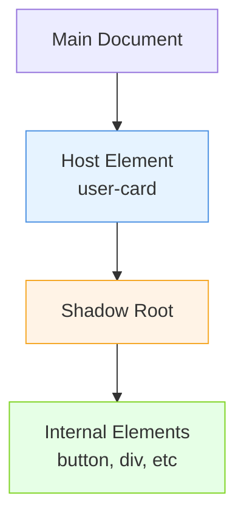

</v-clicks>

---
hideInToc: true
---

### Event Retargeting

<v-clicks>

When events occur inside a shadow DOM, the browser performs "event retargeting" to maintain encapsulation. Here's how it works:

```js
// Example Component
customElements.define(
  'user-card',
  class extends HTMLElement {
    connectedCallback() {
      this.attachShadow({ mode: 'open' })
      this.shadowRoot.innerHTML = `
      <button>Click me</button>
    `
    }
  },
)
```

Event handling behavior:

- Inside Shadow DOM: Event target is the actual element (e.g., <kbd>button</kbd>)
- Outside Shadow DOM: Event target becomes the host element (e.g., <kbd>user-card</kbd>)

</v-clicks>

---
hideInToc: true
---

### Event Retargeting (Visual)

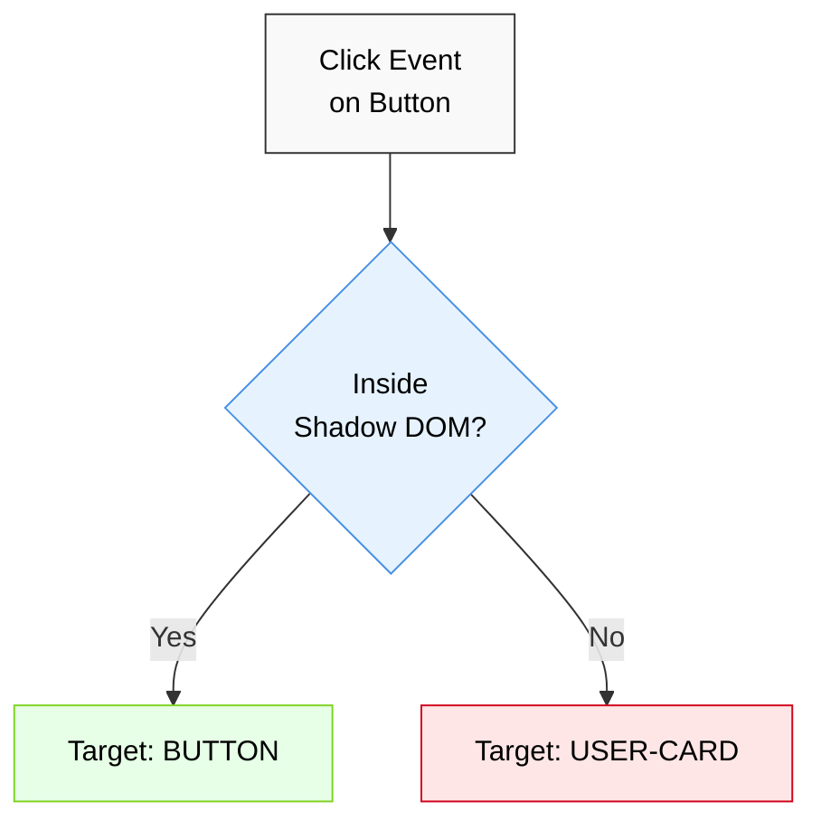

---
hideInToc: true
---

### Slotted Elements and Event Handling

<v-clicks>

Slotted elements are special because they physically exist in the light DOM (main document) but appear inside the shadow DOM. They have unique event handling behavior:

```js
// Example with slotted content
;<user-card>
  <span slot="username">John Smith</span>
</user-card>

customElements.define(
  'user-card',
  class extends HTMLElement {
    connectedCallback() {
      this.attachShadow({ mode: 'open' })
      this.shadowRoot.innerHTML = `
      <div>
        <slot name="username"></slot>
      </div>
    `
    }
  },
)
```

<b>Key point:</b> Events on slotted elements don't get retargeted because they're actually part of the light DOM.

</v-clicks>

---
hideInToc: true
---

### Slotted Elements Structure

<div class="w-46 mx-auto">

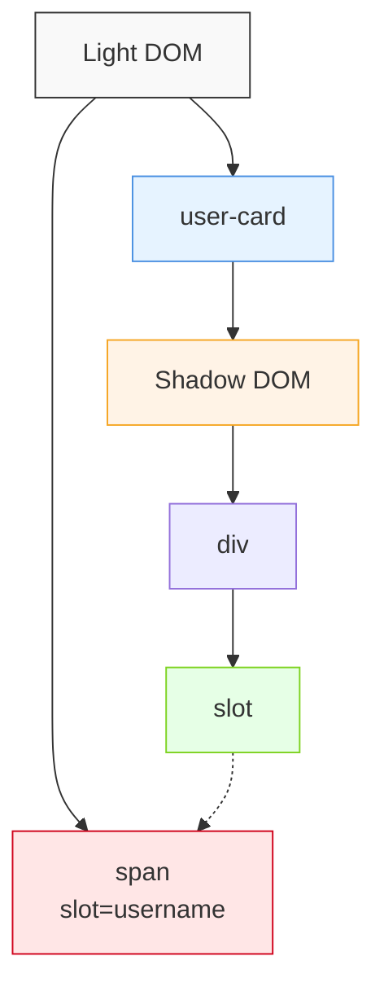

</div>

---
hideInToc: true
---

## Event Bubbling and composedPath()

<v-clicks>

Events bubble through the "flattened" DOM structure, which includes both light and shadow DOM elements. The event.composedPath() method reveals the full path:

```js
// Click on a slotted element shows path:
event.composedPath()
// Returns: [span, slot, div, shadow-root, user-card, body, html, document, window]
```

## Event Composition Rules

Events have a composed property that determines if they can cross shadow DOM boundaries:

</v-clicks>

---
hideInToc: true
---

<div class="max-w-4xl mx-auto">
        <h1 class="text-2xl font-bold mb-6 text-white sticky top-0">DOM Events Composition</h1>
        <div class="rounded-lg shadow-lg">
            <!-- Sticky header wrapper -->
            <div class="max-h-[500px] overflow-y-auto rounded-lg">
                <!-- Table wrapper for horizontal scroll -->
                <div class="min-w-full inline-block align-middle">
                    <table class="w-full bg-white">
                        <thead class="bg-gray-800 text-white sticky top-0">
                            <tr>
                                <th class="px-6 py-3 text-left text-sm font-semibold">Composition</th>
                                <th class="px-6 py-3 text-left text-sm font-semibold">Event Category</th>
                                <th class="px-6 py-3 text-left text-sm font-semibold">Events</th>
                            </tr>
                        </thead>
                        <tbody class="divide-y divide-gray-200">
                            <tr class="bg-blue-50">
                                <td class="px-6 py-4 text-sm font-medium text-blue-800" rowspan="4">composed: true</td>
                                <td class="px-6 py-4 text-sm text-gray-700">Mouse Events</td>
                                <td class="px-6 py-4">
                                    <span class="inline-block bg-blue-100 text-blue-800 px-2 py-1 rounded mr-2 mb-1">click</span>
                                    <span class="inline-block bg-blue-100 text-blue-800 px-2 py-1 rounded mr-2 mb-1">dblclick</span>
                                    <span class="inline-block bg-blue-100 text-blue-800 px-2 py-1 rounded mr-2 mb-1">mousedown</span>
                                    <span class="inline-block bg-blue-100 text-blue-800 px-2 py-1 rounded mr-2 mb-1">mouseup</span>
                                    <span class="inline-block bg-blue-100 text-blue-800 px-2 py-1 rounded mr-2 mb-1">mousemove</span>
                                </td>
                            </tr>
                            <tr class="bg-blue-50">
                                <td class="px-6 py-4 text-sm text-gray-700">Keyboard Events</td>
                                <td class="px-6 py-4">
                                    <span class="inline-block bg-blue-100 text-blue-800 px-2 py-1 rounded mr-2 mb-1">keydown</span>
                                    <span class="inline-block bg-blue-100 text-blue-800 px-2 py-1 rounded mr-2 mb-1">keyup</span>
                                </td>
                            </tr>
                            <tr class="bg-blue-50">
                                <td class="px-6 py-4 text-sm text-gray-700">Focus Events</td>
                                <td class="px-6 py-4">
                                    <span class="inline-block bg-blue-100 text-blue-800 px-2 py-1 rounded mr-2 mb-1">focus</span>
                                    <span class="inline-block bg-blue-100 text-blue-800 px-2 py-1 rounded mr-2 mb-1">blur</span>
                                </td>
                            </tr>
                            <tr class="bg-blue-50">
                                <td class="px-6 py-4 text-sm text-gray-700">Input Events</td>
                                <td class="px-6 py-4">
                                    <span class="inline-block bg-blue-100 text-blue-800 px-2 py-1 rounded mr-2 mb-1">input</span>
                                    <span class="inline-block bg-blue-100 text-blue-800 px-2 py-1 rounded mr-2 mb-1">beforeinput</span>
                                </td>
                            </tr>
                            <tr class="bg-red-50">
                                <td class="px-6 py-4 text-sm font-medium text-red-800" rowspan="4">composed: false</td>
                                <td class="px-6 py-4 text-sm text-gray-700">Mouse Events</td>
                                <td class="px-6 py-4">
                                    <span class="inline-block bg-red-100 text-red-800 px-2 py-1 rounded mr-2 mb-1">mouseenter</span>
                                    <span class="inline-block bg-red-100 text-red-800 px-2 py-1 rounded mr-2 mb-1">mouseleave</span>
                                </td>
                            </tr>
                            <tr class="bg-red-50">
                                <td class="px-6 py-4 text-sm text-gray-700">Resource Events</td>
                                <td class="px-6 py-4">
                                    <span class="inline-block bg-red-100 text-red-800 px-2 py-1 rounded mr-2 mb-1">load</span>
                                    <span class="inline-block bg-red-100 text-red-800 px-2 py-1 rounded mr-2 mb-1">unload</span>
                                    <span class="inline-block bg-red-100 text-red-800 px-2 py-1 rounded mr-2 mb-1">abort</span>
                                    <span class="inline-block bg-red-100 text-red-800 px-2 py-1 rounded mr-2 mb-1">error</span>
                                </td>
                            </tr>
                            <tr class="bg-red-50">
                                <td class="px-6 py-4 text-sm text-gray-700">Selection Events</td>
                                <td class="px-6 py-4">
                                    <span class="inline-block bg-red-100 text-red-800 px-2 py-1 rounded mr-2 mb-1">select</span>
                                </td>
                            </tr>
                            <tr class="bg-red-50">
                                <td class="px-6 py-4 text-sm text-gray-700">Slot Events</td>
                                <td class="px-6 py-4">
                                    <span class="inline-block bg-red-100 text-red-800 px-2 py-1 rounded mr-2 mb-1">slotchange</span>
                                </td>
                            </tr>
                        </tbody>
                    </table>
                </div>
            </div>
        </div>
    </div>

---
hideInToc: true
---

## Custom Events

<v-clicks>

When creating custom events that need to cross shadow DOM boundaries, you must set both bubbles and composed to true:

```js
// Custom event that crosses shadow DOM boundary
element.dispatchEvent(
  new CustomEvent('my-event', {
    bubbles: true,
    composed: true,
    detail: 'Event data',
  }),
)

// Custom event that stays within shadow DOM
element.dispatchEvent(
  new CustomEvent('my-event', {
    bubbles: true,
    composed: false,
    detail: 'Internal event',
  }),
)
```

</v-clicks>

---
hideInToc: true
---

Takeaways:

- Shadow DOM provides encapsulation for web components
- Event retargeting maintains encapsulation while allowing event handling
- Slotted elements maintain their original event targeting
- Most built-in UI events can cross shadow boundaries <kbd> (composed: true) </kbd>
- Custom events need explicit composed: true to cross shadow boundaries
- <kbd>event.composedPath()</kbd> reveals the full event path through shadow DOM

---
hideInToc: true
---
